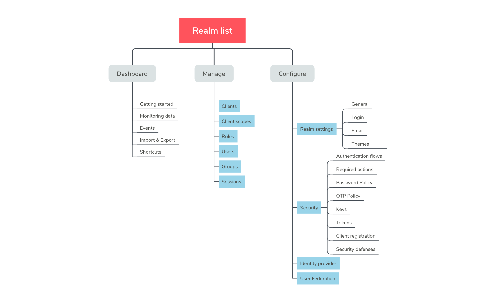
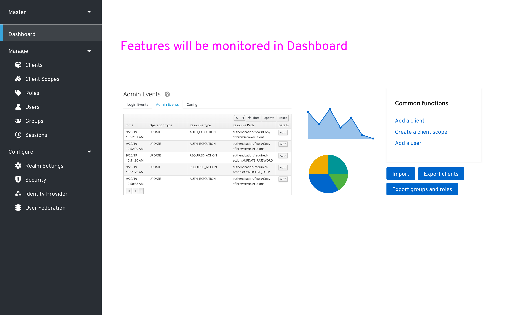
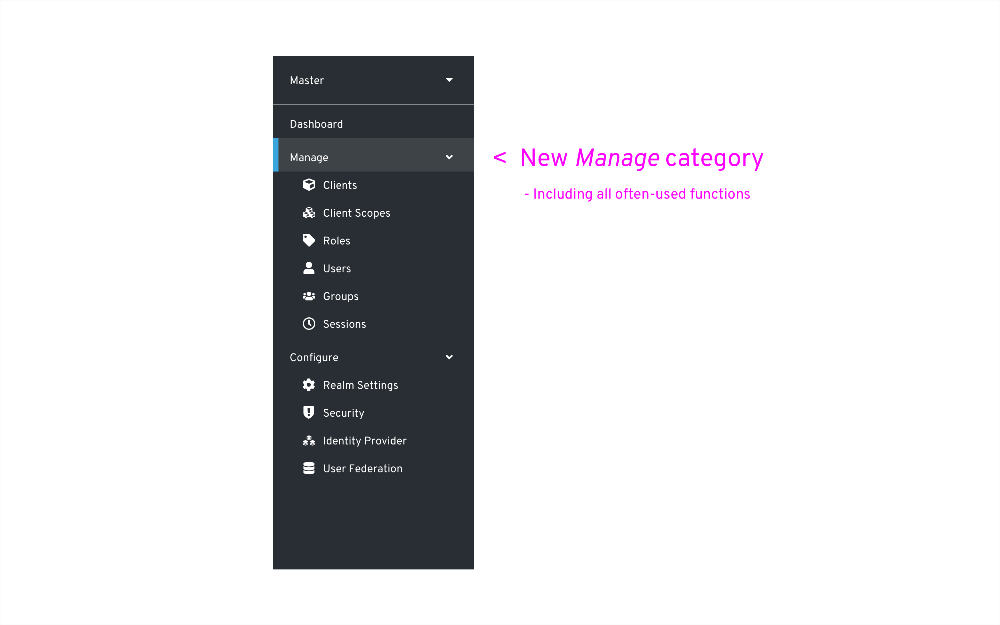
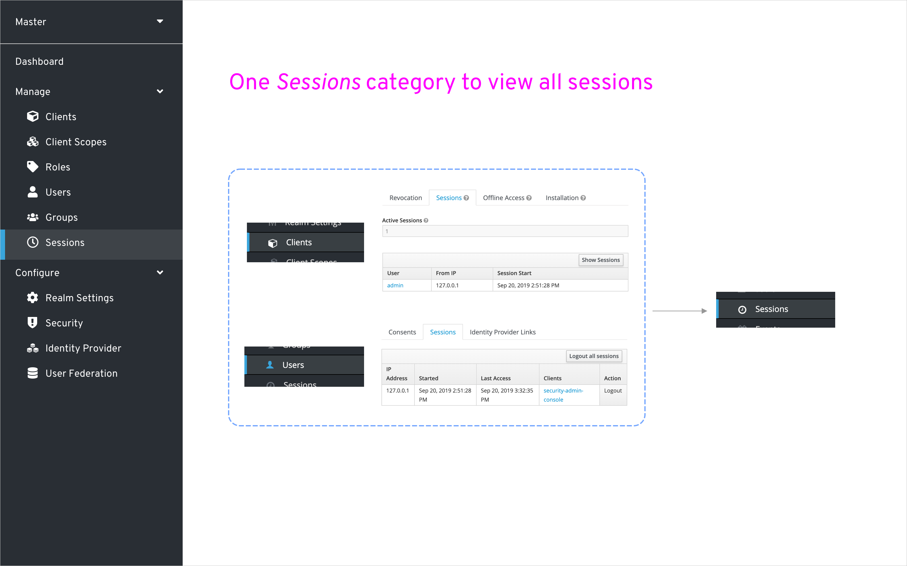
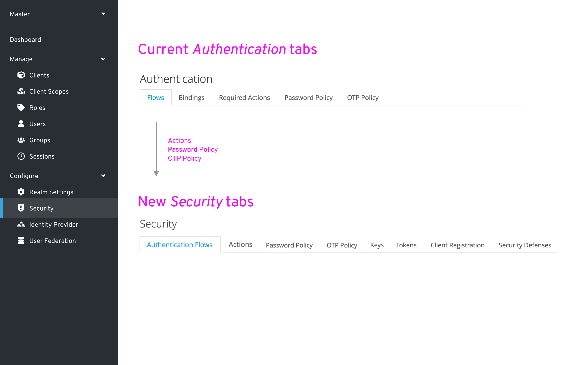

# New IA Proposal for Keycloak Admin Console

* **Status**: Draft #1
* **Author**: [aprilma419](https://github.com/aprilma419)
* **JIRA**: [KEYCLOAK-11516](https://issues.jboss.org/browse/KEYCLOAK-11516)

## Motivation
To have a better console using experience, our UXD team was assigned to review and re-design the current Keycloak Admin Console to make it more usable. After the researching phase and discussions with PM and devs, we came up with a proposal by drafting a new information architecture map of the console.

The content below is the IA map picture, and the proposal markdown includes some explanations of why we decided to make improvements as this new map showed, and what we are going to do next.

**IA map and proposal on Marvel:** https://marvelapp.com/cg037fh/screen/61609846

## The IA proposal markdown

### 1. Improvements on main navigations

We improved the original navigations on the left side into a new one as picture showed below. The basic idea is collecting all the day-to-day used functions into *Manage* category. On the contrary, functions that mostly used in realm initial setting are put in *Configure*. What’s more, a dashboard is added to provide monitoring support and some shortcuts of common functions. Events, Import and Export will also be moved to Dashboard.

### 2. Adding a Dashboard in the main nav(WIP)

The content in Dashboard is still in progress(picture showed below). For now, we’ve considered including monitoring data, shortcuts of common functions and getting started tour in it.

In addition, we are planning to move Events, Import, and Export functions in the dashboard as well, which used to be in the *Manage* category.

### 3. Improvements on *Manage* category

We planed to upgrade the *Manage* category before *Configure*. As mentioned before, the functions inside *Manage* are about almost daily used, that’s why Clients, Client scopes and Roles are moved from *Configure* to *Manage*.

### 4. Improvements on *Sessions*

In the current console, you need to navigate to a specific client or user to view the sessions of them. In the new version, all the sessions will be pulled together. You will have a central place – Sessions to view all the sessions.

### 5. Improvements on *Realm Settings*

We used to have the above nav inside the Realm Settings. In the new proposal, Keys, Tokens, Client Registration, and Security Defenses will be moved to the new Security category. Cache will be moved to a server-level setting.

In addition, Themes will be separated and attached to different functions. That is, Login Theme will go with the Login tab, email theme will go with Email tab. In the future, we may also have an account management tab and the theme setting will go with it.

The new nav seems to be like this pic below.

### 6. Adding a new *Security* category in *Configure*

In addition to the previous functions, Keys, Tokens, Client Registration, and Security Defenses will also be moved to this tab.

Flows and Bindings will be merged into a single function and be improved.

The Security nav should be like this picture below.

Security is developed from Authentication.

