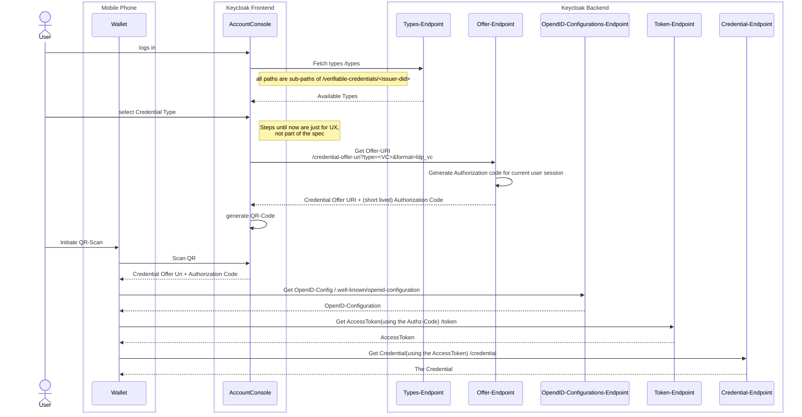
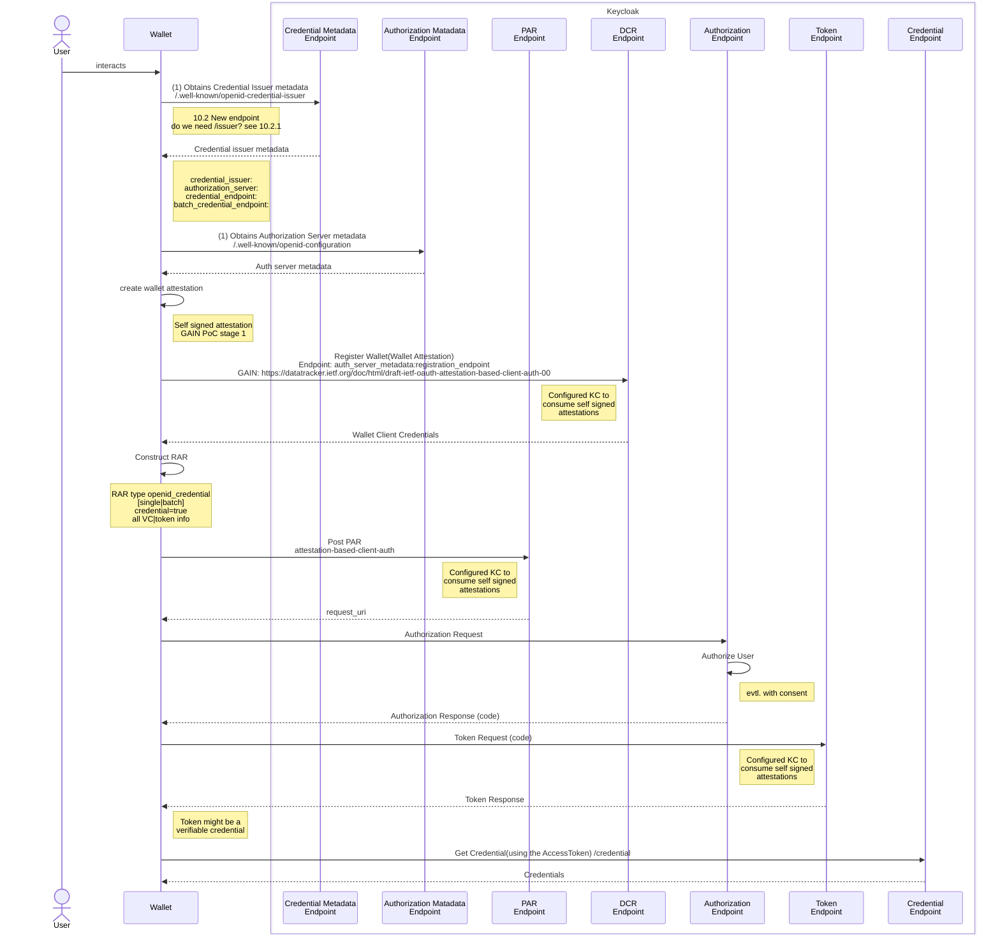

# OpenID Verifiable for Credential Issuance

## Observerability

* **Status**: Notes
* **JIRA**: None
* **Discussion**: [OpenID for Verifiable Credential Issuance #17616](https://github.com/keycloak/keycloak/discussions/17616?sort=new)

## Motivation
OpenID Verifiable Credential Issuance ([OID4VC](https://openid.net/specs/openid-4-verifiable-credential-issuance-1_0.html)) has been discussed a lot in the Self-Soverin Identity (SSI) especially due to European Commission having released a [Framework](https://digital-strategy.ec.europa.eu/en/library/european-digital-identity-wallet-architecture-and-reference-framework) for eIDASv2. The later tends to chose OID4VC as a protocol to issue Verifiable Credential (VC) and to present Verifiable Presentation (VP).

For simplicity, VC is a token generally either JSON-LD / JWT format issued by OpenID Provider to the User whereas VP is a token presented by User to Relying Party for authentication and authorizations purposes. A VP can be the result of an aggregation of multiples VCs or simply a subset of attributes of a single VC. [OID4VP](https://openid.net/specs/openid-connect-4-verifiable-presentations-1_0-07.html) and [SIOPv2](https://openid.net/specs/openid-connect-self-issued-v2-1_0.html) have been introduced for the purposes of presenting Verifiable Presentation from USER to Relying Party.

As interoperability is a key factor for the success of SSI, there are many initiative working on implementing SSI interoperability. The [Interoperability Matrix](#interoperability-matrix) below displays a list of initiatives and the ongoing compatibility negotiation.

Keycloak being the largest SSO open source software, we want to use this initiative to secure implementation of OID4VC into Keycloak.

## PoCs

### FIWARE
https://github.com/FIWARE/keycloak-vc-issuer

## Roadmap
In the first step, we will be extending Keycloak to act as a VC Issuer. For that purpose, we will implementing both flows:
* The pre-authorize flow
* The auth code flow

In the secon step, we will be providing keycloak with the verifier functionality, such as to fit into many federation use cases in use with keycloak today.

## Step-1-a: Keycloak Issuer - Preauthorize Code Flow
This approach appears to be the simplest, as it doesn't necessitate significant extensions in the Keycloak codebase. The [FIWARE](#fiware) implementation previously mentioned encompasses the majority of the required code. However, this implementation depends on components that are not compatible with keycloak licensing model.

The following diagram from [Stefan](https://github.com/wistefan) in issue [OID4VC#17616](https://github.com/keycloak/keycloak/discussions/17616?sort=new#discussioncomment-7326341) displays components needed for the pre-authorized flow, as currently implemented in the [FIWARE](#fiware) codebase:

* The flow is using the "Cross-Device Flow"(e.g. Wallet is on a different device than the browser showing the Account Console). 
* Binding the credential to holder-proof is also not yet provided.

As the diagram illustrates, implementation into Keycloak brings three new Endpoints:
### Account Frontend
The modification of the account console to allow for the enrolment of the user wallet.
**To-Do**
* [] Does this leads to the production of any sort of Client Attestation.
### Types Endpoint
**To-Do**
* [] Describe purpose of the Types Endpoint
### Credential Offer Endpoint
See Credential Offer Endpoint in [OID4VCI](https://openid.net/specs/openid-4-verifiable-credential-issuance-1_0.html#section-11.2)
**To-Do**
* [] What type of credential will be natively offered by Keycloak?
* [] Are we planing to provide some sore of generic model based on the current KC user and role data model?
* [] Do we want to design something like a CredentialOfferProvider to allow for plugable credential models?
### OAuth 2.0 Authorization Server Metadata
This interface will be extended to add: pre-authorized_grant_anonymous_access_supported=true|false
### Credential Endpoint.
Whereby it is open to check if it does not make sense to have Token Endpoind directly produce the VC.

## Step-1-b: Keycloak Issuer - Authorization Code Flow
In this use case, the user's wallet serves as a client, utilizing the OIDC authorization code flow to facilitate user authentication and enable the wallet to request a token from Keycloak's token endpoint. The token provided by Keycloak can then be:

* A typical access token that can subsequently be used by the wallet to obtain the VCs from a separate credential issuer endpoint, or
* The VCs themselves, assuming we agree to configure Keycloak's token endpoint to return a different token format.

The following diagram from [Francis](https://github.com/francis-pouatcha) in the issue [OID4VC#17616](https://github.com/keycloak/keycloak/discussions/17616?sort=new#discussioncomment-7326341) displays components involved in the production of the VCs.

The key element of concern here is the Client Attestation. The Keycloak client registration interface wil have to be extended to support some sort of client attestations, whihc are consumable both by keycloak and eventually by external credential issuers that rely on Keycloak for the authentication of the wallet.

From the diagram, we have following resulting todos:
### Credential Issuer Metadata Endpoint
The Credential Issuer Metadata is specified [here](https://openid.net/specs/openid-4-verifiable-credential-issuance-1_0.html#section-10.2.2).
### OAuth 2.0 Authorization Server Metadata
This interface will be extended to add: pre-authorized_grant_anonymous_access_supported=true|false
### Client Registration Endpoint (DCR)
**To-Do**
* [] Missing clear instruction on how to proceed with the registration of the wallet.
### RAR Support
**To-Do**
* [] Need details on how to proceed with RAR
### Attestation Based Client Auth
See: https://datatracker.ietf.org/doc/html/draft-ietf-oauth-attestation-based-client-auth-00
**To-Do**
* [] Design Keycloak extension to support this.
### Credential Endpoint
See [Credential Endpoint](https://vcstuff.github.io/oid4vc-haip-sd-jwt-vc/draft-oid4vc-haip-sd-jwt-vc.html#section-4.4)

# Additional Resources

## Working Sessions
Video of [OAuth SIG Breakout Session of 10.19.2023](https://us06web.zoom.us/rec/share/tMnMD-dZqHCNktddGwxQf_ICsR3ImUGNHV3jlAyN0fhli3URSZ2u0I1AtNxWdB5F.tt0iRKaP8wiNap34)

## Interoperability Matrix
The following table displays some competing initiatives, all implementing OID4VC. This table is managed by GAIN PoC working group at [OID4VC Profiles](https://docs.google.com/spreadsheets/d/1s6REK5eNAb3GSElID0J02_TtbuI2Exd9z-CLdLx0emk/edit?usp=sharing).

There is a attempt to define a baseline profile, that will be supported by all initiatives.

|                                   | [DIF Presentation & Issuance Profile](https://identity.foundation/jwt-vc-presentation-profile/) | [DIIP](https://dutchblockchaincoalition.org/en/bouwstenen-2/diip-2) | Baseline Profile Proposal | [HAIP](https://vcstuff.github.io/oid4vc-haip-sd-jwt-vc/draft-oid4vc-haip-sd-jwt-vc.html) | [EBSI](https://api-pilot.ebsi.eu/docs/ct/verifiable-credential-issuance-guidelines-v3) |
|-----------------------------------|:-----------------------------------:|:----:|:-------------------------:|:----:|:----:|
| OID4VP                             | x                                   | x    | x                         | x    | x    |
| OID4VCI                            | x                                   | x    | x                         | x    | x    |
| SIOP v2                            | x                                   | x    | ?                         | x    | x    |
| Credential Format                  | JWT VC                              | JWT VC | SD-JWT VC                | SD-JWT VC | JWT VC |
| Credential Format Details         |                                     |      |                           |      |      |
| key binding                        | did:jwk                             | did:jwk | cnf with jwk or kid (with did:jwk) | jwk in cnf | |
| issuer keys                        | did:web                             | did:web | did:web or jwt-issuer   | jwt-issuer and x509 | |
| Signature types                    | "ES256K, EdDSA/Ed25519"             | ES256 | ES256                     | ES256 | |
| compact serialization              | x                                   | x    | x                         | x    | |
| JSON serialization                 |                                     |      |                           | o    |     |
| revocation method                  | StatusList 2021                     | StatusList 2021 | JWT statuslist (with 1 bit status) | JWT statuslist | |
| link domain verification           | x                                   |      |                           |      | |
| OID4VCI details                    |                                     |      |                           |      | |
| pre-authz                          |                                     |      | p                         | x    | |
| authz code (credential offer)      |                                     |      |                           | x    | |
| authz code (wallet initiated)      |                                     |      |                           | x    | |
| PAR                                |                                     |      |                           | x    | |
| scope                              |                                     |      | p                         | x    | |
| authorization_details              |                                     |      |                           |      | |
| Wallet Attestation JWT scheme      |                                     |      |                           | x    | |
| dpop                               |                                     |      |                           | x    | |
| refresh tokens                     |                                     |      |                           | x    | |
| credential endpoint                |                                     |      | p                         | x    | |
| deferred credential endpoint       |                                     |      |                           | x    | |
| deferred authorization             |                                     |      |                           | x    | |
| OID4VP details                     |                                     |      |                           |      | |
| custom scheme                      | openid-vc                           |      | openid-baseline            | haip | |
| vp_token                           |                                     |      | p                         |      | |
| direct_post                        |                                     |      | p                         | x    | |
| direct_post with redirect_uri      |                                     |      | p                         | x    | |
| query encoded parameters           |                                     |      |                           |      | |
| request_uri                        |                                     |      | p                         | x    | |
| client id scheme x509_san_dns      |                                     |      | p                         | x    | |
| client id scheme verifier_attestation |                                |      |                           | x    | |
| scope                              |                                     |      |                           |      | |
| presentation_definition            |                                     |      | p                         | x    | |
| reduced PE feature set             |                                     |      | p                         | x    | |
| asynchronous message delivery (to the wallet) |                         |      | data passed in the issuance request | | |

