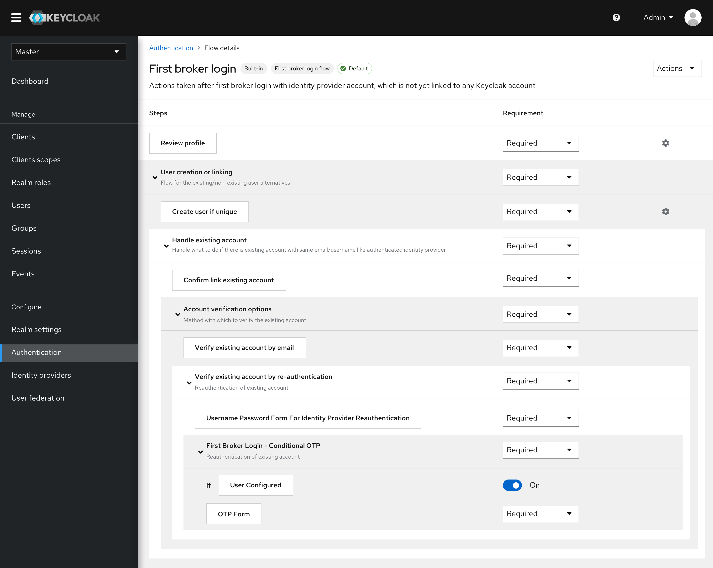
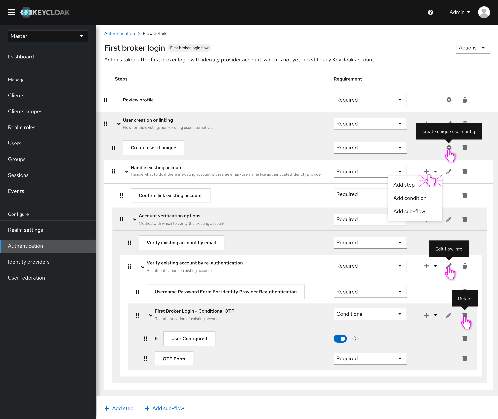
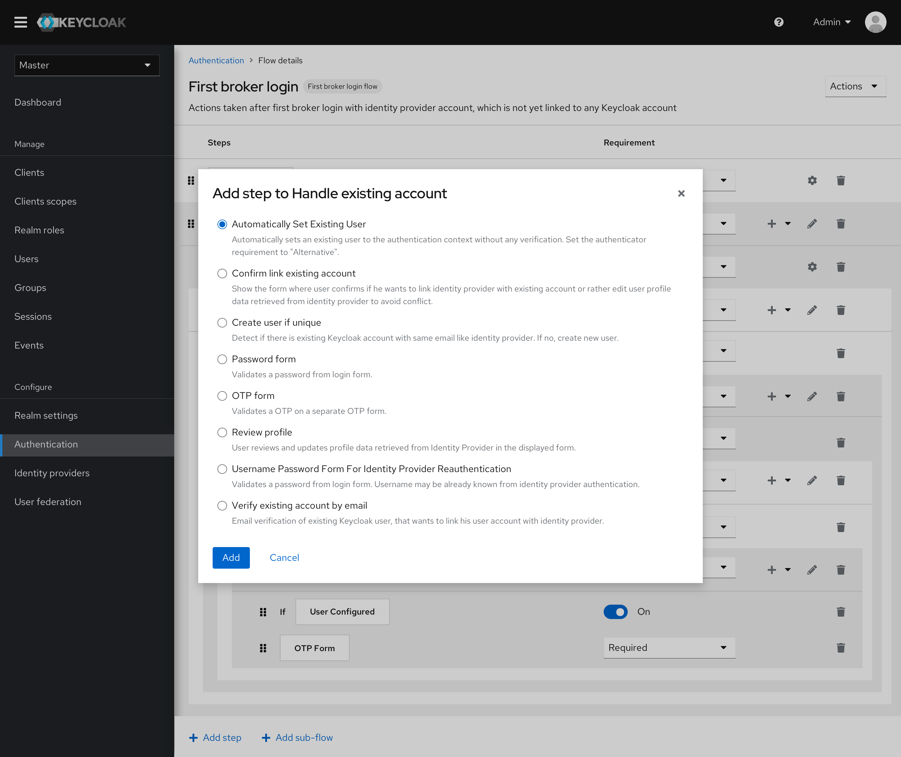

# Layout of Flows

In this round of design, we apply the PatternFly 4 to the current interface. And optimize the layout of the flow to a certain extent.

## Layout of the built-in flow

* There are labels in the header that displays the type and the status of the flow.
* Executors are represented by the small cards. And the sub-flows are represented by the expandable rows. The hierarchies of the sub-flows are represented by different colors.
* The requirements are simplified to only show the selected one.

## Layout of the custom flow

The layout of the custom flow is similar to the built-in one. But users can make more configurations on this screen.

* All the orders of the steps/sub-flows can be changed by dragging and dropping the handlers in the most left of the row.
* The actions are separated into different groups in the new layout. Duplicate, edit flow and delete are moved to the Actions dropdown in the top right. Add step and add sub-flow (to the highest level) are moved to the bottom of the flow.

* All the executors are divided into different groups according to the flow type. When adding a step, only the specific type of executions will be displayed.

* Conditions are distinguished from the other executors. Users can add them through different actions.

