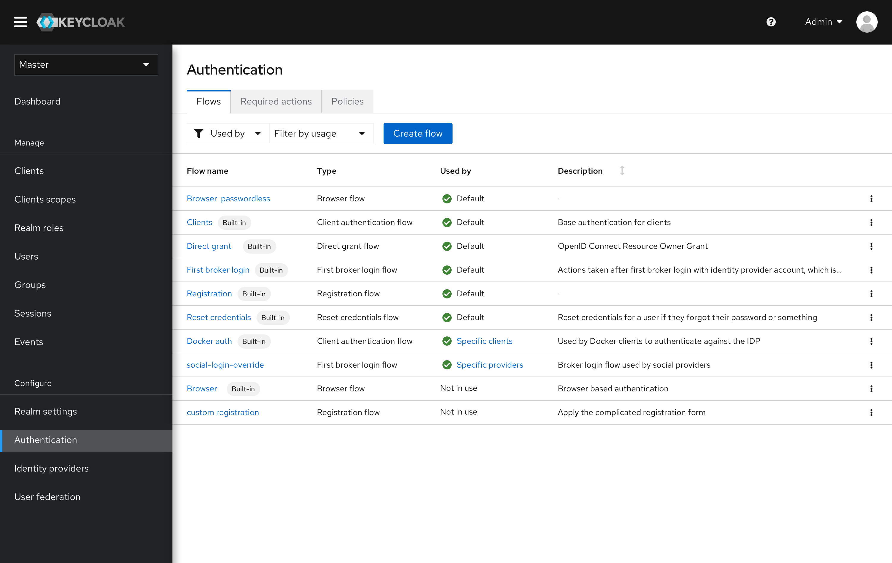
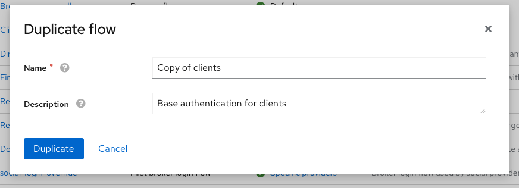
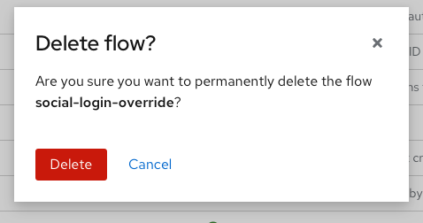

# Flow List

A list view is added to the Authentication section. All the built-in flows and custom flows will be displayed in this list.

* Built-in flows have labels attached to them.
* Type is added as an attribute. All the flows are separated into 6 types - the browser flow, the registration flow, the client authentication, the direct grant flow, the reset credential flow, and the broker login flow.
* Status is added as an attribute. All the default flows are the flows displayed in the current Bindings tab. If the flows are used by specific clients/providers, it means they are used as overrides.

* Flows can be duplicated or deleted from the kebab menu.

