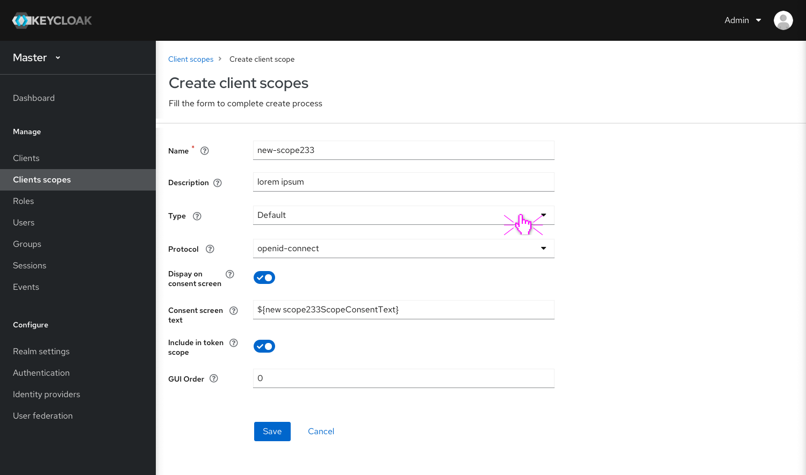
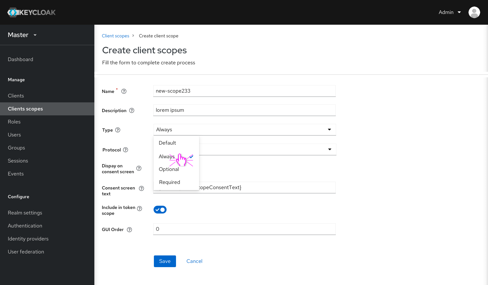
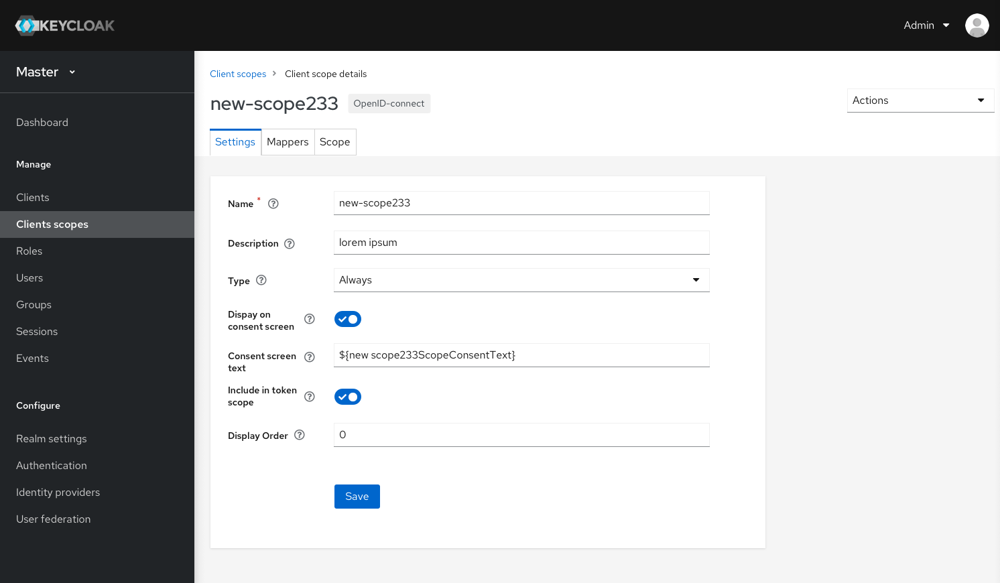

# Create client scope

## Layout improvements

* Same to other Create functionality page layouts.

## Function changes

* Added a Type field in the form to allow users to choose a type(out of new 4 types) to assign this new client scope.
* Click “Save” to finish creating process and go to the Settings page.

* In the Settings page, the form is the same to Create page. I just added a new label of protocol next to the client’ scope name in the header.

