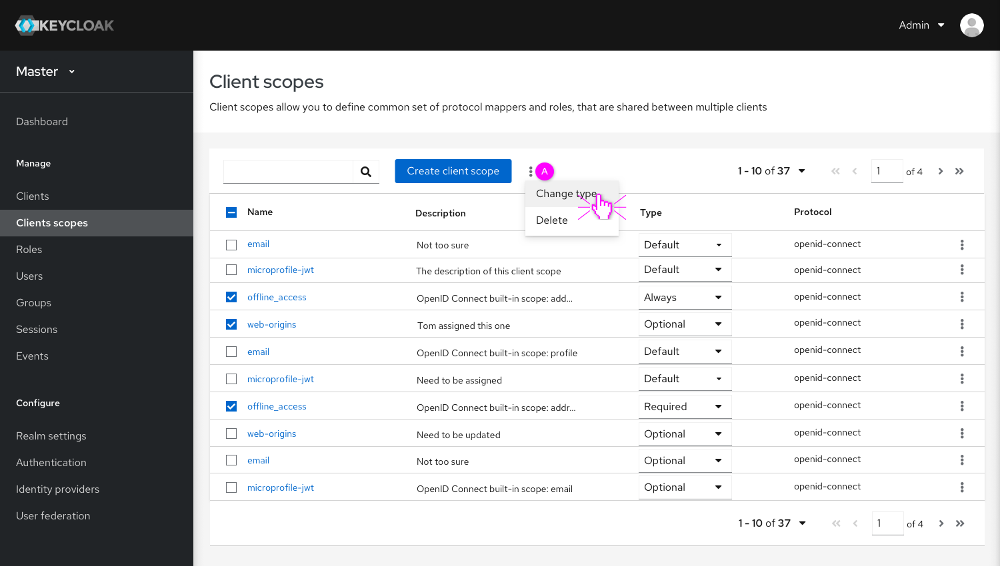
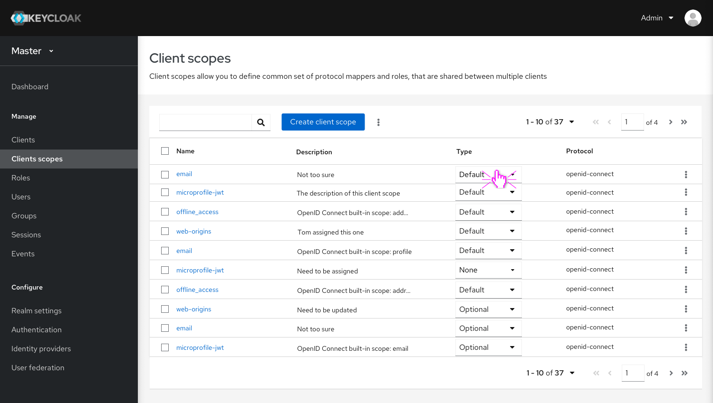
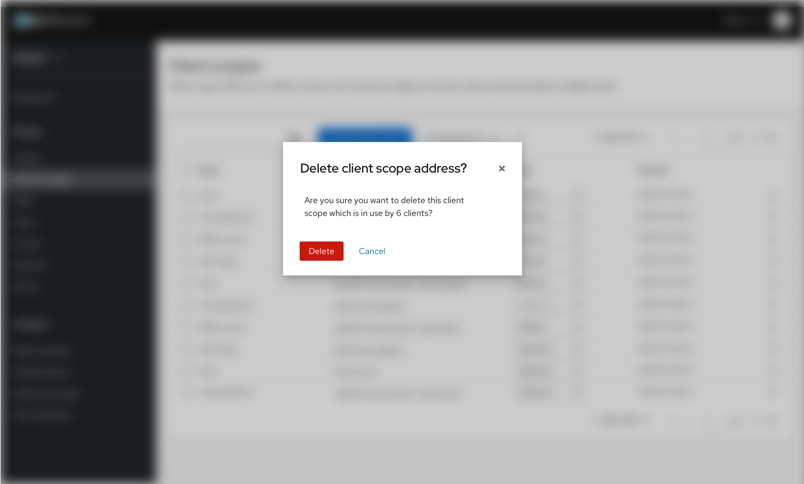

# Client scopes list

In the new version of Client Scopes feature, not much function changes on the List and Create page, as well as Settings page. To be consistent with the Client scope page in Clients, we got rid of the Default client scope page in the current console and used Change types dropdown to allow users to assign or change client scope types.

## Layout improvements

* No more default client scopes tab
* Using dropdown to change the assigned types.

## Function changes

* Click the kebab to view the dropdown of Change types.
* Click the inline dropdown to change the assigned type one by one.

* After clicking the red Delete button under kebab, there will be a Modal to let the user confirms.

