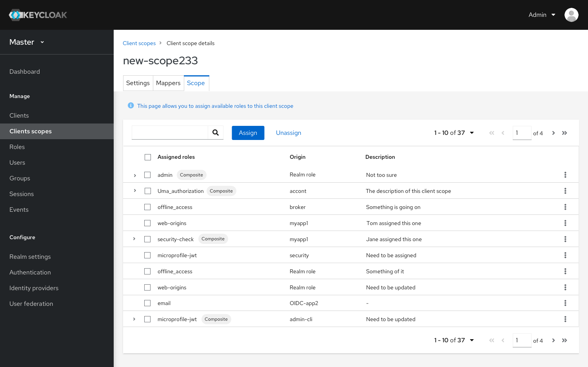
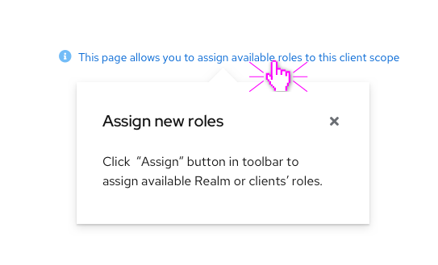
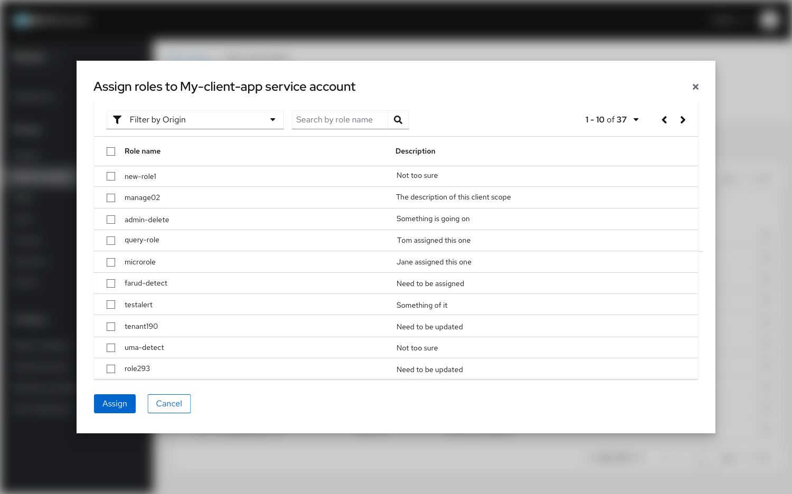
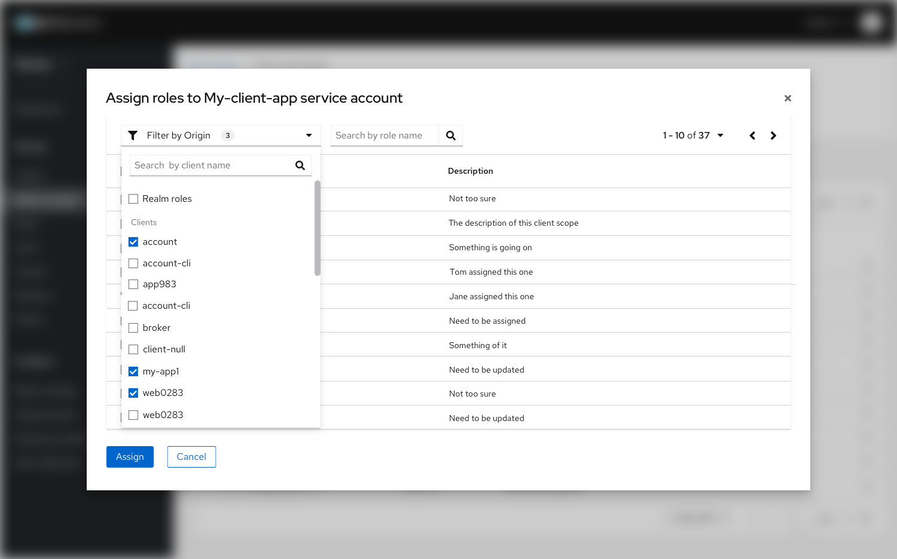
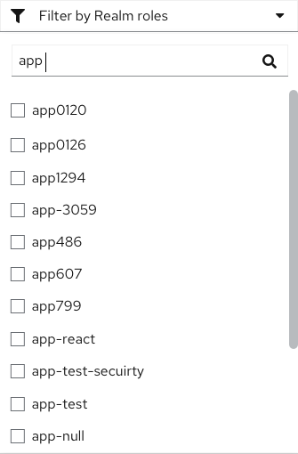
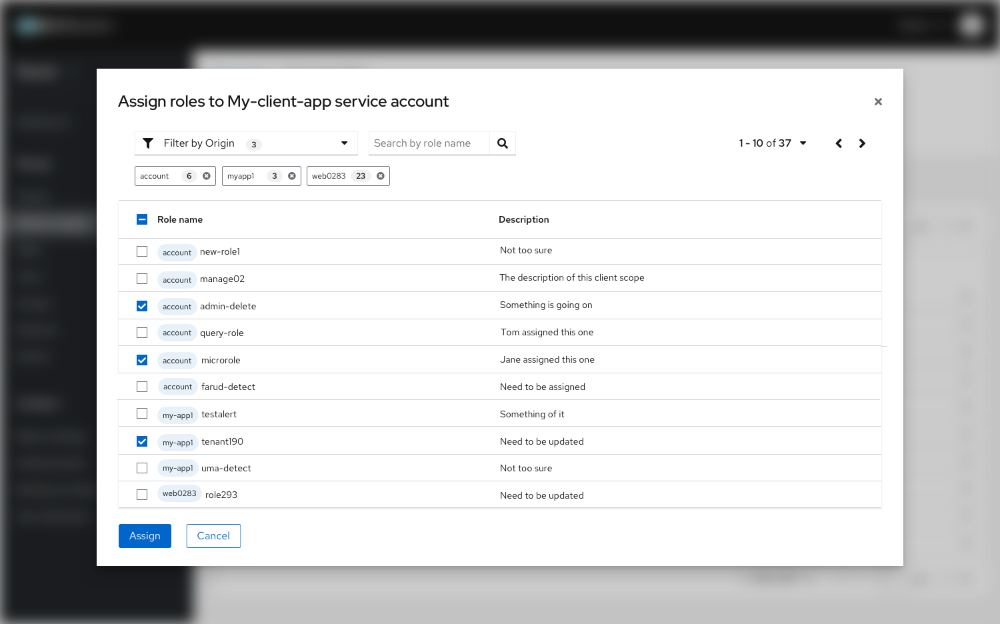

# Client scope feature in Admin Console

## Scope tab

The scope tab in Client scope is a function we used a whole new layout to show all the assignments. Users will see a table of all effective roles when they first landed on this page.
In this table, there’s a new column called “Description” to allow users to view the detailed information of the roles. And a quick filter of showing “All directly assigned roles” only.

Click the “Assign” button will trigger a Modal of available roles which allows user to assign roles to particular client scopes.

### Layout improvements

* Scope home page - table format of assigned roles
* Help info in blue text above the table indicates users of table usage(WIP)
* Effective roles display - Show all the effective roles with their origins via labels.

* Click the blue help info text will trigger a popover hint of what this page does. (This feature is still WIP)

* Assign new scope page - Modal format with table and pagination
* Filters on role name and origins.

### Function changes

* Click the “Show directly assigned roles checkbox to show all assigned roles only.

* When assigning new roles, users can choose whether it is “Realm role” or the Client’s roles to be assigned, or both by the filter; The dropdown list can be searched by keywords.

* When the users finished filtering, the search results will be showed below the filter. The chips also indicate the number of that specific filter.
* After selecting target roles to be assigned, click the assign button down below in the modal to finish this task.

