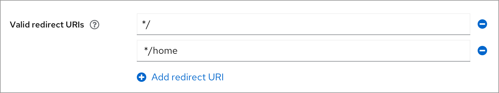
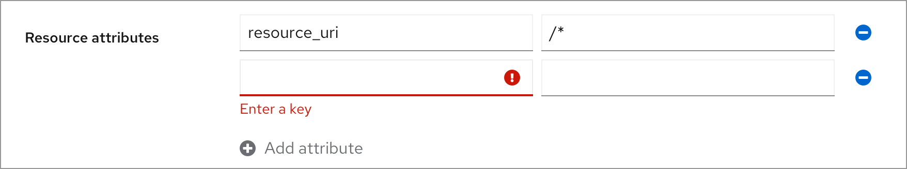

# Add new row

## Add a single new row at a time

### Initial state

  * The color of Add and Remove are both disabled grey (#6A6E73).
  * The **Add** button should say “**Add noun** ”(singular).

### Filled with something

  * When all the existing rows are filled with something, the **Add** button changes to be active blue (#0066CC).

### Add new row

  * When there are multiple rows, all the **Remove** buttons change to be active blue, users can remove any of the rows.
  * When there is an existing row which is empty, the **Add** button is disabled again.

### New row is filled

### Hovering state

  * Hovering on the remove icons will always show the tooltips.

## Attributes
In this scenario, only the key is required at most time. Sometime the key and the value are both required.

### Initial state

  * The asterisk is used to indicate whether the **Key** or **Value** is required.
  * The color of **Add** and **Remove** are both disabled grey.
  * **Save** button is enabled all the time.

### Only value is provided

  * The **Add** button is still disabled when the **Key** isn’t filled. If the **Key** and **Value** are both required, then the **Add** button will only be enabled after both fields are filled.

### Only key is provided

  * The **Add** button is enabled after the key is filled, the value is allowed to be empty.

### Multiple rows

  * When there are multiple rows, all the **Remove** buttons change to be active blue.
  * When there is an existing row which is empty, the **Add** button is disabled again.

### Validation

  * When saving with required fields empty, a validation error displays below the corresponding field.

## Single label for key and value
In this scenario, whether the key and value are required depends on whether there is an asterisk attached to the field label.

### Initial state

  * The color of **Add** and **Remove** are both disabled grey.

### Only key or value is provided

  * The **Add** button is still disabled when only the Key or value is filled.

### Both key and value are provided

  * The **Add** button is enabled after both key and value are filled.

### Multiple rows

  * When there are multiple rows, all the **Remove** buttons change to be active blue.
  * When there is an existing row which is empty, the **Add** button is disabled again.

### Validation
#### Validation of key

#### Validation of value

  * The validation will appear after the field losing the focus.

### Select from the existing list

  * The key and value fields could be dropdown instead of text input fields if there are existing options to select from.
