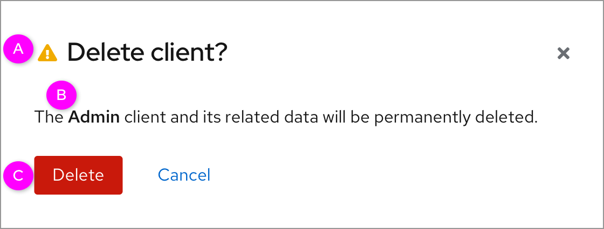
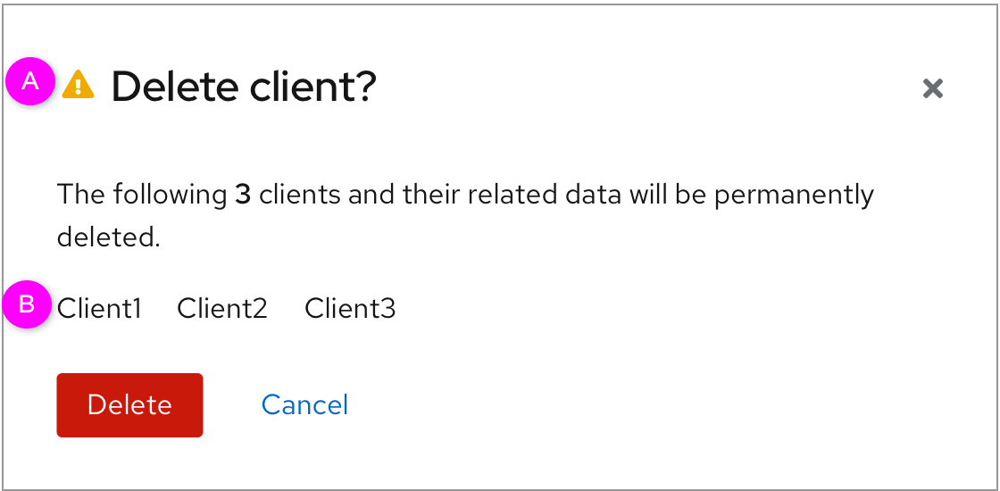
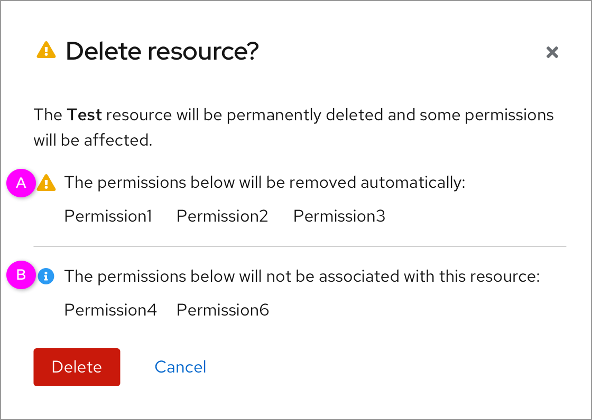

# Delete modal

When users delete one or more items, there will be a modal pop up to make users confirm their action. This part specifies the wording of the deletion towards different situations.

### Single delete

  *  A. There is an exclamation-triangle icon.
  *  B. The font of the object to be deleted is bold.
  *  C. The button should be destructive button.

### Batch delete

  *  A. There is an exclamation-triangle icon.
  *  B. The items that will be deleted are listed out here.

### The result of deletion affects other items

If deletion of an item affects other items, such as causing other items to be deleted, unassigned, or unassociated, the results should list what will be affected.

  *  A. There is an exclamation-triangle icon. The items that will be automatically deleted are listed out here.
  *  B. There is an info icon. The items that will be are affected but not deleted are listed out here.
