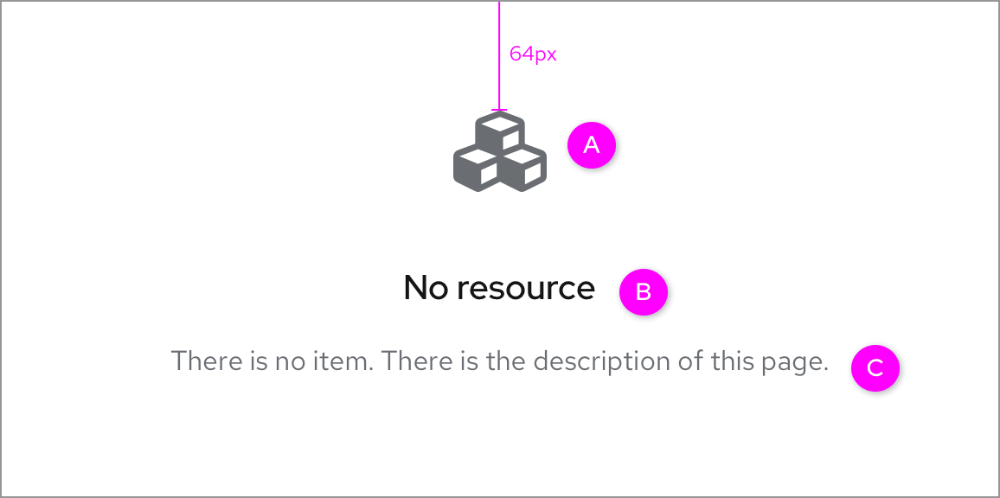
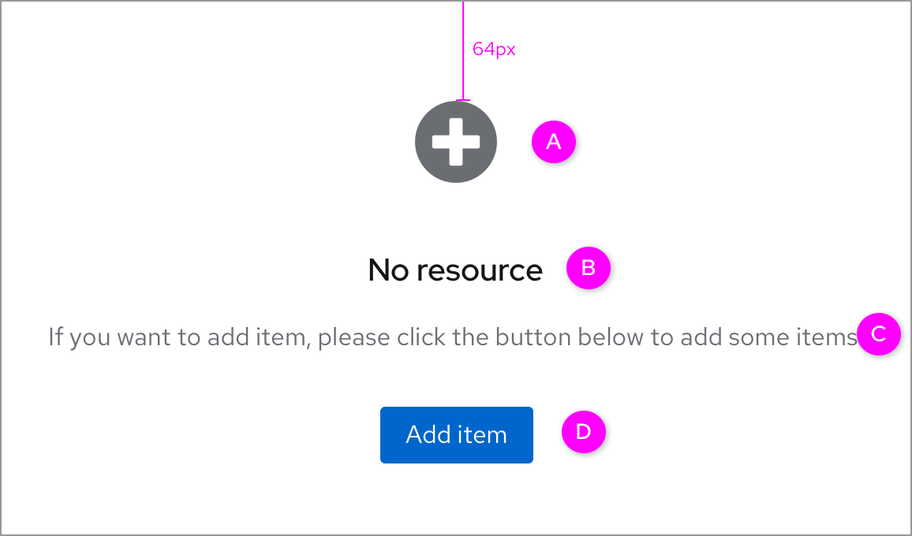
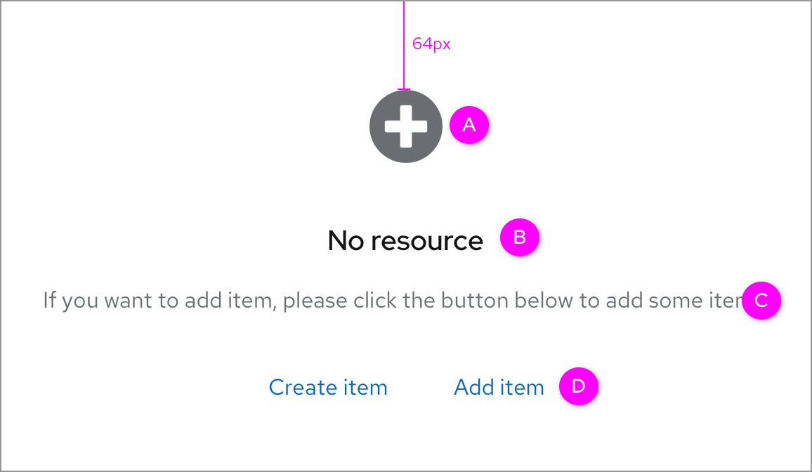
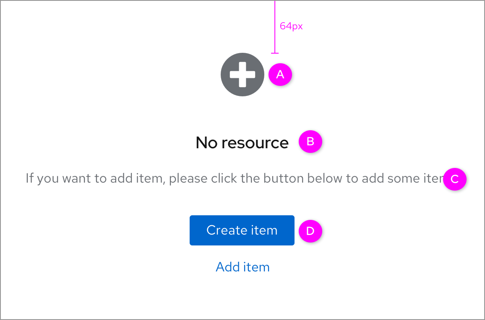
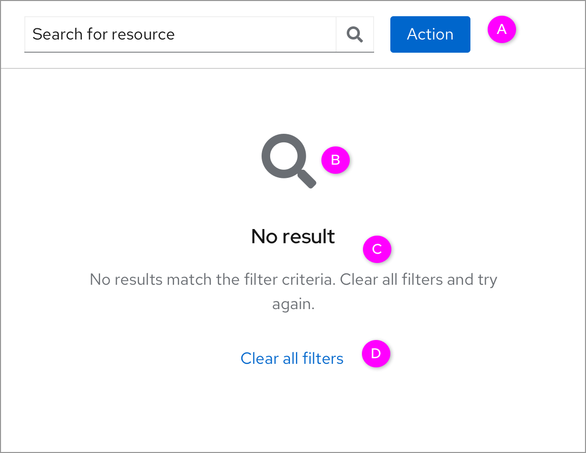
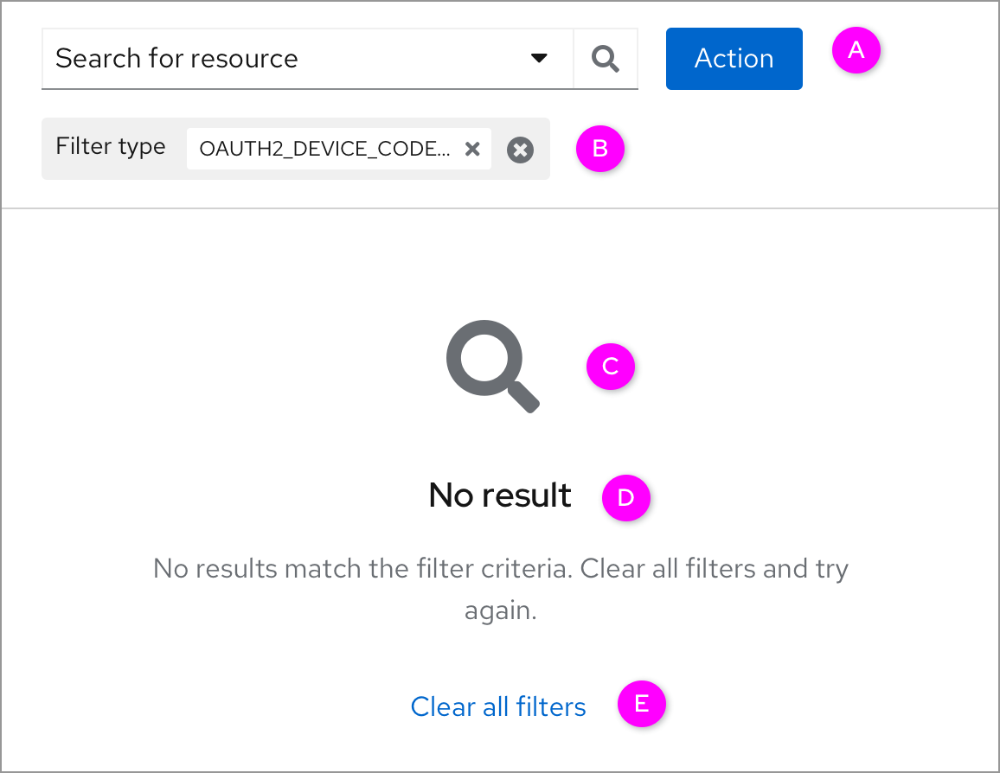
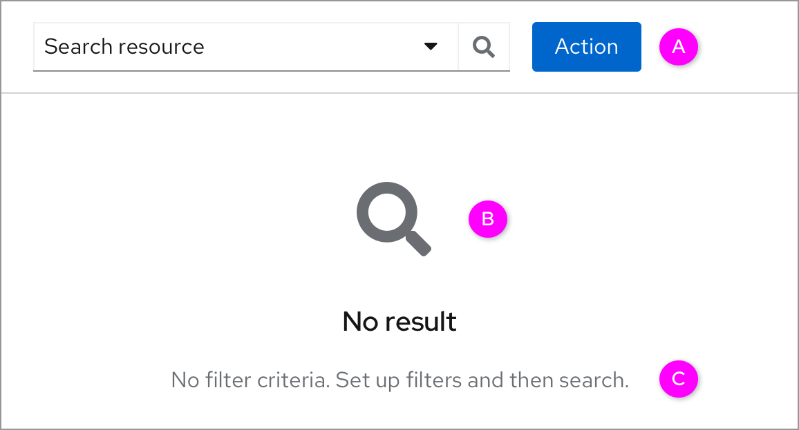

# Empty state

## Table original page

In some pages, the table starts without any resources. In the new design, the empty state is based on the [basic empty state](https://www.patternfly.org/v4/components/empty-state#basic) of PF4, and there are some detailed guidelines of the empty state.

### No actions

* A. If users can’t take any action, the icon should be a **Cube** icon.
* B. The title shows that there is no resource.
* C. The description depends on the application scenario.

### Empty state with one action

* A. If users can add or create one or more items, the icon should be a **Plus** icon.
* B. The description depends on the application scenario.
* C. If there is only one action button, the button should be the **Primary** button.

### Empty state with multiple actions of the same priority

* A. If users can add or create one or more items, the icon should be a **Plus** icon.
* B. The title shows that there is no resource.
* C. There is the description to tell users how to add or create the new item.
* D. If the multiple actions here have the same priority, all  buttons should be the **Link** buttons.

### Empty state with multiple actions of the different priorities

* A. If users can add or create one or more items, the icon should be a **Plus** icon.
* B. The title shows that there is no resource.
* C. There is the description to tell users how to add or create the new item.
* D. If the multiple buttons here have different priorities, the button with the highest priority should be the **Primary** button.

## No search results page

In the new design, pages with no search result are based on the PF4 component named [No match found](https://www.patternfly.org/v4/components/empty-state#no-match-found). In this part, there are 2 cases of the no search result states.

### No search result with criteria

* A. The toolbar will always be displayed.
* B. The icon should be a Search icon.
* C. It indicates there is no result. The description suggests what users can do.
* D. Clicking the “Clear all filters” link will clear all the filters and return to the original page.

### No search result with criteria (chips)

* A. The toolbar will always be displayed.
* B. The chips are not required. That depends on the requirements and real scenarios.
* C. The icon should be a **Search** icon.
* D. It indicates there is no result. The description suggests what users can do.
* E. Clicking the **“Clear all filters”** link will clear all the filters and return to the original page.

### No search result without filter (Only for Group global search)

* A. The toolbar will always be displayed.
* B. The icon should be a Search icon.
* C. The description should tell the users that they can set up the filter and then search for the target.
