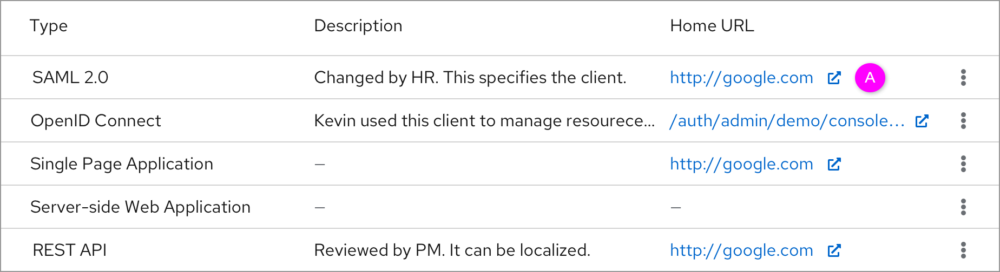
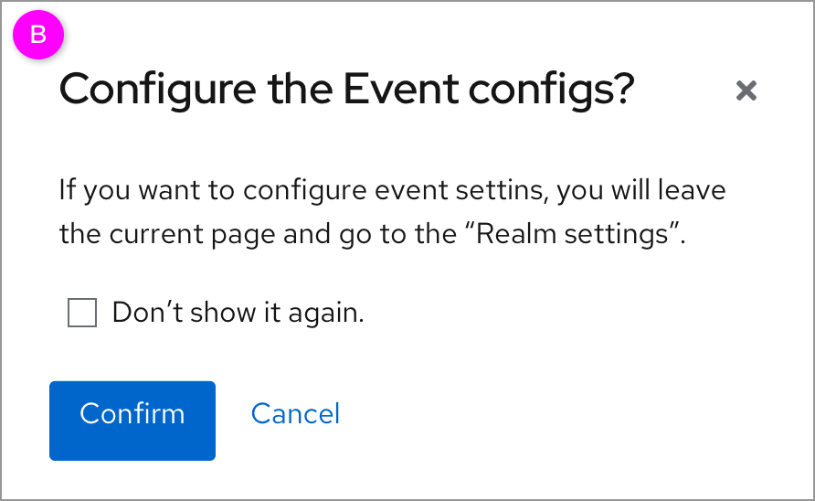

# Hyperlink

This part includes 2 cases of the hyperlink including external hyperlink and internal hyperlink. Notice that the internal link doesn’t include the hyperlink that navigates to the details page of the object.

### External link

  *  A. This is a hyperlink with an **External link** icon. Click the link will open a new window.

### Internal link (Tab changes in the nav bar)

  *  A. This is a hyperlink that will lead users to another function or tab. This action will change the tab in the navigation bar.
  *  B. After clicking the hyperlink, there will be a modal popup that makes the user confirm if they want to leave the current functionality for another functionality.
