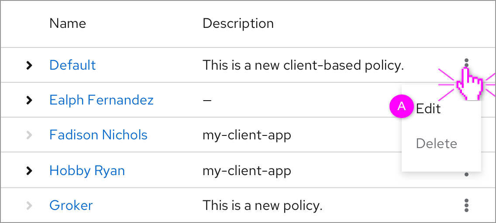
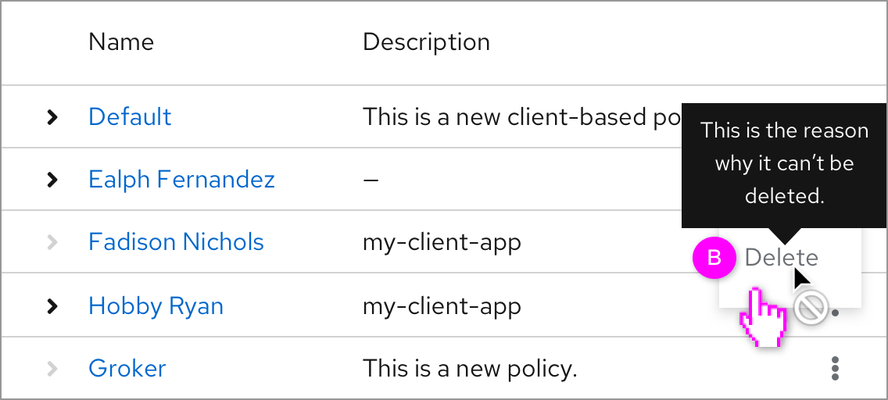
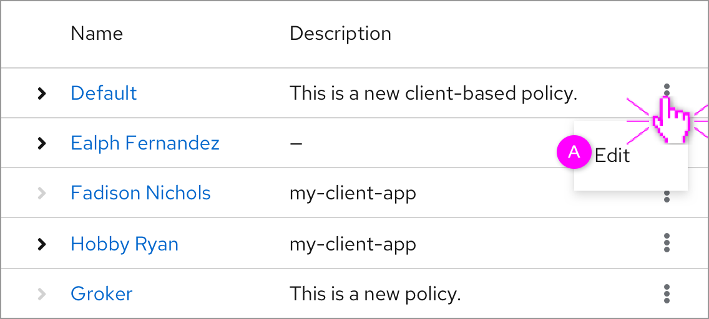

# Kebab menu

In the future, all the kebab menu in the table will include an option named “Edit”. But some other options’ status should be specified including disabled status and hidden status.

### Disable the **"Delete"** options

  *  A. The **Edit** option is always displayed here.
  *  B. If an action is dependent on a condition or status in the console, disable the action with a tooltip explaining why the action currently is unavailable.

### Hide the **"Delete"** option

  *  A. The **Edit** is always displayed here. If an action cannot be taken because of a product constraint or rule, hide the action.
