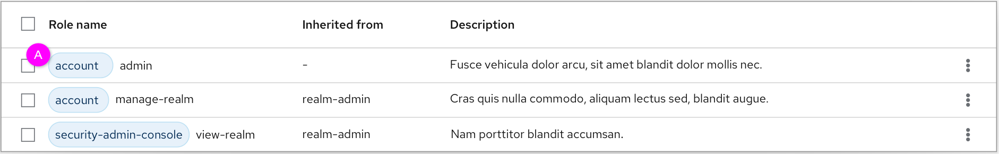
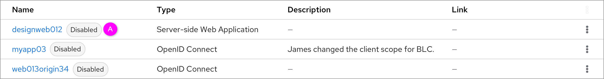

# Labels

In the new design, there are 2 cases of the label’s position, one is before the subject and the other is after the sbuject. This part defines the rules on how to use the labels of the subjects.

### Prefixed label

  *  A. The label  indicates the object’s source, origin, etc. The label should be the “Blue - Filled - No icon” label.

  Notes: The distance between the label and the object should be 8 px.

### Suffix label

  *  A. The label indicates the object’s status, attributes, etc. The label’s style should be selected according to the application scenarios.
