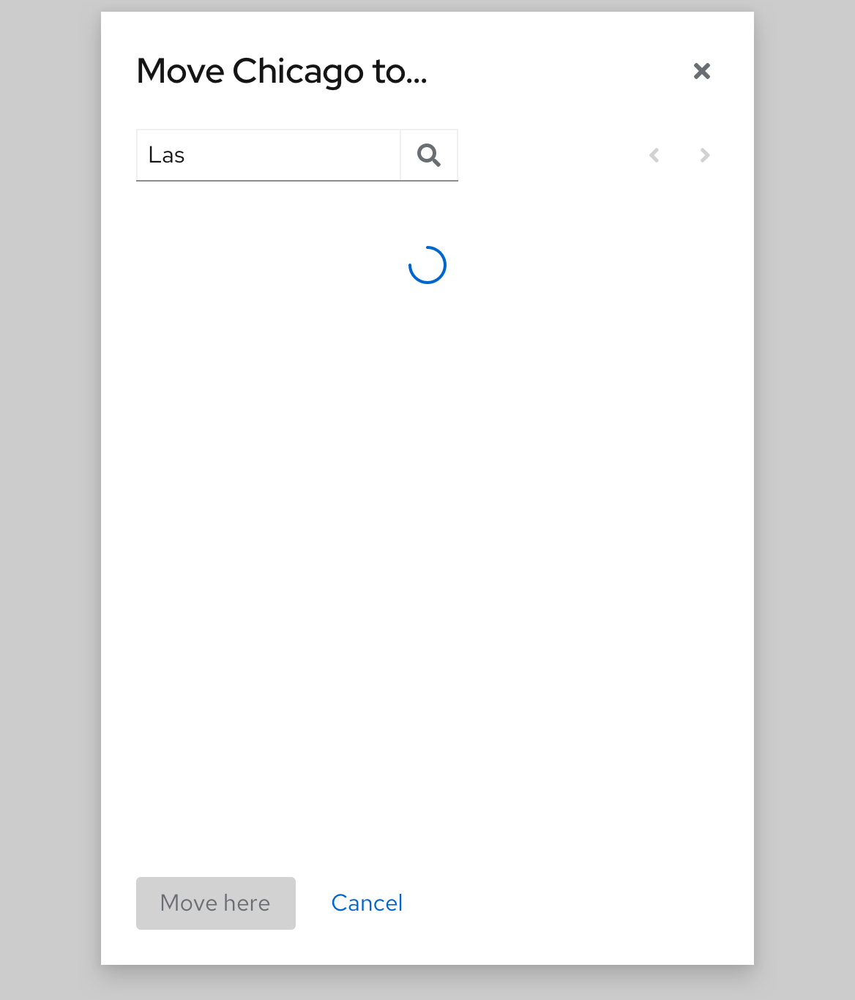

# Move group/join group
This convention introduces the modals that used to manipulate groups, e.g. move group to a specific location, join groups and add groups to a list.

## Move group
This pattern is used to move a group to other locations.

### Initial state (root group level)

  * When opening the modal, the location is default to be the root level. The breadcrumb is hidden in this level.
  * “Root” in the header shows the current group name. It will dynamically changes along with the current location changes.
  * When the groups of current level are less than one page, the pagination is disabled.
  * The group that have children is clickable. Clicking the name can drill down into the next level
  * Groups are listed in the Alphabetical order.

### At the current level

  * The group itself shows in disabled grey because it is not allowed to move into itself or its children.
  * The group that doesn’t have any children is in black because it is not allowed to be drilled down.
  * When the modal shows the current location, the “move here” button is disabled because the group is not allowed to be moved to the current location.

### Hovering state

  * Hovering on different status of groups will show different tooltips.
  * For the groups that have children, not only the group name but the whole row is clickable.

### Search group
The user can search any of the groups among all the groups in all levels.

  * When searching something, the modal header shows “…” instead of the target group name.
  * The “move here” button is disabled during the whole searching process, before the user selects a specific target group.
  * If users delete the text in the search box and click search icon, the list will return to the root level.

#### Group path truncation
If the group path is too long to display in a row, only the groups of the second level and the last two levels displayed. Hovering on the path will show the whole group path.

#### Loading state
When searching costs a long time, the loading status is showing up.

### Breadcrumb
When not in the root group, user can always use the breadcrumb to navigate between different levels.
#### Breadcrumb truncation
When the breadcrumb is too long (more than 4 levels), the breadcrumb should be truncated.

## Join group
Basically, the modal of joining group is the same with moving group. The only difference is the group list allows multi-select. Because the user can join multiple groups at a time.

### Initial state

  * The group that doesn’t have any child is not clickable.
  * The group that already been joined shows as disabled selected, which means it has already been joined. But if the group has any child, it is still clickable. Because its child groups still allow users to join.
