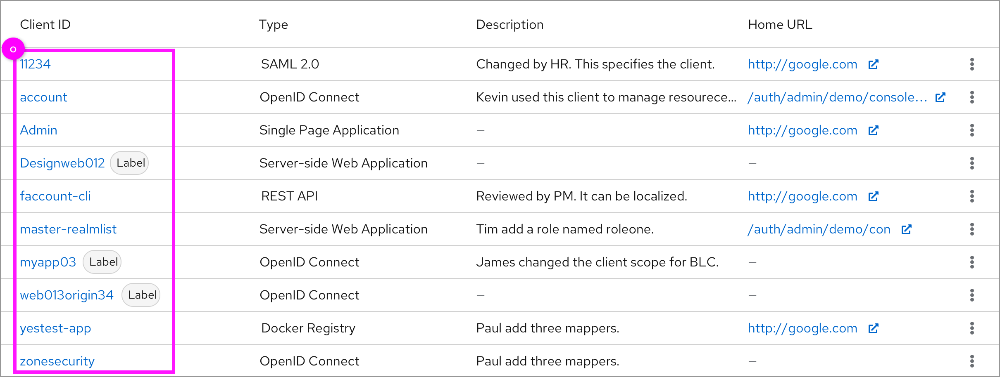
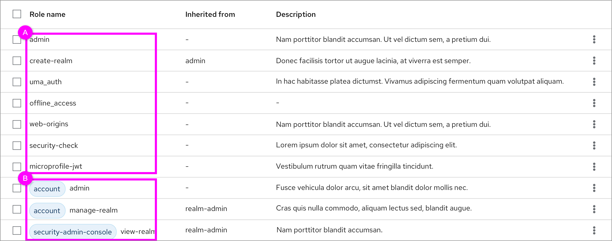
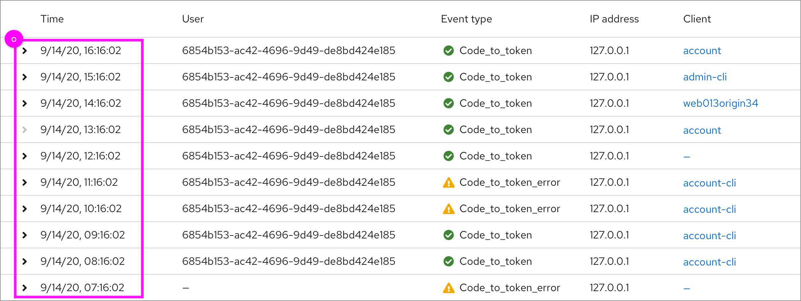
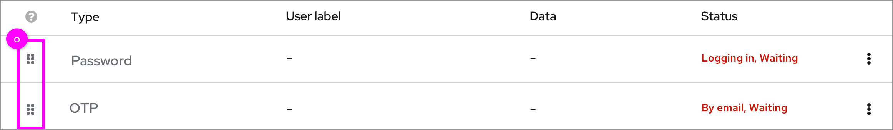
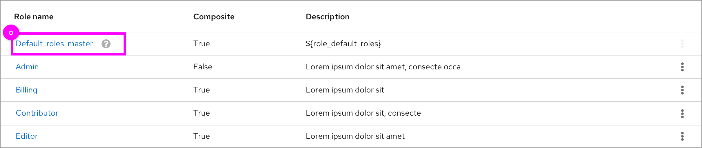

# Orders of the objects in table

There are some different cases and guidelines about how to list objects in the table.

### Alphabetical order

  * In most cases, objects in the table should be arranged alphabetically, an example of order is: 123>aaa>Aaa>bbb.

### With prefixed labels

  * A. Start by presenting the unlabeled topics alphabetically.
  * B. The objects with labels are then displayed. The objects are listed alphabetically based on the label. Objects under the same label are listed alphabetically.

### Time-based

  * If the objects are recorded in chronological order, such as the creation date, record time and so on, the objects should be listed chronologically. The later it is recorded, the more advanced it appears in the table.

### Manual configuration

  * Users can drag and drop the object to change it’s order. There is a  “Grip-vertical” icon in front of the objects.

### Fixed object

* A. In the **Realm roles** and the **Client scopes** inside client, there is a special role named Default-roles-realmname in **Realm roles** and a special client scope named the "ClientName-dedicated" in **Client scopes** tab that always is displayed in the first row.
