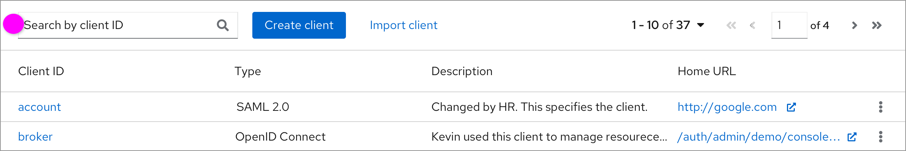
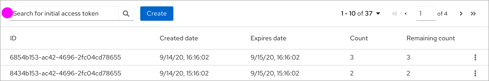
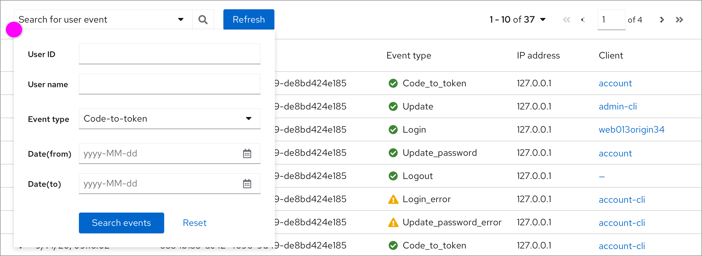

# Placeholder in the search bar

In the new design, the placeholder of the search box should start with the phrase “Search by” or “Search for”. “Search by” will be followed by one attribute, and “Search for” should be followed by the target that users want to find. The usages and details of them are listed in the below.

### Search by
Only one attribute acts as the search criterion.

  *  **Search by one attribute** - If there is only one attribute that can be used to search, the placeholder should start with “**Search by**”. The following part is the attribute that can be used as the search criterion.

### Search for
Multiple attributes act as search criteria.

  *  **Search for object** - If there are
multiple attributes as search criteria, the placeholder should start with “**Search for**”. The following part is the object that users want to search for.

### Search for (support advanced search)
Multiple attributes act as search criteria and are listed in a search form.

  *  In some cases, there is a search form to set some criteria based on the attributes.
