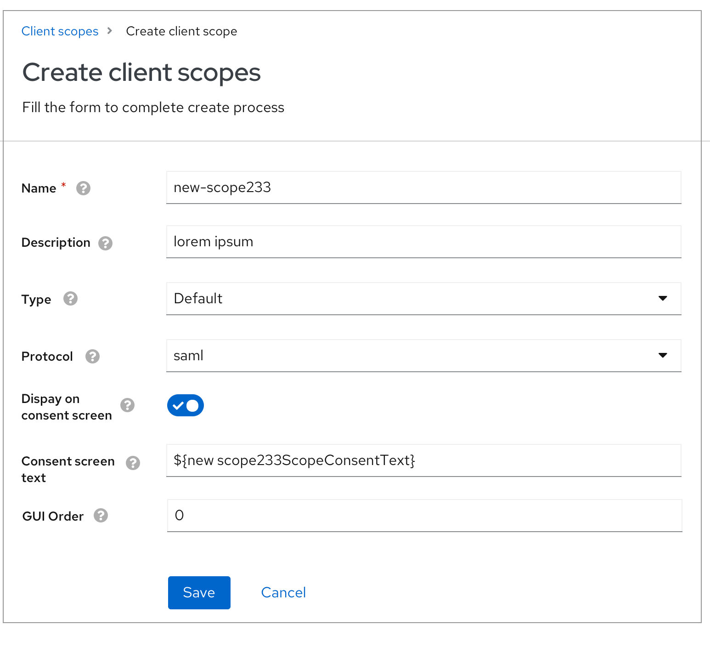
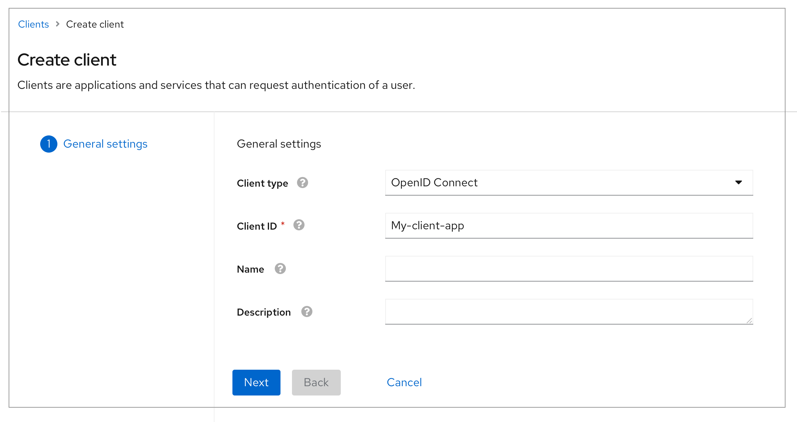
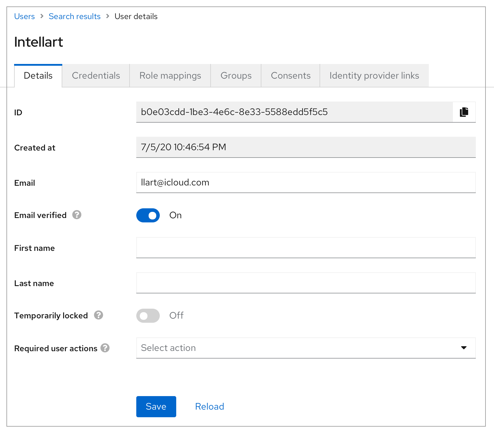
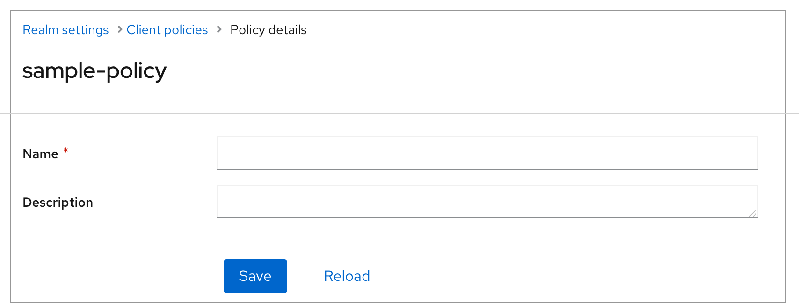
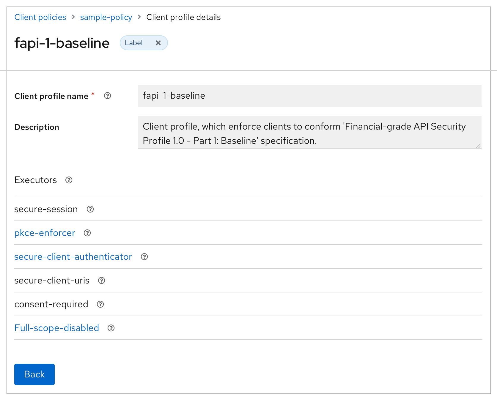
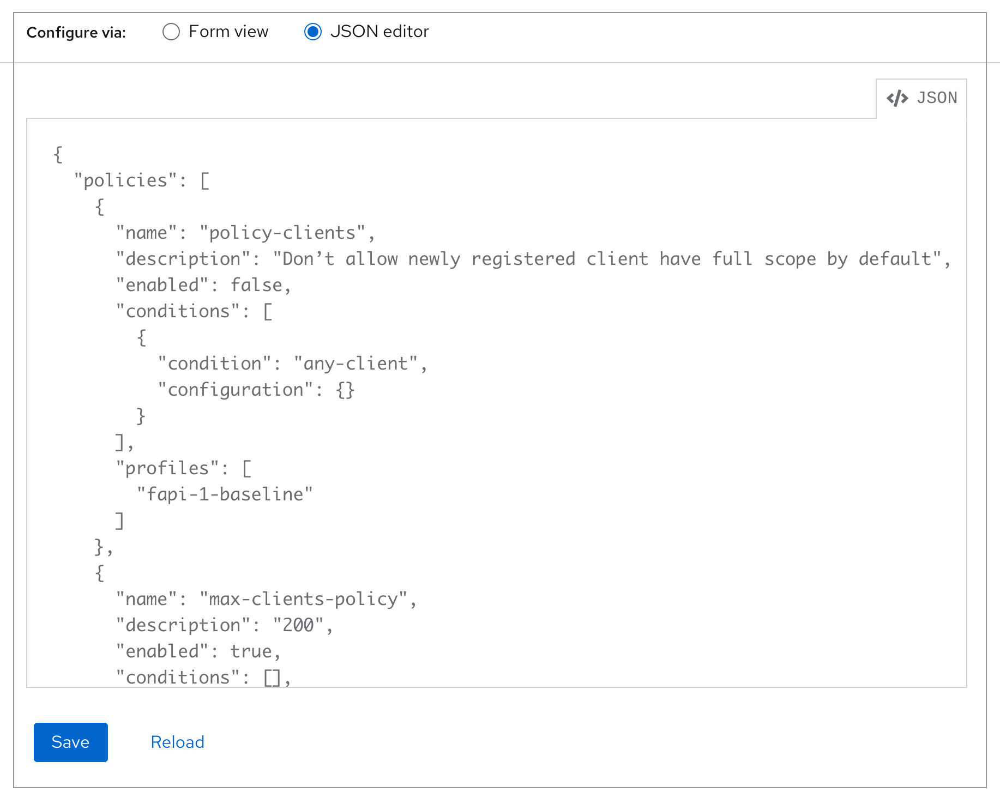
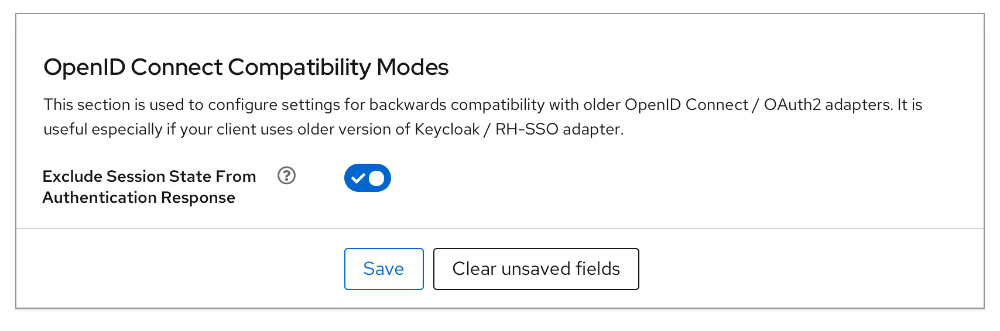

# Save button bar

In the old console, the Keycloak is broadly using the “Cancel” button to revert the changes that haven’t been saved in a form. In the new console, all the “Cancel” buttons are only used to terminate a process and return to the previous page. Meanwhile, the “Reload” button is used to cover the functionality that revert the changes that haven’t been saved in forms.

This documentation detailed records which buttons should be used in different cases.

### Create/add (full-page/modal)

* There should only be two buttons -

  "Cancel" is used to terminate the create/add progress and go back to the previous page.

### Create (wizard)

* This component follows PF4 [guidelines](https://www.patternfly.org/v4/components/wizard#basic).

### Details/edit/settings
The previous level isn’t embedded in a tab/doesn’t have previous level.

* There should be only two buttons

  Users are supposed to use breadcrumb to go back to the previous level.

### Details/edit
The previous level is embedded in a tab.

* There should be only two buttons

  When users click the previous level in the breadcrumb, it’s supposed to go to the tab that contains this object instead of the first tab.

### Read-only details/view

* There should only be one button:
  

  Users can return to the previous level by using it.

### Code editor

* There should be only two buttons

### Settings in cards

* There should be only two buttons

  Save is usually using the secondary button style.
