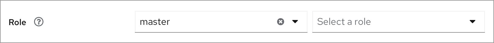
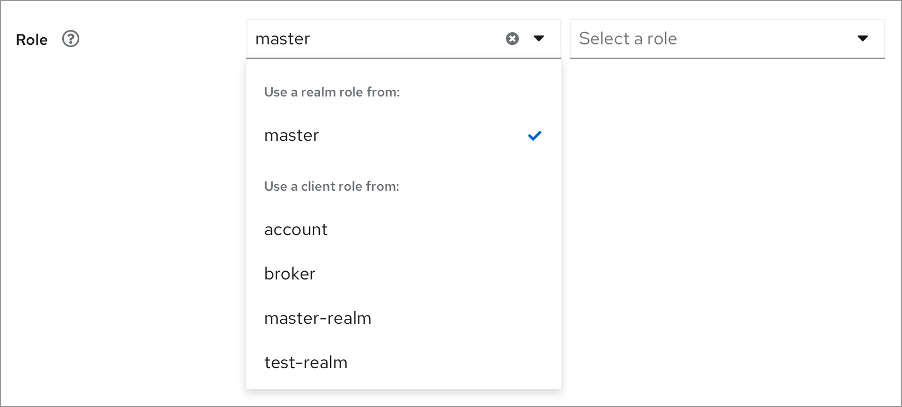
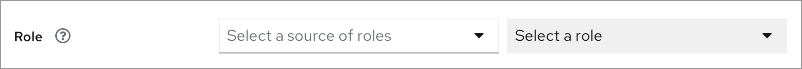
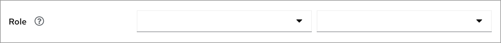
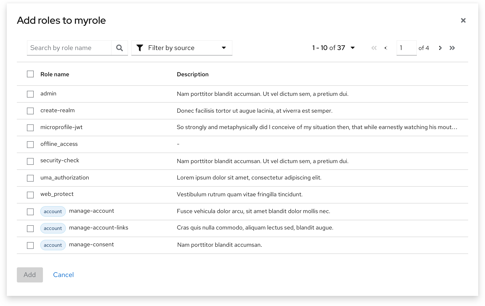
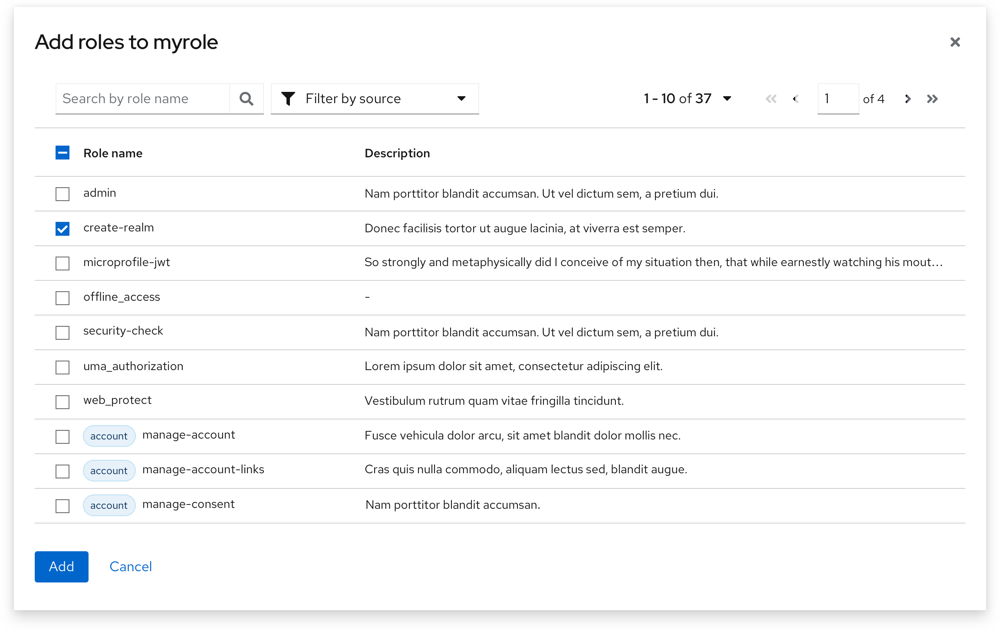
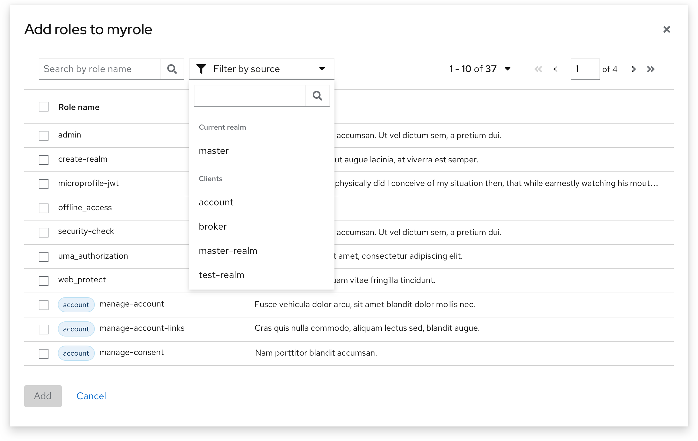

# Select role/client scope

This convention introduce the patterns that are broadly used to select the objects that could belong to different sources (realm/clients). The typical use case is to select roles and client scopes.

## Single row pattern
This pattern is usually used in a form because it occupies little space.

### Initial state

  * The current realm name is the default value of the source dropdown.

#### Dropdown options

  * The current selection is ticked.
  * Only the clients that have roles will be included as options.

### Remove the current selection of the source

  * The user can remove the default selection by clicking the “x” icon.
  * The second dropdown is disabled until the first dropdown is selected.

### Select a client role

  * After the source changing in the first dropdown, the scope of the second dropdown will dynamically change according to it.

## Modal pattern
This modal is usually triggered by an add/assign button in the objects table.

### Initial state

  * The order of the table is:
* Realm roles go first (in the alphabetical order).
* All the other client roles follow the order of their sources, which is also in the alphabetical order.
  * The roles / client scopes that already been added won’t show up in this modal anymore.

### Partially selected.

### Filter

