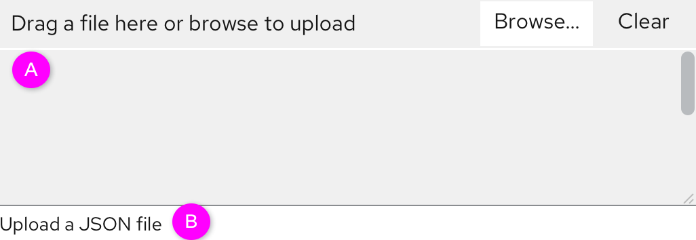
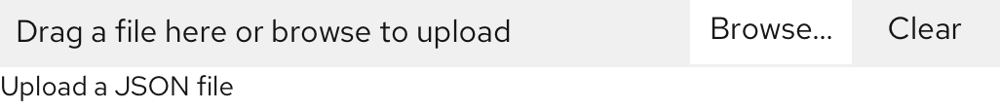

# Upload file

Based on the **[File upload](https://www.patternfly.org/v4/components/file-upload/#text-file-with-restrictions)** guidelines in the PF4, the details of the uploaded file should be displayed or hidden that  will be elaborated in this part.

### Show the details

  *  A. If the file includes some configurations that can be edited or will overwrite the existing settings, the details should be displayed.
  * B. It’s not required. If there is a format restriction, the component is Text file with restrictions. If there is no restriction, this part can be removed.

### Hide the details

  *  A. The label indicates the object’s status, attributes, etc. The label’s style should be selected according to the application scenarios.
