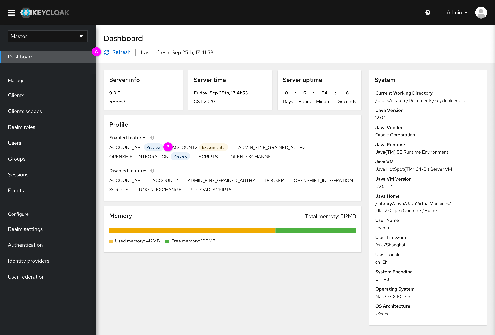
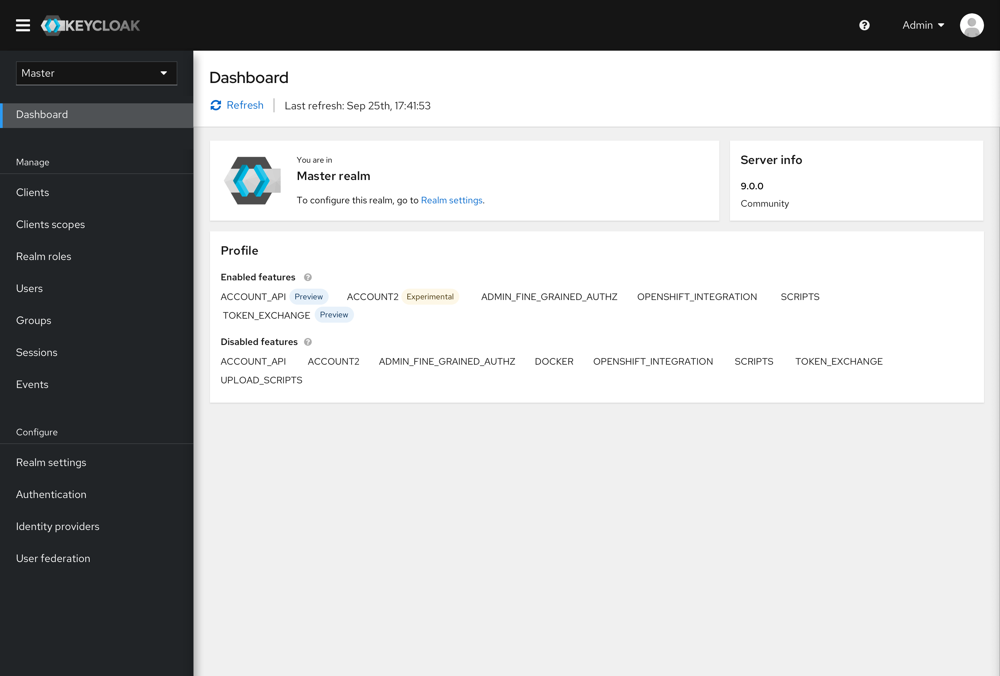
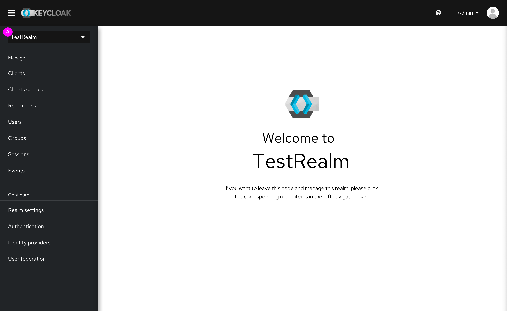

# Dashboard

This version was designed for Keycloak version 7.5. In this design, the dashboard covers server information rather than real metrics or statistics. Therefore, this design is suitable for version 7.5. If all the data is ready, we will redesign the new dashboard for further release.

The whole prototype can be accessed here: https://marvelapp.com/prototype/baei9db/screen/73638263

### Master realm
* Standalone mode

 * (A)
Refresh data: Click the “Refresh” button to update the data.
 * (B)
Profile: In the new design, enabled features and disabled features have been displayed directly. The labels indicate the types of the feature.

* Cluster mode

As for Cluster mode, the Dashboard includes Server info and Profile. In addition, there is a welcome message as the first tile.

### Non-master realm
If users change the realm from the Master realm to non-master realm, users will be navigated to this page. This is just a welcome message, no actual data. This page is displayed only once. Therefore the navigation bar on the left has no Dashboard menu.

