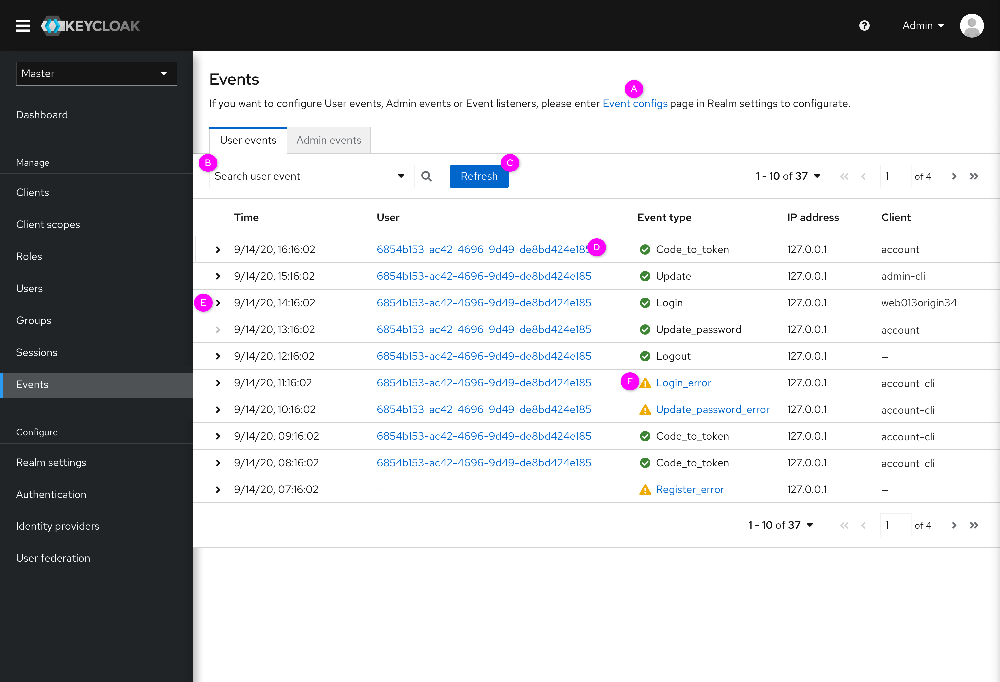
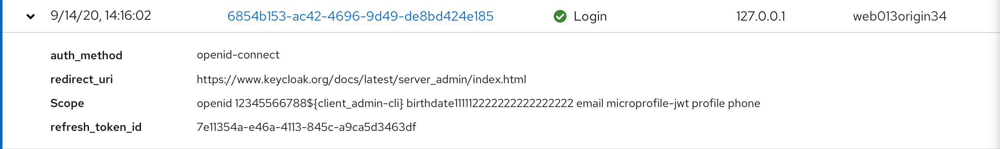
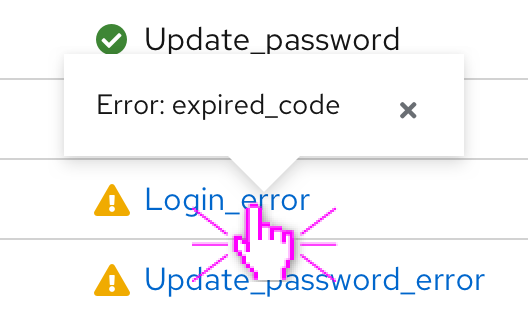
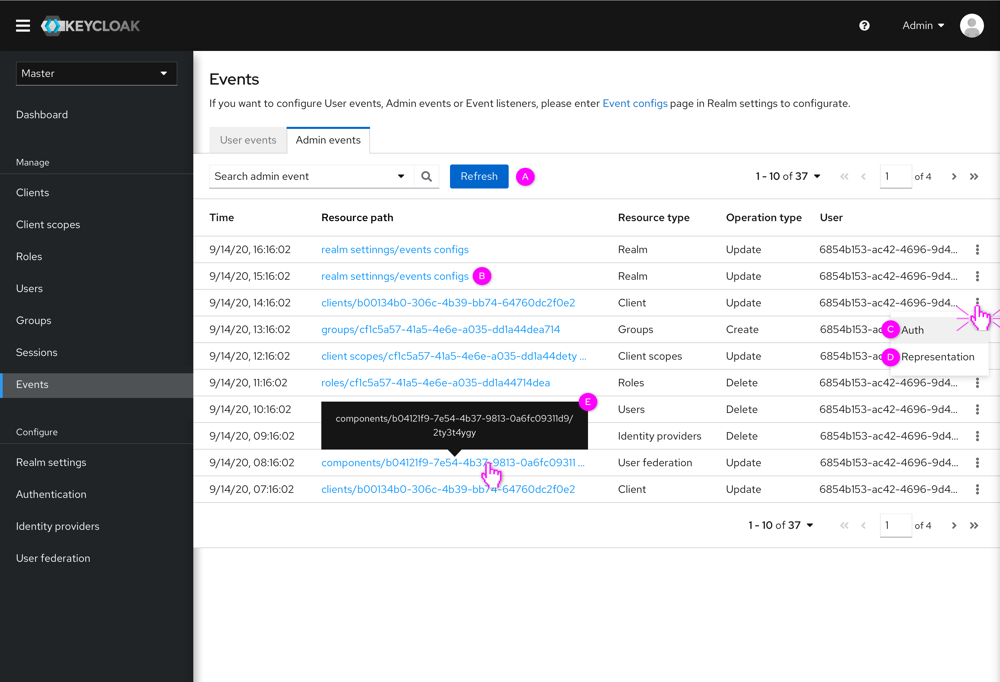
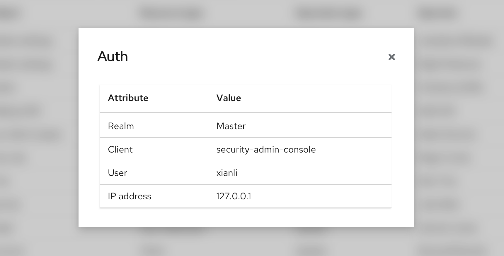
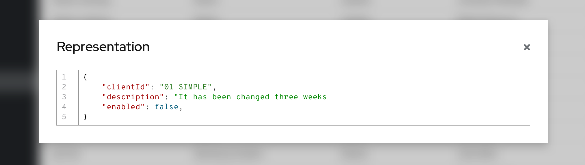

# Events

In the current console, there are three tabs in the Events menu named Login events, Admin events and Config. In the new design, Config will be moved to Realm settings and Login events will be changed to User events. This part will mainly introduce the updates of Users events and Admin events.

The whole prototype can be accessed here: https://marvelapp.com/prototype/506813g/screen/72103070

### User events

* (A)
Event configs: Clicking on the Event configs will direct users to the Event configs tab in Realm settings page.
* (B)
Search bar: Users can set up some criteria to search for the prefered events, as shown in the picture below.

* (C)
Refresh: Due to the events data is dynamic, users need to be allowed to refresh the events to view the latest info.
* (D)
UserID: Clicking the user’s ID will enter the detail page of the user.
* (E)
Collapsible list: Click the arrow to expand the details of the event.

* (F)
Event type: After clicking the error event types, the details will pop-up to show the reasons.

### Admin events

* (A)
Search bar and refresh: It is the same as what has been shown in Users events.
* (B)
Resource path: Click the resource path can direct users to the detail page of the resource.
* (C)
Auth: Click the Auth option, the auth info will pop up.

* (D)
Representation: This JSON file captures only the fields that have been changed.

* (E)
Details of resource path: If the text length of the resource path exceeds the limit, the user can hover over the resource path to see all the information.
