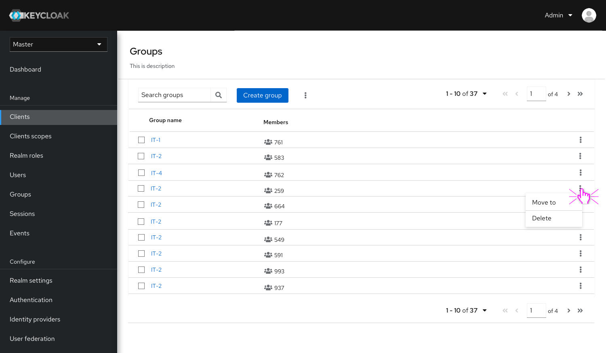
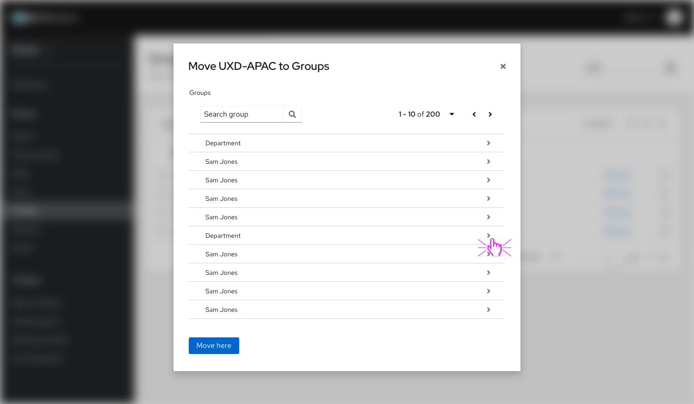
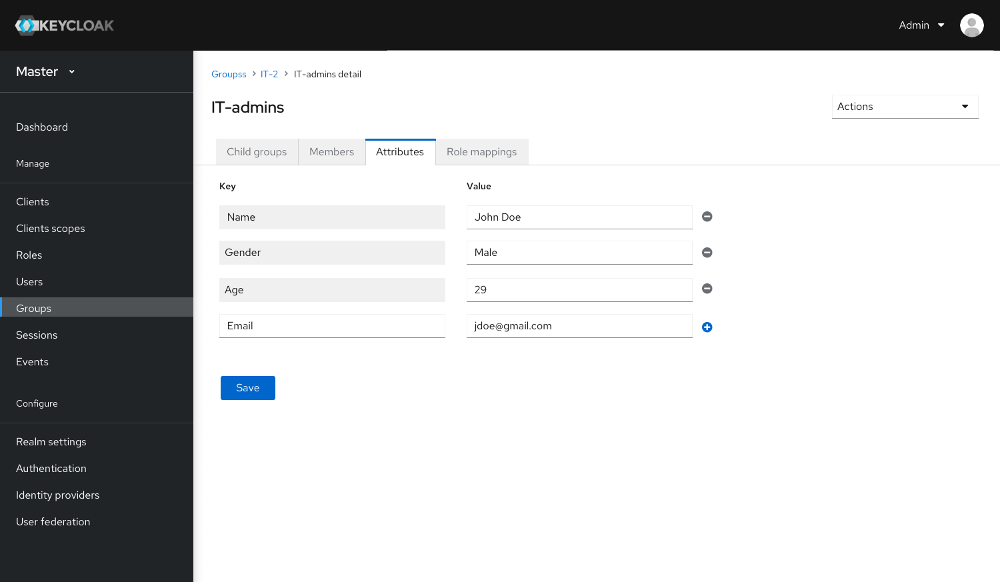
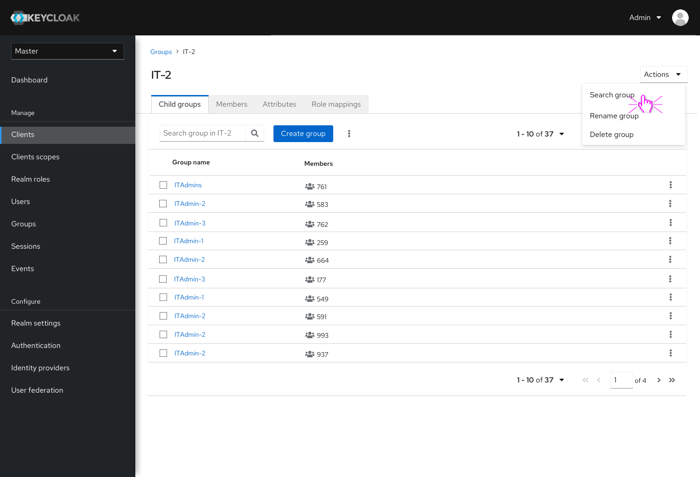
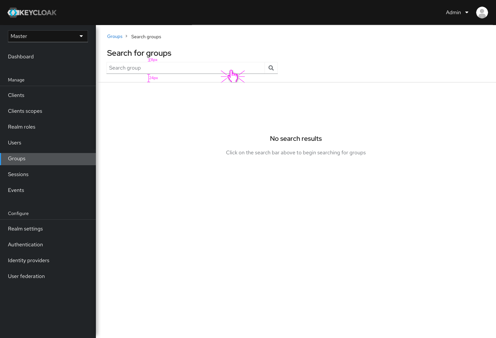
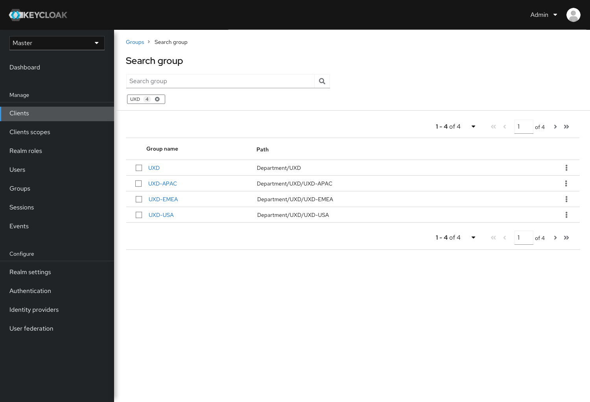
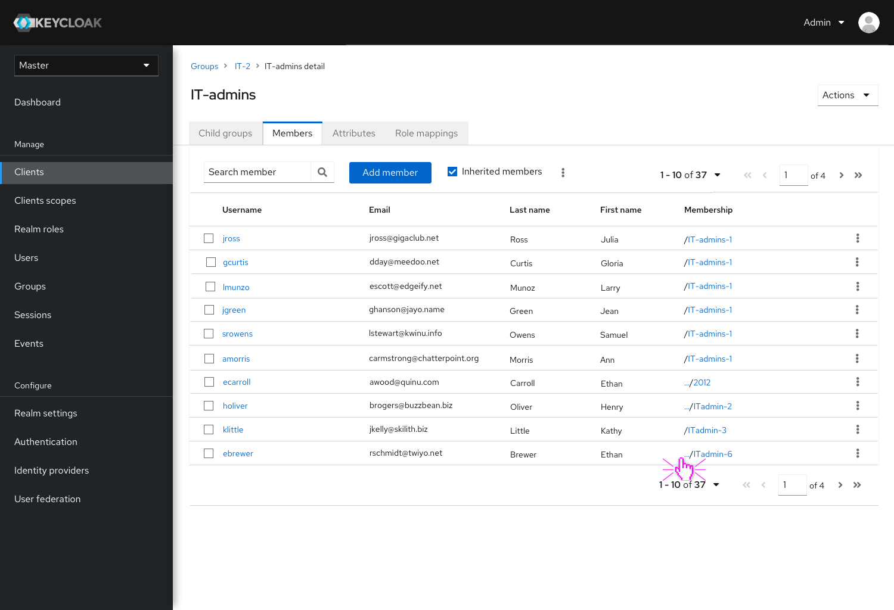
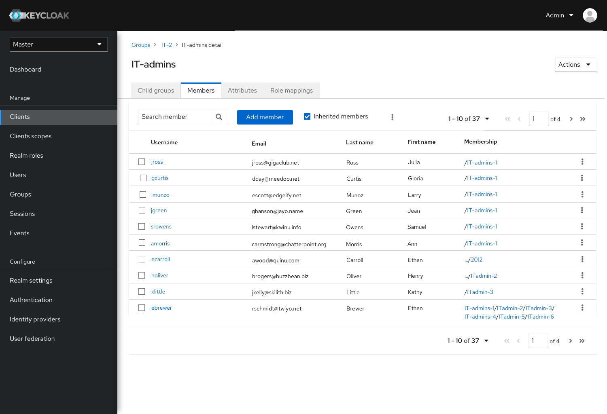
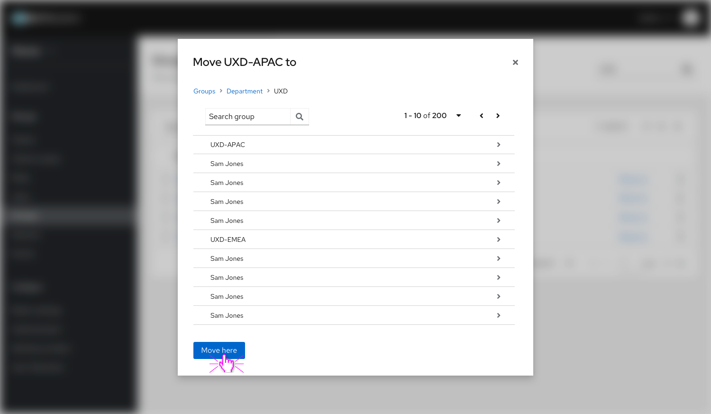

# Groups feature in Admin Console

## Groups home page

In the new Groups feature, we re-done the layout with a flat table, users can click the group name to either drill down or view the details of it. We also re-designed the Move feature by using a simple pop-up table to move a group into another one, instead of clicking the buttons to move.

This is the initial version of Groups feature redesign, changes or updates will be published to this site in later release.

### Layout improvements

#### Home page - new table format
* Add a new column to show members count in home page.
* Click kebab icon in table to do actions.

* New "Move" groups pop-up table view.
* Click arrows at right to drill down to children levels.

* Members page & attribute page new layout

### Function improvements

#### Search groups function
* Click "search group" option in Actions dropdown on page header.
* Global search page - A new screen for users to search groups, and use breadcrumbs on top to navigate back to previous pages.

#### Members page
* By default, users will see all direct assigned members to this group, click "Inherited members" to show only inherited members in this group.
* In inherited members view, click "..." to expand and see the complete path of membership groups.

#### Move Groups
* Click arrows to drill down.
* Use breadcrumbs to navigate back and fourth.
* "Move here" means directly moved to this current level.

