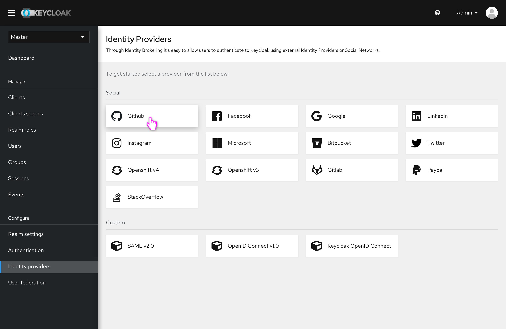
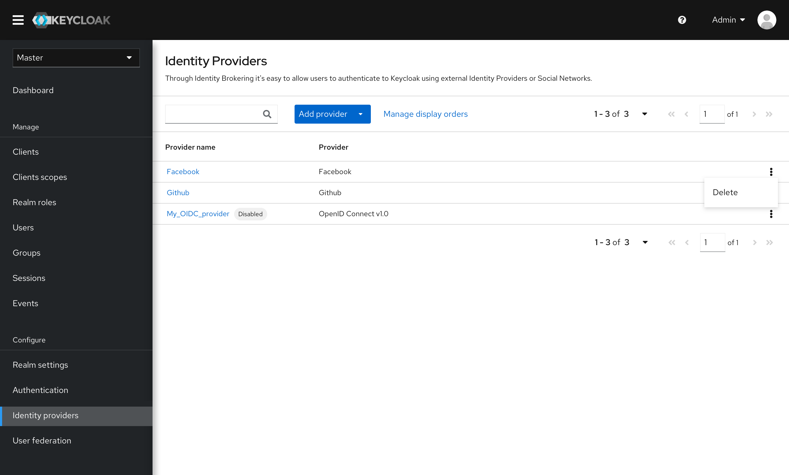
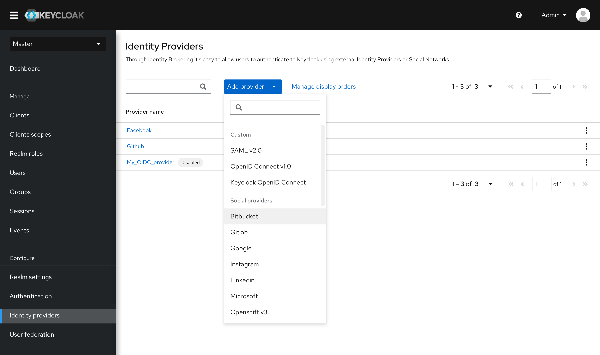
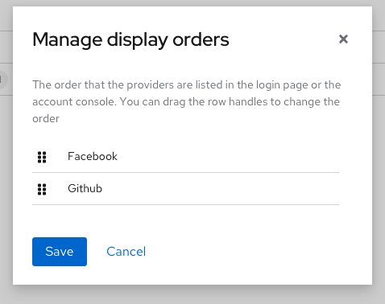

# Identity Provider List

## Empty State

When there are no Identity providers added at first, an empty state will be displayed. All the available providers are listed as cards. Clicking a card will start the creation process

## Identity Provider List

* All the providers will be listed in alphabetical order.

* Users can add more providers through the dropdown.
* A search box is provided for quick locating to the result.

* The display order of all the providers can be managed in a small modal. The display order refers to the order that the providers displaying on the login page.

