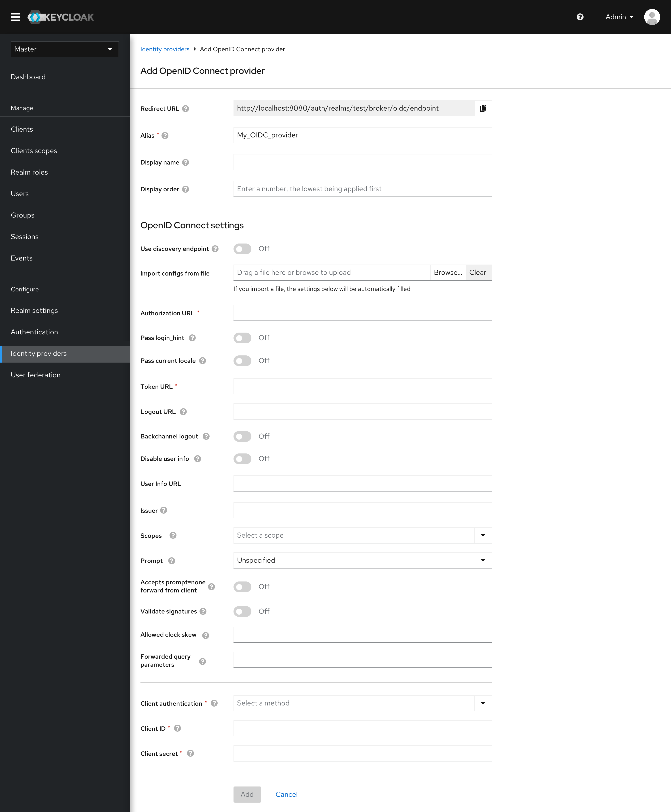
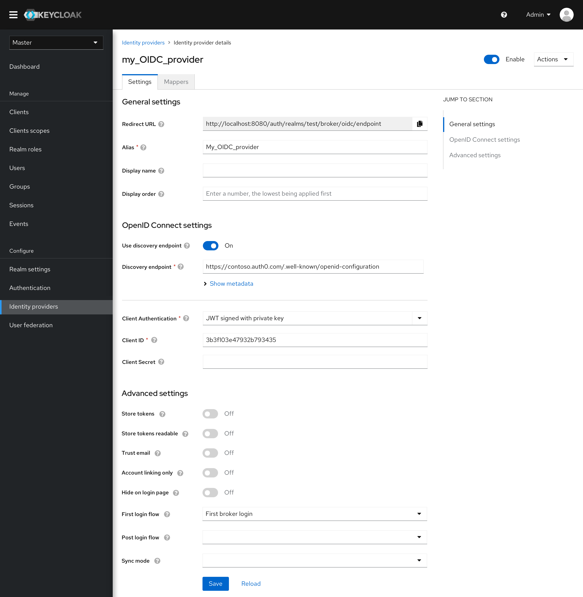

# OIDC Provider

## Add OIDC Provider

Add OIDC provider has been simplified to only include the basic settings and the OIDC settings.

* The experience of using a discovery endpoint has been simplified. If an available endpoint is provided, the metadata will be loaded automatically. Users can complete the configuration very easily.

* If a discovery endpoint is not provided, users can fill the form by importing a config file or manually.

## OIDC Provider Settings

* The settings form provides the additional advanced settings.
* Jump links are provided in the right to quickly jump to the specific section.

