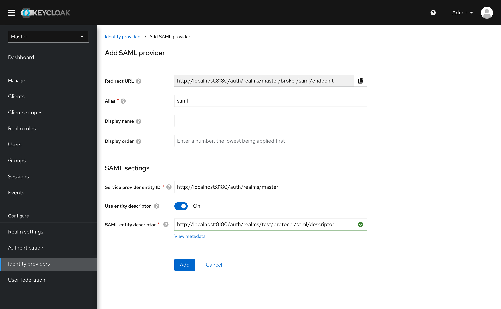
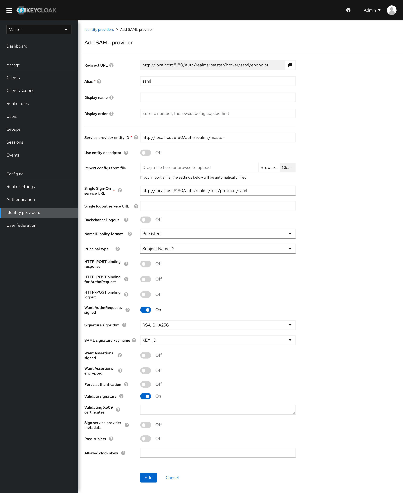
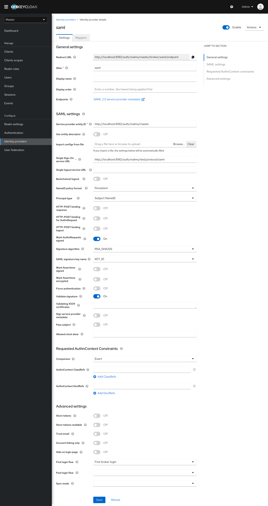

# SAML Provider

## Add SAML Provider

Add SAML provider has been simplified to only include the basic settings and the SAML settings.

* The experience of using an entity descriptor has been simplified. If an available descriptor is provided, the metadata will be loaded automatically. Users can complete the configuration very easily.

* If an entity descriptor is not provided, users can fill the form by importing a config file or manually.

## SAML Provider Settings

* The settings form provides the additional advanced settings.
* Jump links are provided in the right to quickly jump to the specific section.

