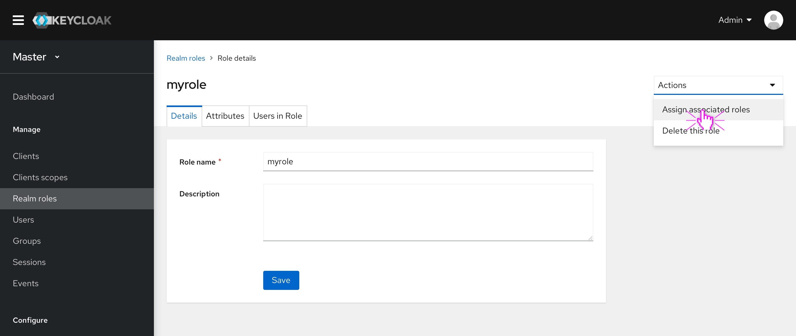
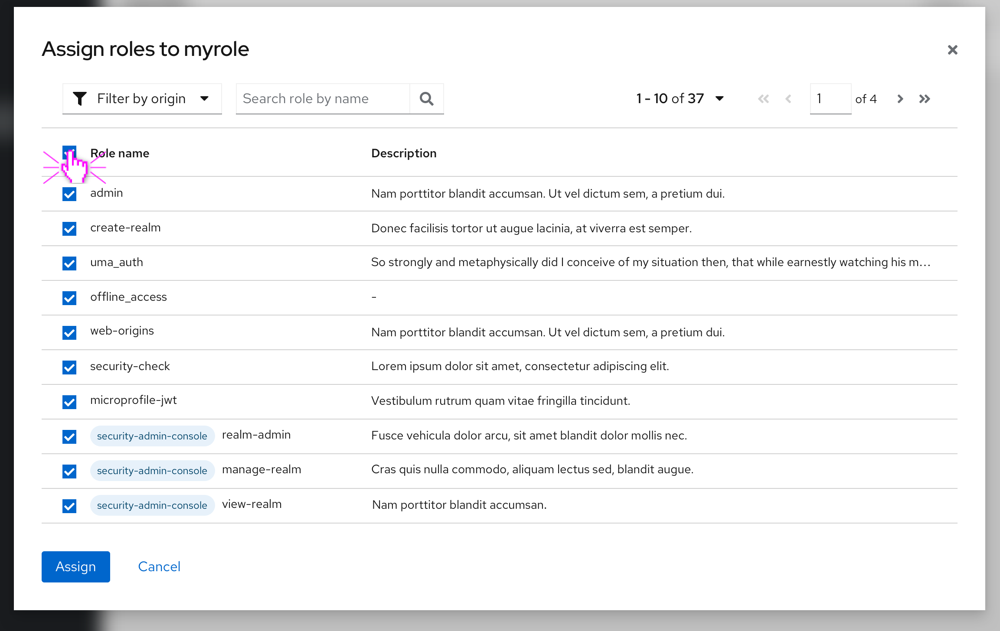
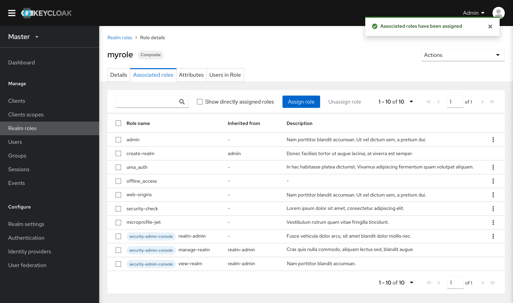
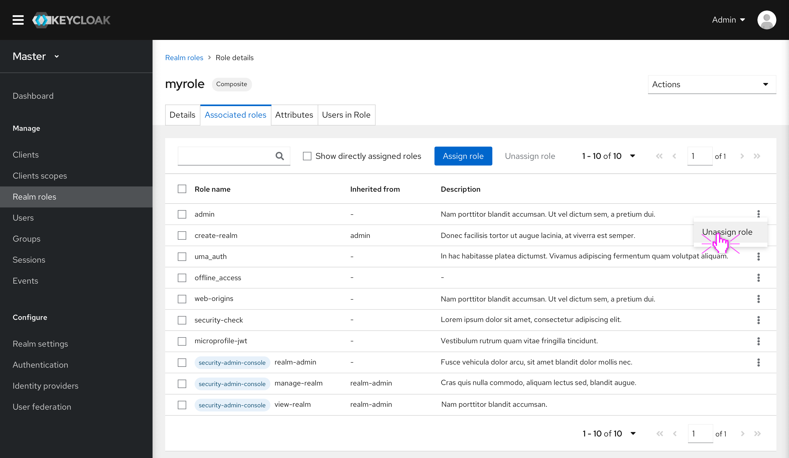
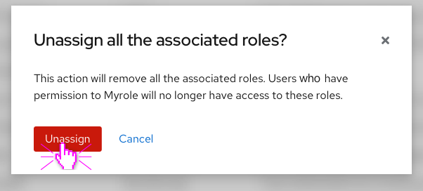
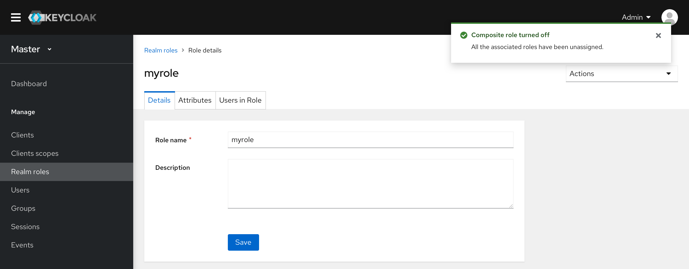

# Composite role

In the new design, the Composite role function is separated into a new tab. This tab is hidden by default until associated roles are assigned to this role.

## Turn a role into composite

* A role can be turned into a composite one when it is assigned with associated roles. By default, this function is in the top-right menu.

* Clicking the option will pop up a role assignment modal. All the available roles will show up in the list.
* The roles list includes all the available realm roles and client roles. It can be filtered by different origins, i.e. realm, client names. A search box can also be used to search by role name.
* One or more roles can be selected and assigned at a time.

* Once the associated roles are assigned, this role turns into a composite role. A new tab will appear next to the Details tab. And all the associated roles will show up under this tab.
* A Composite label will show up next to the role name in the header.
* This list displays all the effective roles. That means if a composite role has been assigned to this role, all the roles associated with it will also show up on the list. The “Inherited from” indicates the role that this role is associated with.
* If “Show directly assigned roles” is enabled, only the directly assigned roles will show up.

## Unassign role

* Users can unassign one or more roles at a time.
* Only the directly assigned roles have the unassigned function.
* If a composite role is unassigned, all the roles associated with it will be unassigned together.

## Turn off composite

* When all the assigned roles are unassigned, the composite role will turn into a common role.
* All the associated roles can be unassigned in one click. This function is in the top-right menu.

* Clicking the option will pop up a confirmation modal.

* After unassign all the associated roles, the composite role turns into a common role. And the Associated roles tab is closed.
* The Composite label will not show up in the header anymore.

