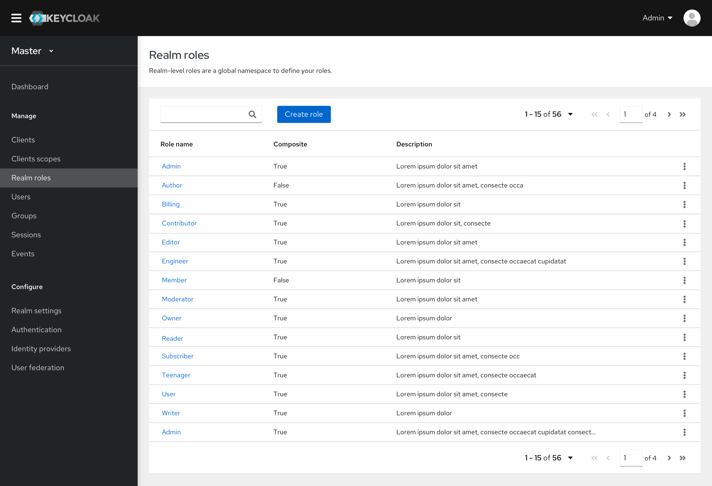

# Roles list

* The Roles list is basically the same as the current console. It will have 3 columns: Role name, Composite, and Description.
* The Default roles function has been removed from this section. See details in the [overview of Roles](https://www.keycloak.org/keycloak-community/design/admin-console/#/RealmRoles/overview).

## Search roles

* The search box will allow users to filter the roles list by Role name or Composite attribute. Upon hitting the search icon or ‘Enter’, filter chips will be added to the second row of the toolbar.

