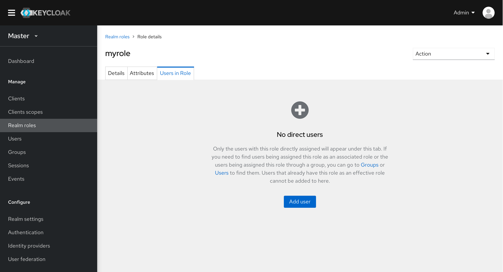
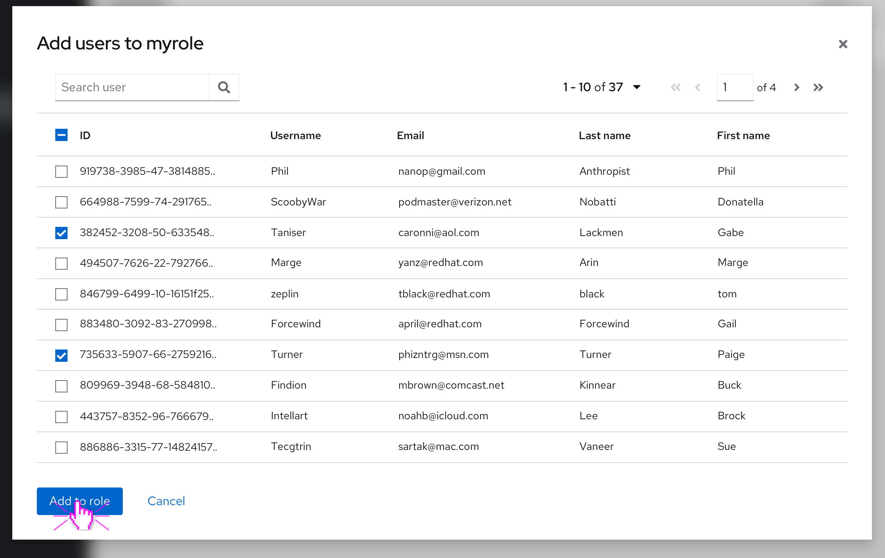
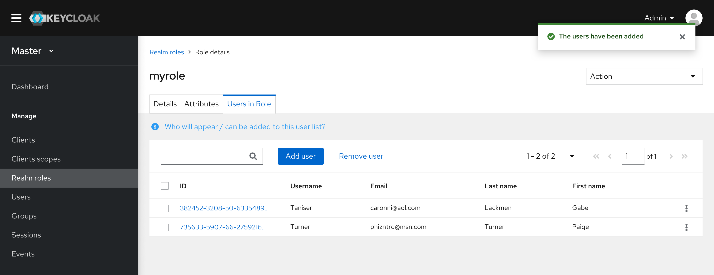
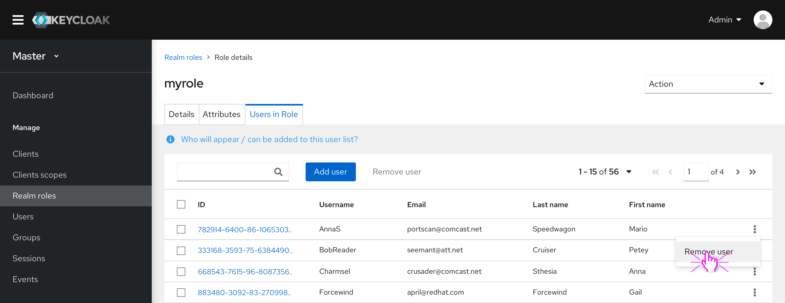
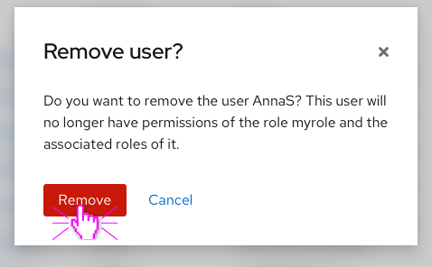
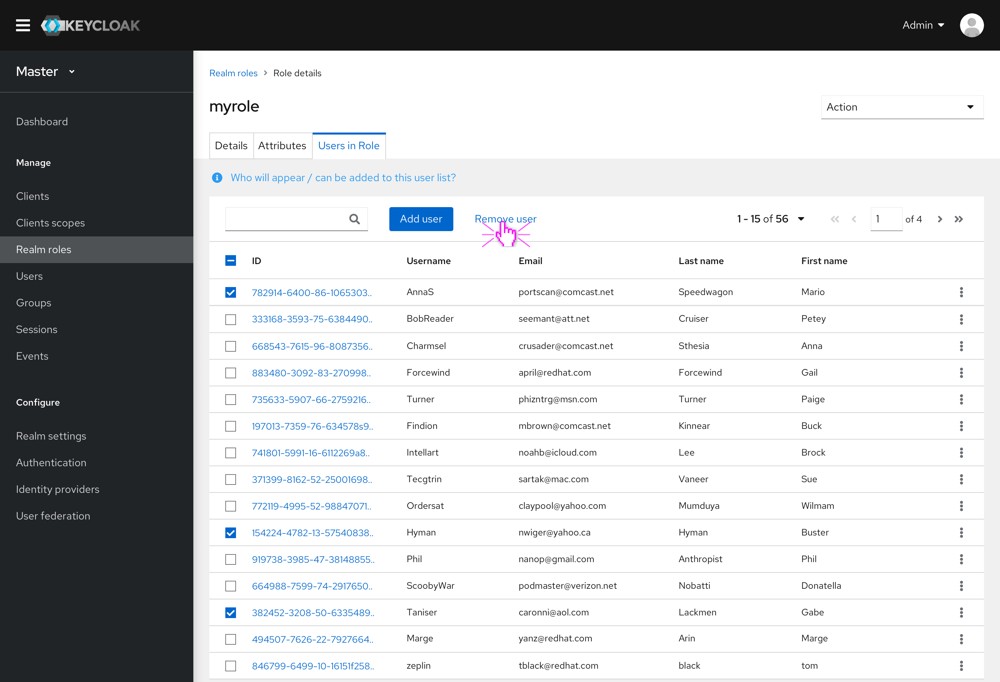
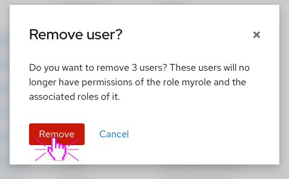

# Manage users in Role

The Users in Role tab lists all the users who have this role assigned. In the current console, these users can only be viewed. But in the new design, users can be directly added to/removed from this tab.

## Empty state

An empty state occurs when no users have this role directly assigned. That means if this role is assigned to a user as an associated role, that user won’t display under this tab. Also, if this role is assigned to a group that includes some users, those users won’t display here as well.

## Add users

* Users can be added to this role through the Add user function. Upon clicking the Add button, a modal with the whole list of all available users will pop up.
* Users that already have this role as an effective role won’t appear in the list and cannot be added here.

* A toast alert will appear when users are added successfully.
* The added users will appear under this tab.

## Remove users

The users can either be removed one by one or bulk removed.

### Remove a single user

* Clicking the kebab shows the Remove user action. This action can remove a single user.

* Clicking the Remove user button will pop up a confirmation modal.

### Bulk remove users

* If multiple users are selected, the Remove user action in the toolbar will be enabled. This action can remove multiple users.

* Clicking the Remove user button will pop up a confirmation modal.

