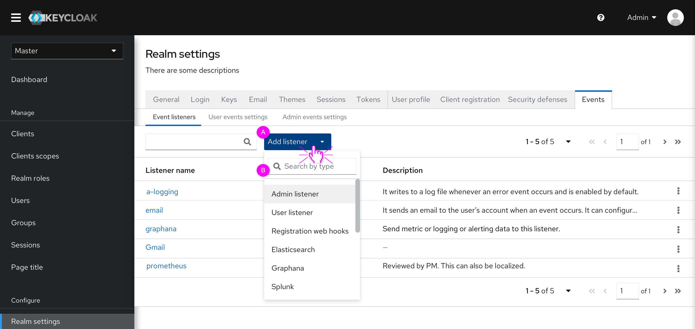
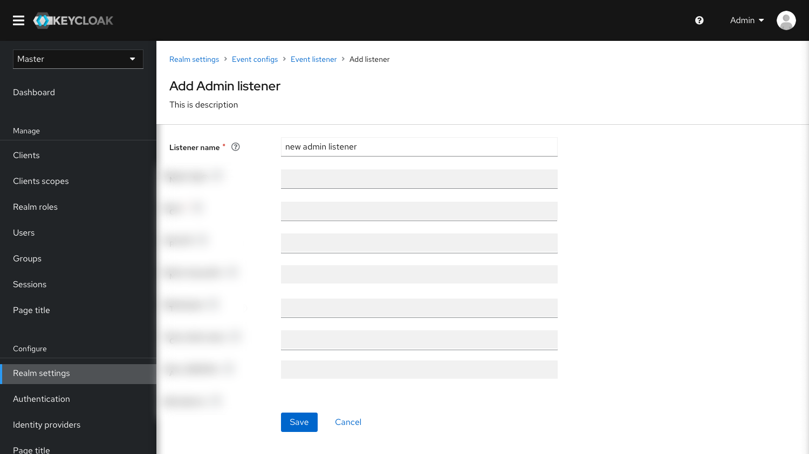
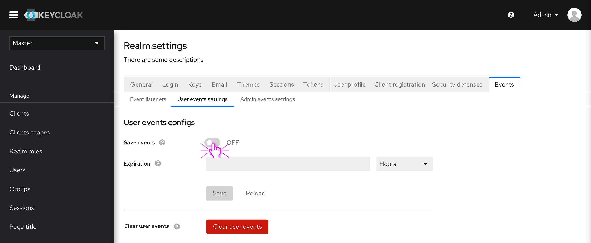
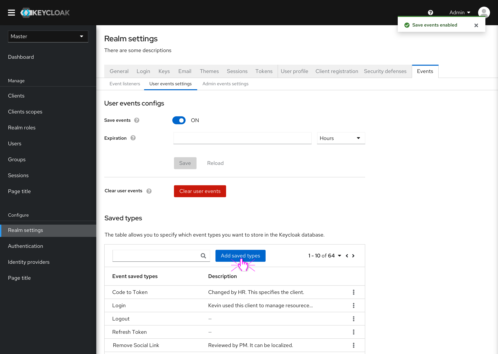
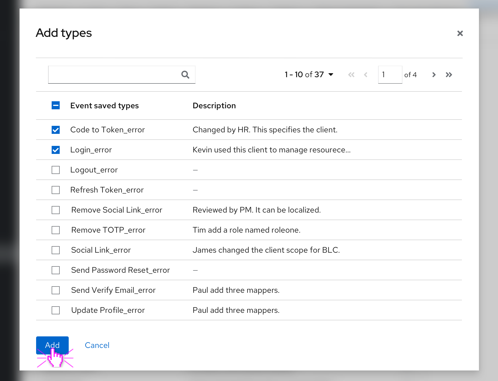
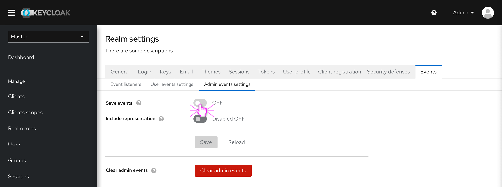
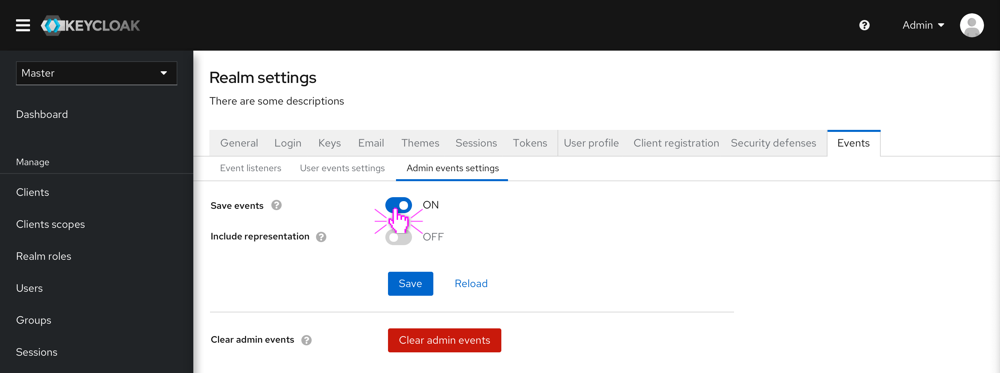
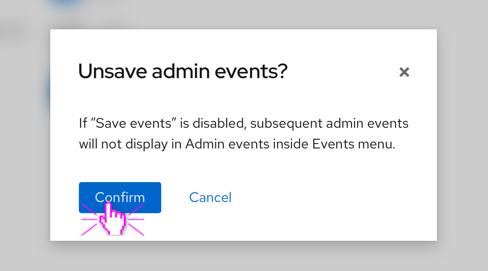
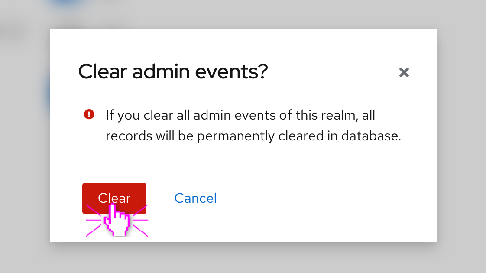

# Event configs

In the new design, Event configs will be moved to Realm settings. Event configs tab has three sub-tabs namly Event listener, User event settings and Admin events settings. In this way, the configuration is separated from the view of events. Users can focus on different requirements when using Events.

The whole prototype can be accessed here: https://marvelapp.com/prototype/256i2h2g/screen/72446165

### Event listeners

* (A)
Event listeners will not just be added, but also have configuration options when added. There can also be multiple instances of the same event listener (with different configuration). It is similar to Identity provider or User federation.
* (B)
“Listener type” is equal to “Listener” of the current console, including jboss-logging, email and so on. Based on the same listener type, users can create different listeners.

Some details of the creation page and edition page are not determined. This is just a rough layout.

### User events settings
* Enable Save events

After enabling the "Save events", users can set up the "Expiration" and manage the saved types. In addition, Keycloak will record all the subsequent user events.

* Add saved types

After clicking the "Add saved types" button, users can select and add some types from the modal below.

 

### Admin events settings
 * Enable Save events
 

 After enabling the “Save events”, Keycloak will record all the subsequent admin events.

 * Disable Save events
 
 After disabling the “Save events”, Keycloak no longer records all the subsequent admin events. After clicking the "Save" button, there will be a reminder pop up, as shown below. The same thing goes with “User events settings”.

  

 * Clear events
 
 Click the “Clear all admin events” button, the reminder will pop up. After clearing all admin events of this realm, all records will be permanently deleted. It is the same as the truth with “User events settings”.

 
