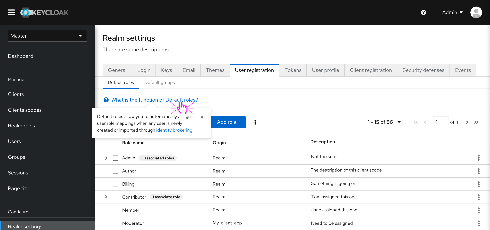
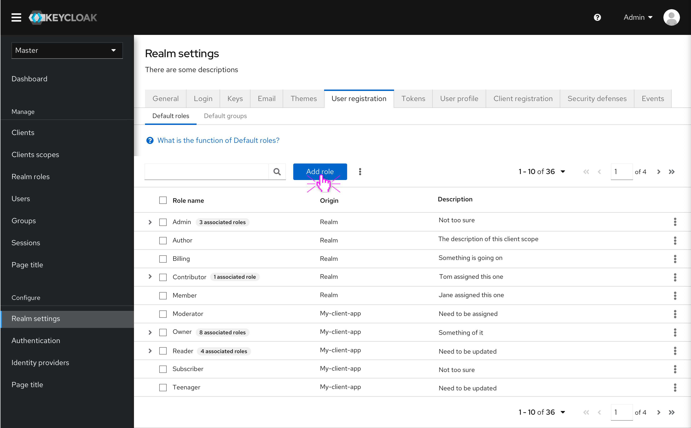
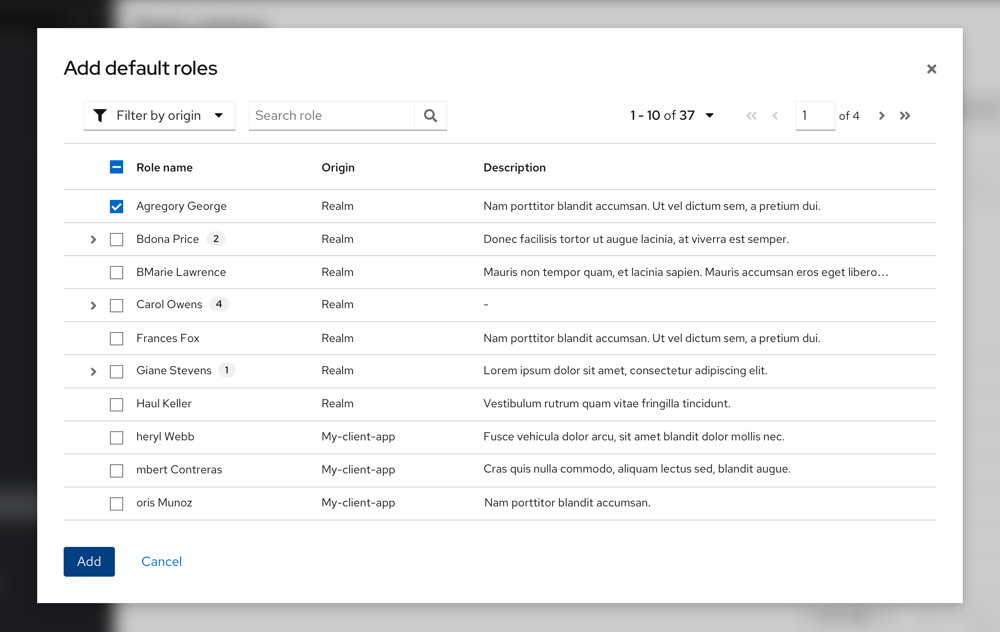
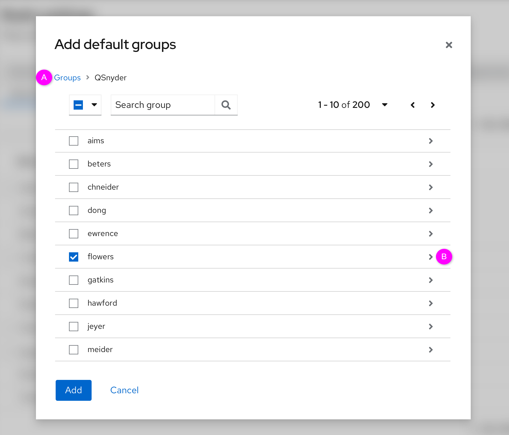
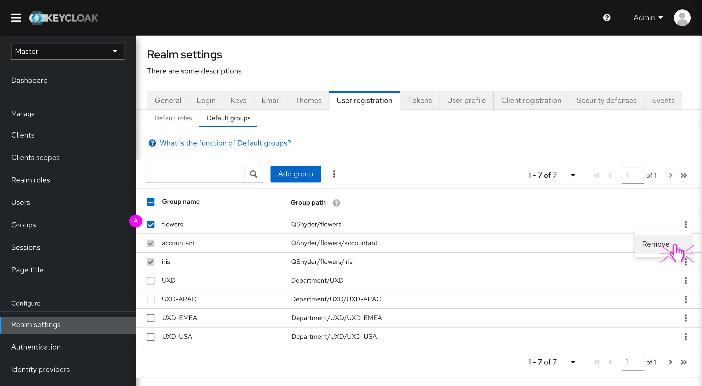
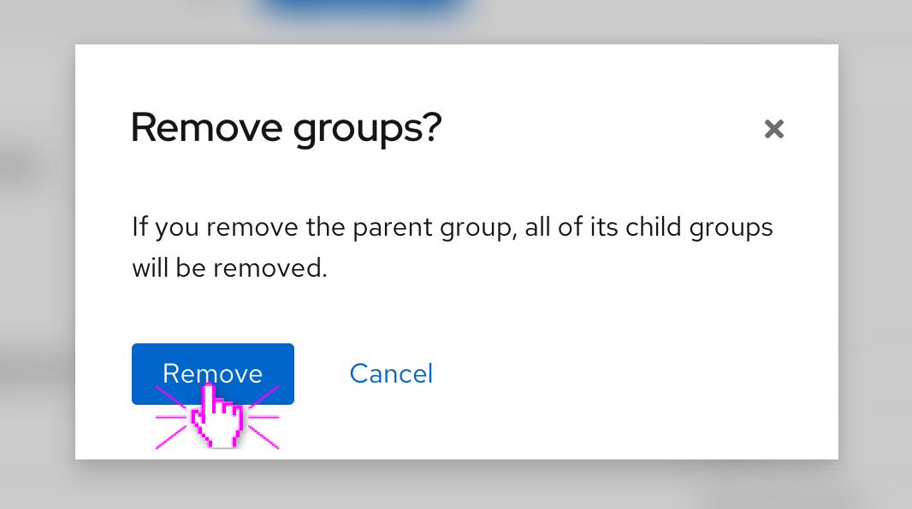

# User registration

In the new design, the default roles from "Roles" menu and default groups from "Groups" menu will be merged together in Realm settings called “User registration”. This part will introduce some designs and updates of "User registration".

The whole prototype can be accessed here: https://marvelapp.com/prototype/7gaf163/screen/74810895

### Default roles
Default roles allow users to automatically assign user role mappings when any user is newly created or imported through Identity Brokering.

* Help info

 Clicking on the link text brings up an explanation to help novice users better understand the feature. The similar thing happens to "Default groups".

* Add default roles

After clicking  “Add roles” button, the roles table will popup as shown in the screenshot below. Users can add some roles from this table.

 

### Default Groups
 Default groups allow users to automatically assign group membership whenever any new user is created or imported through Identity Brokering.

 * Add default groups

 

  After clicking  “Add groups” button, the group table will popup, as shown in the screenshot below. Users can select one or more groups to add to the default group.

  

  * (A) There is a breadcrumb to indicate the group’s path.
  * (B) Click the arrow to see the subgroups of the parent group.

 * Remove groups

 
 Users can select one or more groups to remove. If users select the parent group, all of its child groups will be selected automatically. After clicking the "Remove", there will be a reminder for users, as shown in the modal below. Clicking the "Remove" button, all selected groups will be removed.

 
