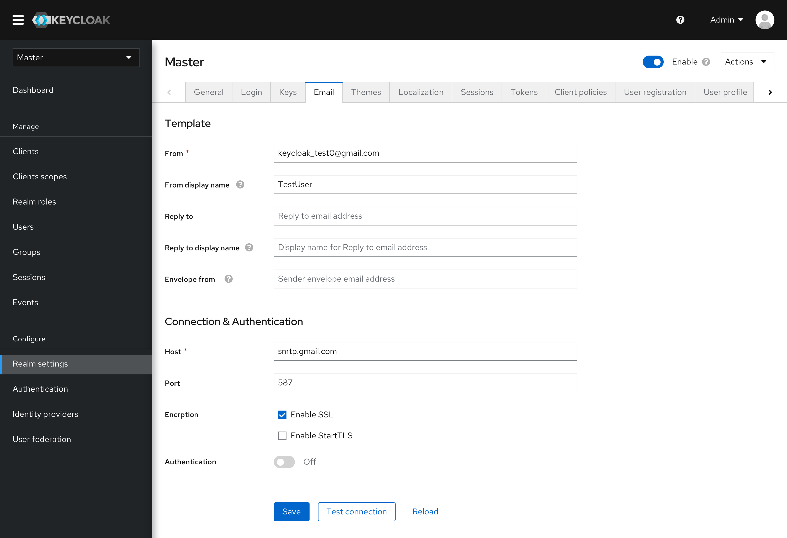
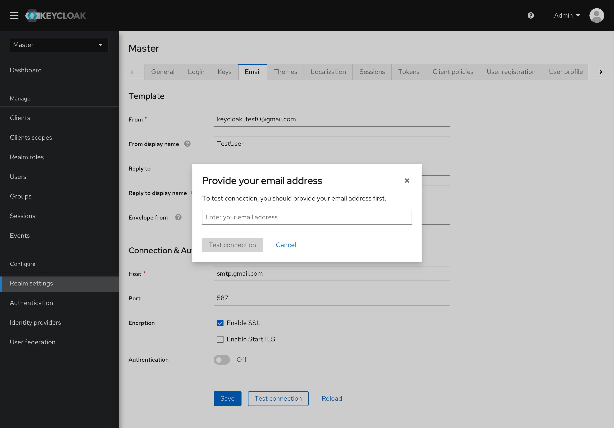

# Email

All the email settings have been reorganized and grouped. Users can configure the email template and the connection/authentication separately.

* The test connection button has been moved to the button bar.

* If the administrator doesn't have an email address recorded in this realm, saving the configuration won't return an error message, but an input box to complete the info.

