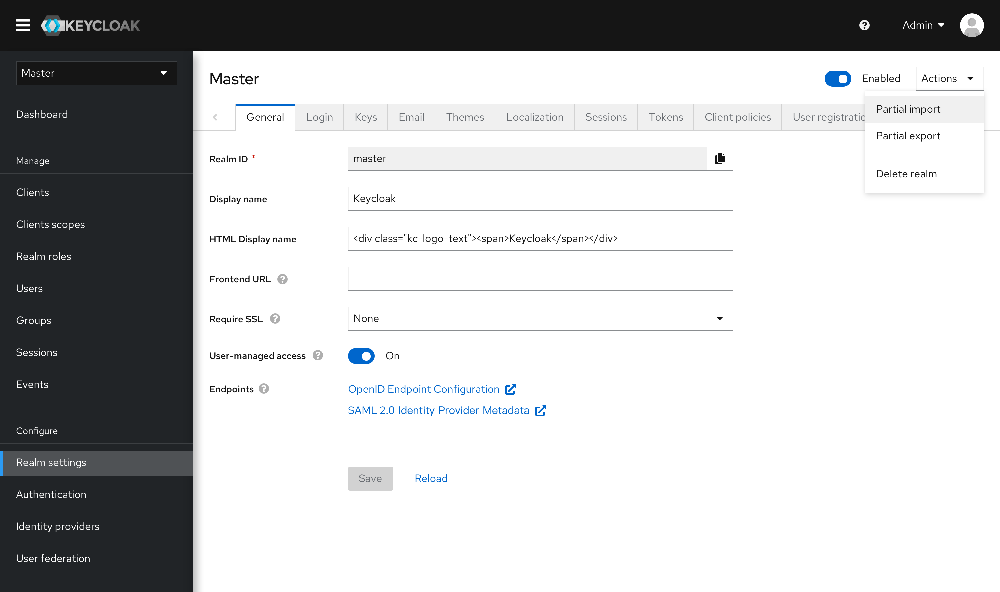
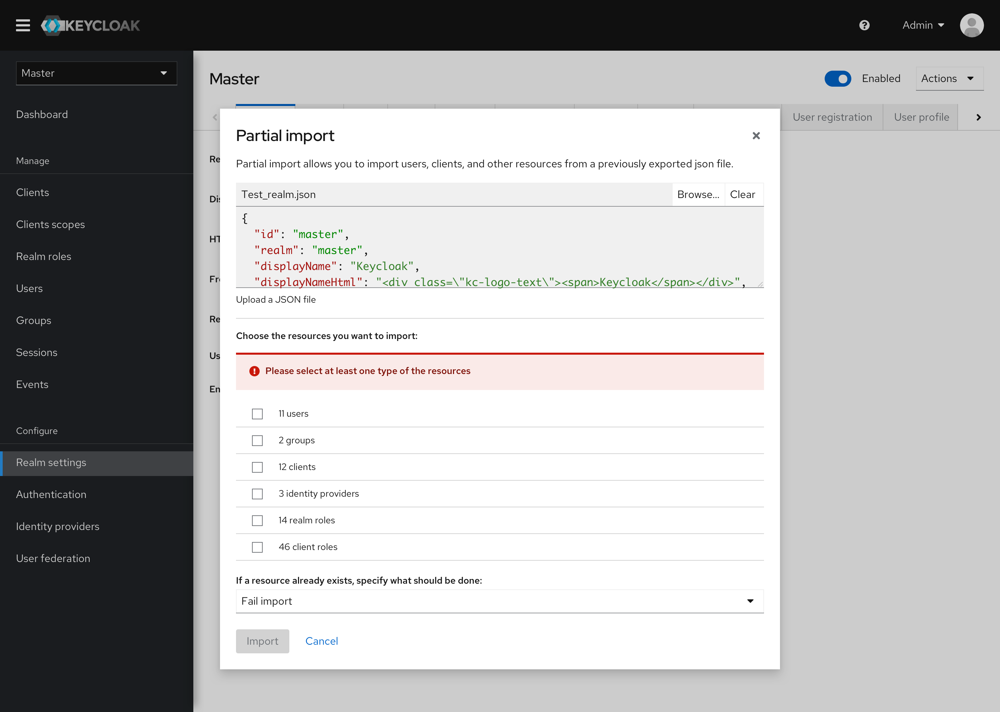
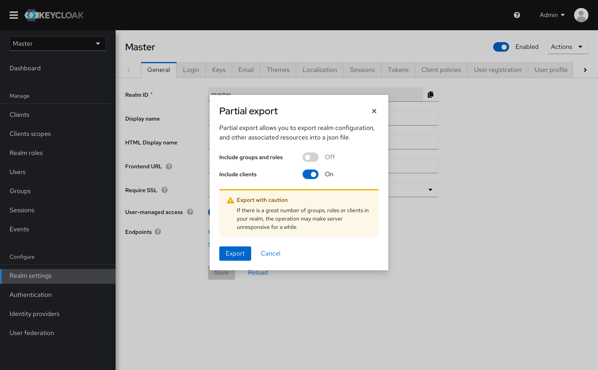

# General

* The Partial import and export are moved to the Realm settings as the realm actions.
* The enable/disable action is also moved next to the actions area.

* In the new design of the Partial import modal, users can preview the uploaded JSON file directly.
* Proper validation is provided.

* Proper validation is also provided during the Partial export.

