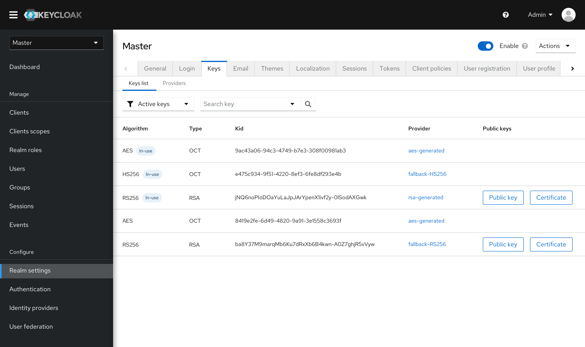
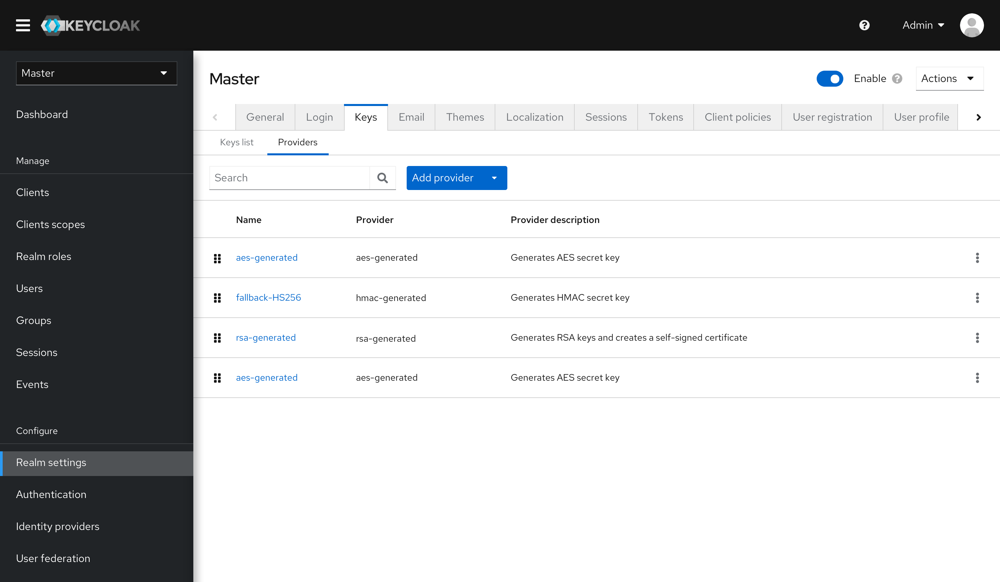

# Keys

## Keys list

* The new design integrates the different types of keys in a single list. Users can still look into each type separately by using the filter.
* For each key, the priority attribute is removed. As the keys actually follow the priorities of their providers. The priorities are indicated by their order in the list instead.

## Providers

* The priority of the provider is not defined by a number anymore. Users can define the priority by dragging and dropping the rows to change their orders in the list.

* A provider can be added or configured by a modal.

