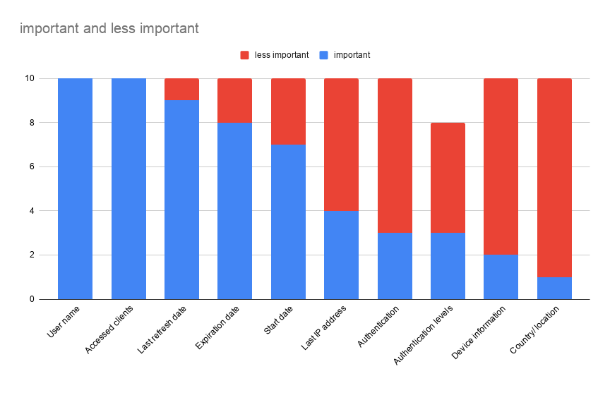
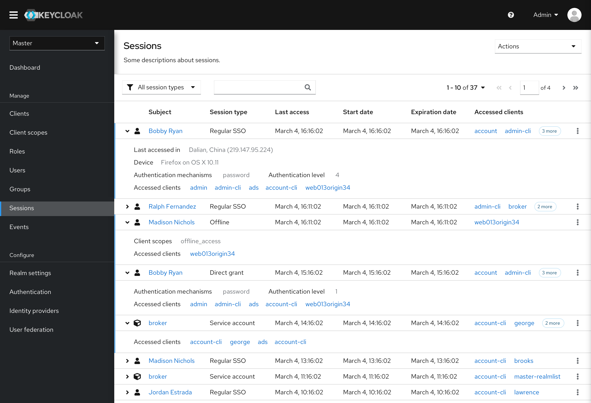
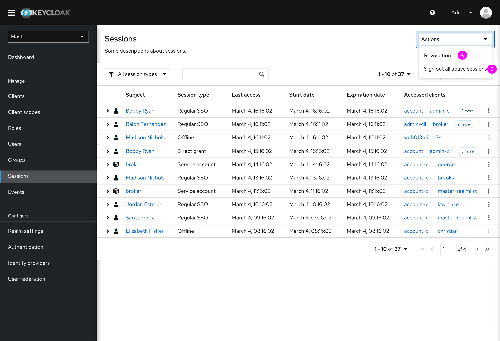
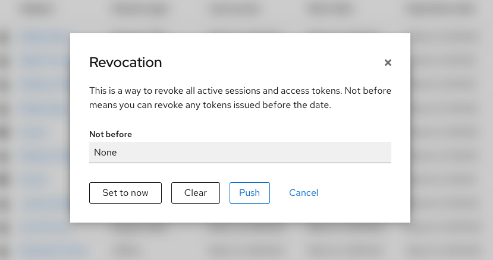

# Sessions

In the new design, sessions in Clients and Users will be merged into the Sessions menu in the navigation bar. In addition, “Offline access” in Clients will also be merged into the Sessions menu as “Offline sessions”. This document focuses on three parts: the main updates of the Sessions types, the layout of the Sessions table and some subtle changes.

This document only records the main changes. The whole prototype can be accessed here: https://marvelapp.com/prototype/751c046/screen/69416459

### Updates of Sessions type
In the new design, types of sessions will be expanded to Regular SSO session, Direct grant (single application session), Offline session and Service account session.

* Regular SSO session:
A regular login session where a user is logged-in through a user-agent (web browser). The user will authenticate to one or more applications as part of the shared SSO session.
* Direct grant (single application session):
A user enters credentials directly into an application that exchanges it for a token. The application then has a session with Keycloak for that single application.
* Offline session:
An application that has been given offline access to a user's account. Offline access basically means an application has been granted “permanent” and limited access to the user’s account.
* Service account session:
An application can obtain access on behalf of itself. Right now an application creates a session and can refresh the token within this session. We are considering changing this to not issue a refresh token to an application, but instead simply issue a short-term access token that can not be refreshed. In this case we may most likely want a single session for a service account that is associated with all current tokens.

### Layout of sessions table
We invited 10 users to participate in our usability testing for Keycloak admin console new design. One of the test tasks is to have users categorize sessions fields in terms of importance according to their real application scenario. The result is shown in the figure below.

Based on the result, we redesigned the layout of the Sessions table. The important fields are shown directly in the table ,including Subject, Sessions type, Last access, Start date, Expiration date and Accessed clients. Some other less important fields are hidden in the collapsible list. Users can click the arrow or label to view these details. By this way, users can focus on the important information when they enter this page. As shown in the picture below.

### Revocation and sign out sessions
In the new design, the “Revocation" tab and “Sign out sessions” button have been moved to the Actions drop-down menu.

Clicking “Revocation” or “Sign out all active sessions”, there will be a modal pop up. Note that the current design allows only active sessions to be signed out.

