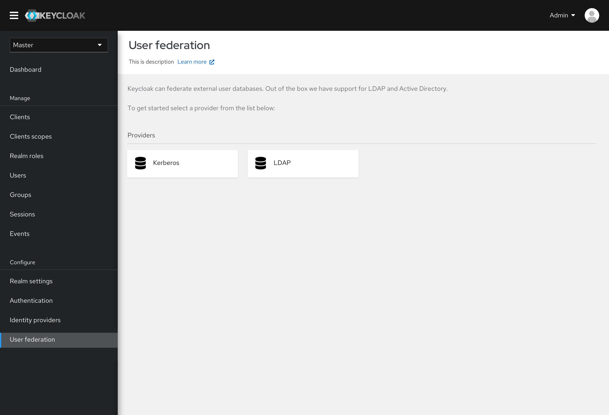
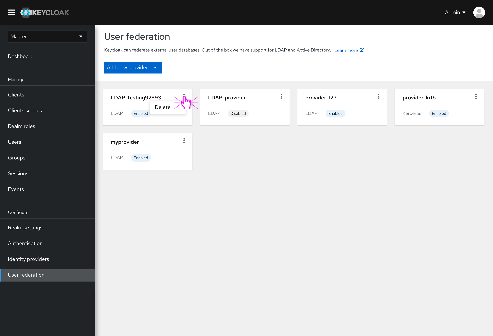
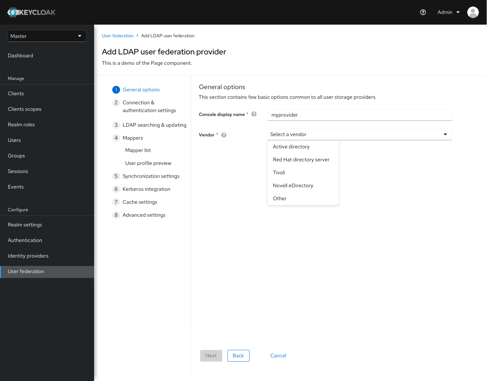
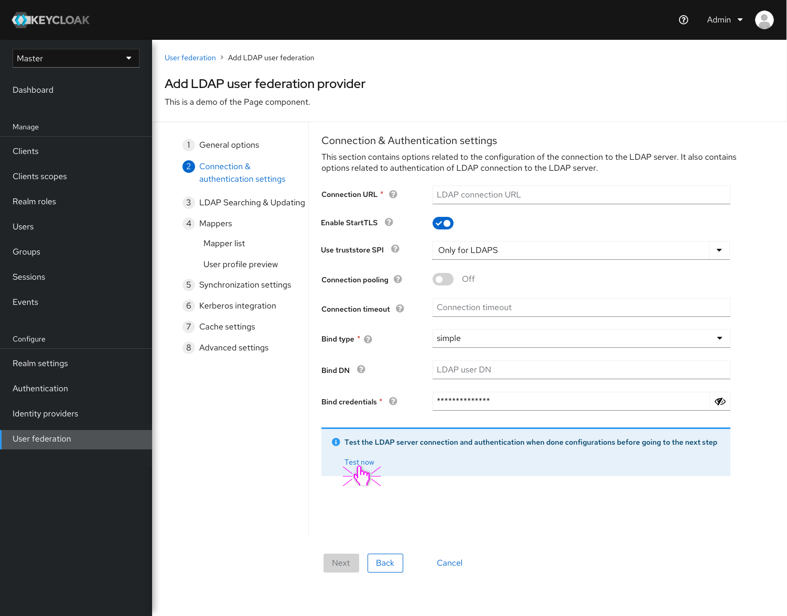
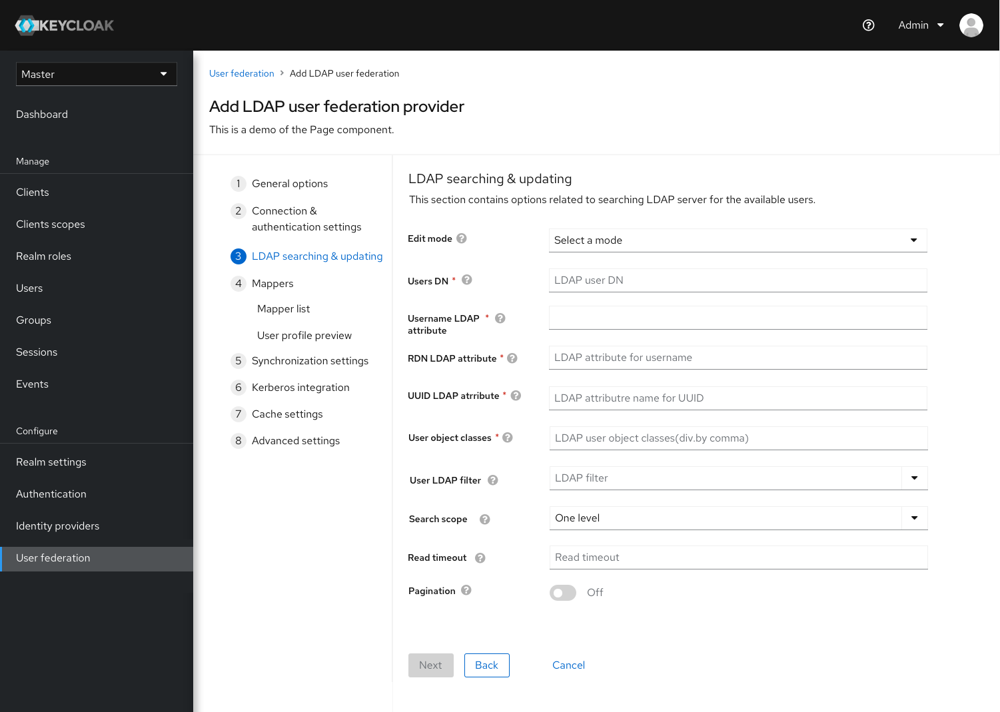
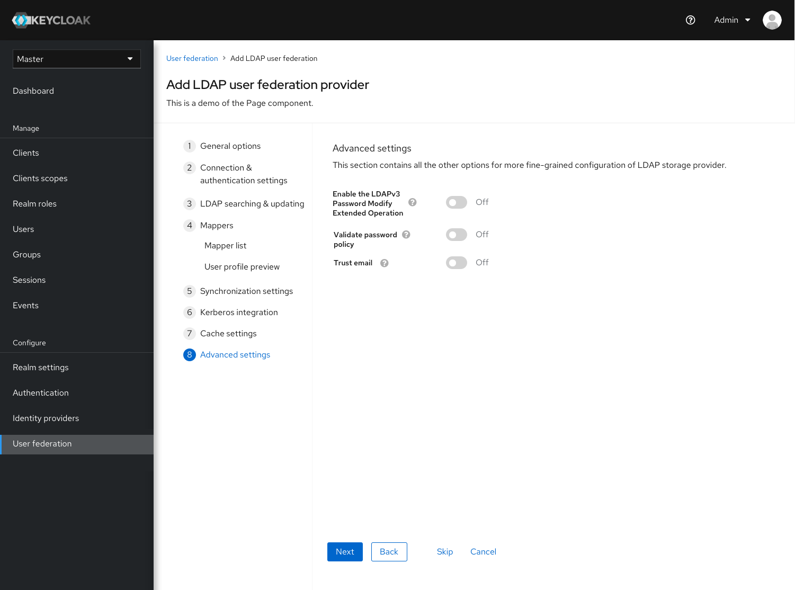
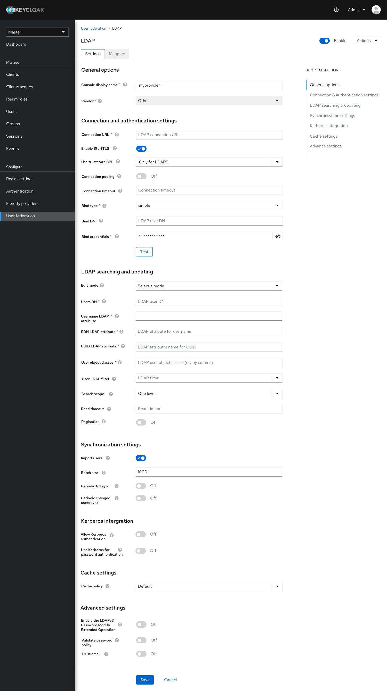
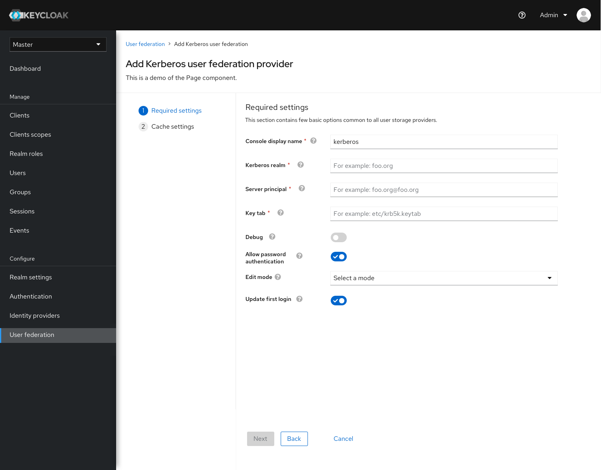
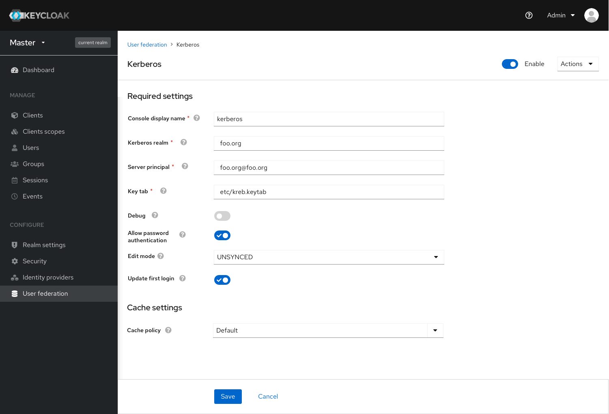

# User Federations Redesign

In the User Federation, we re-designed the overall layout with most recent PatternFly standards and patterns. The landing page is made with cards view, as well as the provider list page.

### Landing page

* New card view for choosing types - same as Identity Provider's page

### Provider list

* Card view with info(type and enable status), the provider can be deleted by clicking the kebab icon in the card.

### Layout & function improvements - LDAP

#### New add-provider layout

* The progressive wizard format, we divided the setting into 8 sections for adding new LDAP providers.

* For LDAP connection testing, we used an inline alert with action button to allow users to test the connection and authentication

* LDAP searching and updating.

* Advanced settings

#### New Setting page layout
* A long-form format with same setting divisions as the add-provider wizard

### Layout & function improvements - Kerberos
#### New add-provider layout

* Same functions, only the layout changes for Kerberos

#### New setting page layout

