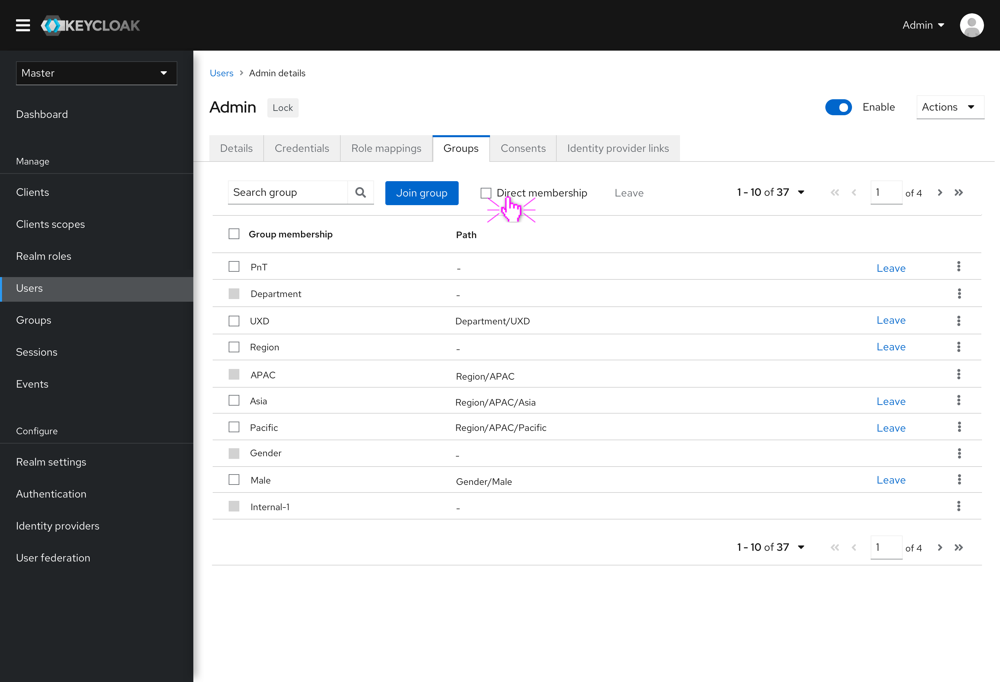
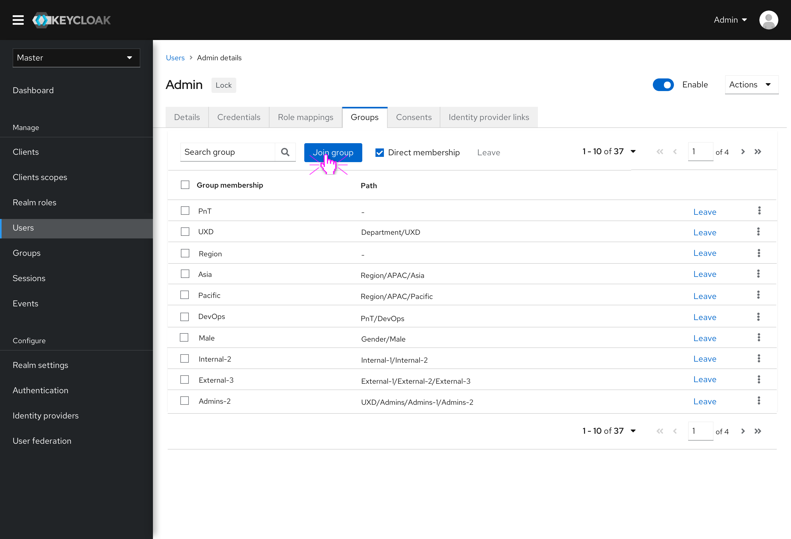
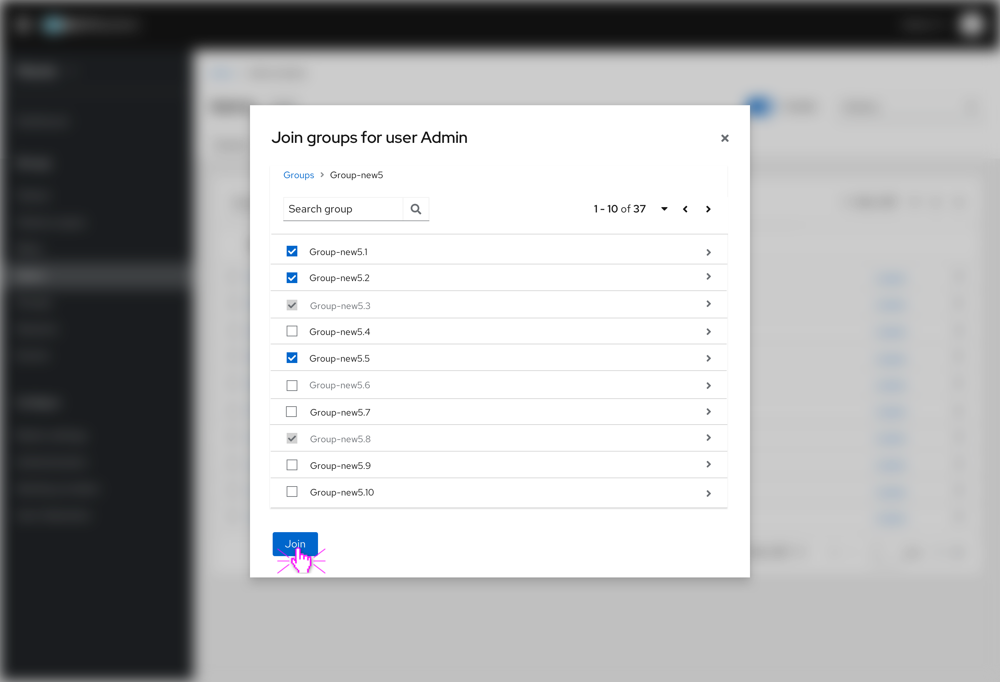

# The Groups tab under Users feature

This is the groups tab in Users to view groups this user has joined. We added a new function called "Direct membership" which is same to main Groups feature's Member page. With it users can view direct joined group path.

User can choose to leave one group or more, the associated group memberships can not be left.

The "Join group" function pattern is similar to "Move group" function in Groups feature, which may be updated in the future release.

The joined groups are showed here in this modal, but read-only.

