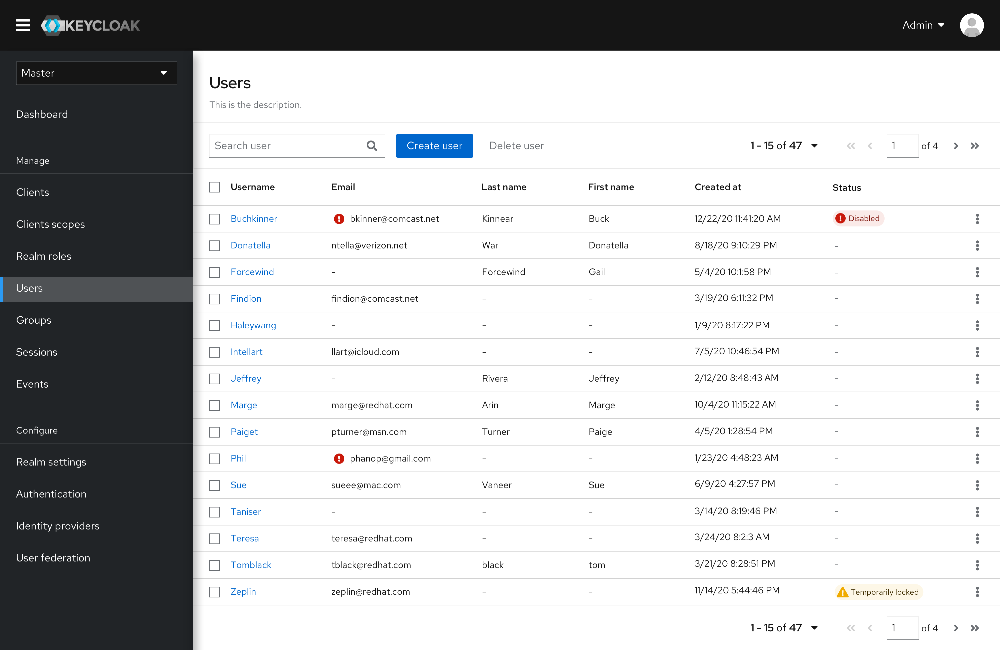
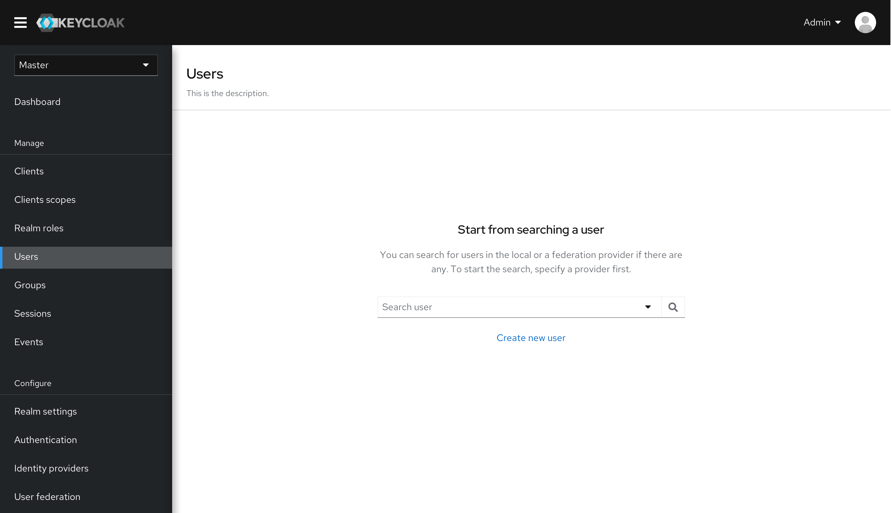
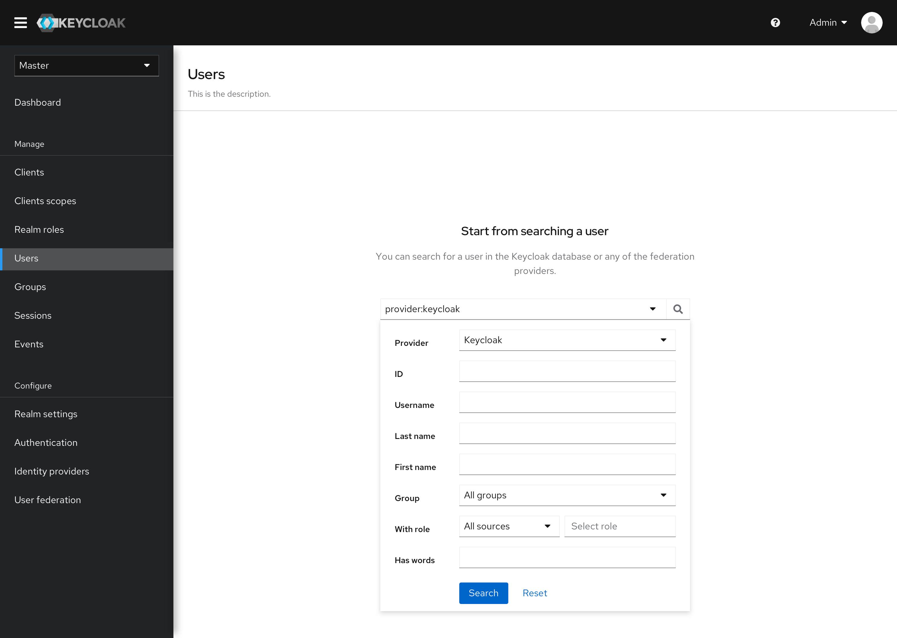
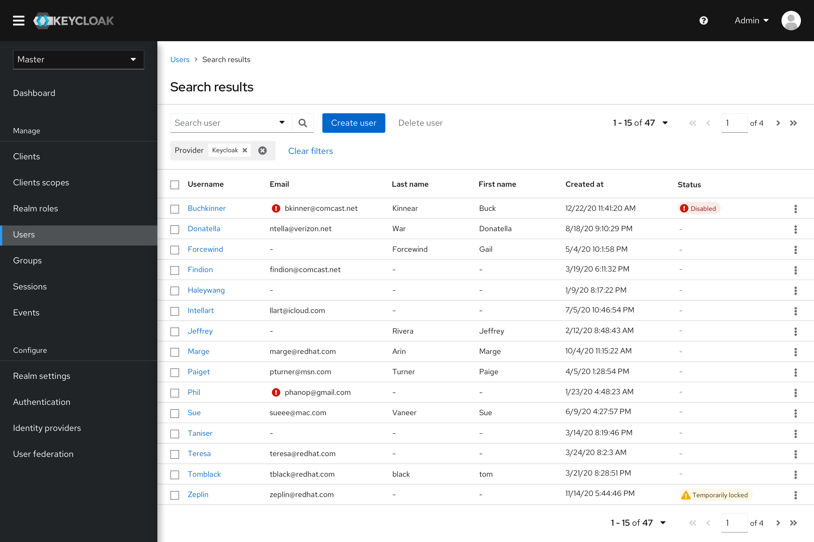
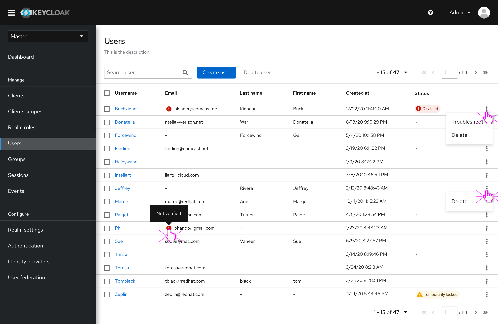

# Default Page

In the new design, we will provide two versions of default pages according to the total amount of local users:

* When there are no more than 100 local users, and no external users, directly show the user list
* In the other cases, just show a search box

## User list version

All the users will be displayed by default. Pagination is provided for easy navigation.

## Search box version

When there are a large number of users, the general use case is to start from a search. So in this scenario, only a search box is provided by default.

The search box has been reinforced. Multiple attributes can be defined for limiting the result. The search operator and form are both supported for an easy search.

The search leads to a result list. All the users that meet the criteria are listed here.

## Users list

* The status of email verification is added to the email column. It's easy to know that which emails are not verified yet through the little red icon.
* The creation timestamp is added.
* User status is added to prompt the unusual cases. In the first phase, "Disabled" and "Temporarily locked" labels will be available.
* "Disabled" status will be applied when the Brute force detects is enable and the permanently locked mechanism is triggered. Or the user is manually disabled by the administrator.
* "Temporarily locked" will be applied when the Brute force detects is enable and the temporarily locked mechanism is triggered.

