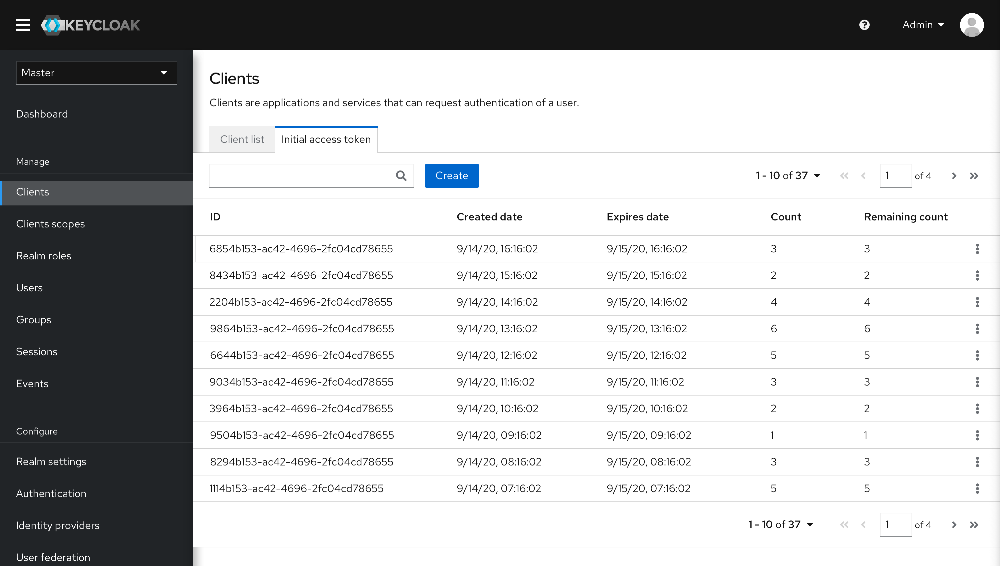
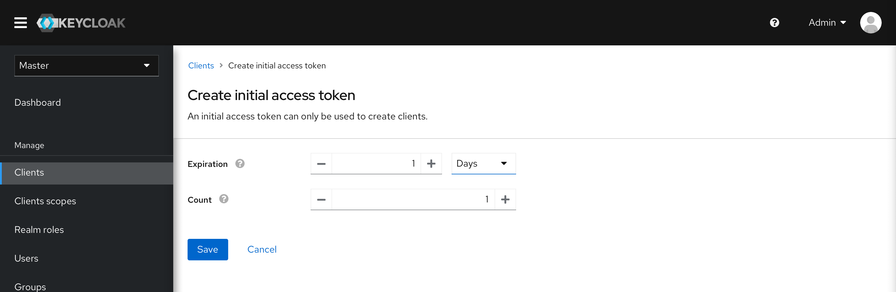
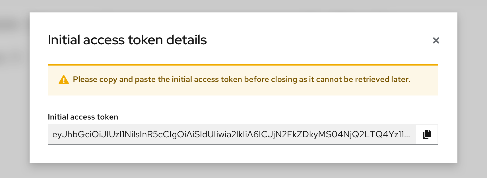

# Initial access token

Keycloak admin console can create clients and it also allows clients to create themselves. There are two methods to register clients.
* Click the “Create” button on the Client page to create a new client. That means this client has been registered.
* Clients/applications can register themselves and Keycloak needs to provide the initial access token.

An initial access token can only be used to create clients and has a configurable expiration as well as a configurable limit on how many clients can be created. To some extent, initial access token is a part of client registration. Therefore, the "initial access token" will be moved to "Clients" section from "Realm settings" in the new design.

In the new design, Initial access token as a tab will be moved to Clients page from Realm settings. Client list is the same as what we designed before. Here is the client list design for your reference. https://marvelapp.com/prototype/f00e9jb/screen/71968754. The whole prototype of "Initial access token" can be accessed here: https://marvelapp.com/prototype/be22jj6/screen/74620513

### Initial access token tab

Click the "Create" button, users will enter the creation page, as shown in the picture below.

Users can set up the "Expiration" and "Count". After clicking the "Save" button, there will be a modal pop up. It reminds users to copy and paste the initial access token. Like the screenshot shows below.

