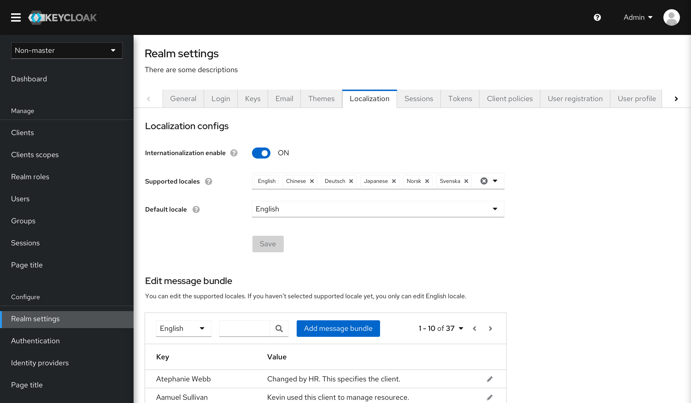
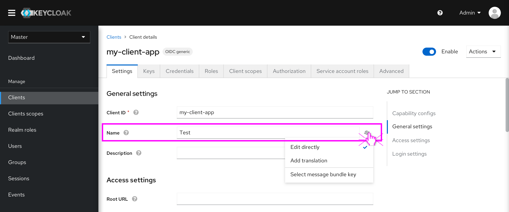

# Localization for specific realms

In the new design, “Internationalization enabled” and the related settings will be moved from Themes tab to Localization tab. Users will be able to manage the message bundles for the specific realms including override the existing message bundles and add new message bundles based on the different locales/languages.

The whole prototype can be accessed here: https://marvelapp.com/prototype/56d9606/screen/76453547

### Localization configs

The functionality is the same as what we have in the old console. The subtle change is that English as the default language can’t be removed from Supported locales.

### Edit message bundles

This part is affected by Localization configs.
* If “Internationalization enabled” is OFF,  users can only edit the message bundles of English.
* If “Internationalization enabled” is ON and there are some supported locales. Users can override the existing message bundles or add new message bundles based on the different supported locales.

### The difference of Localization between Realms and some fields

* In the admin console, there are three levels of Localization feature.
 * Global localization - These are stored in Java property files. Users are not able to edit global localization in the Admin console.
 * Realm-specific localization - As mentioned before, users can override the existing message bundles and add new message bundles based on the different locales. These changes can only affect the specific realm.
 * Field-specific localization - As for some fields, users may customize the values, e.g Client name, Client scope name, etc. Users can directly type the value or select the existing message bundles. In addition, users can also add some translations for the values.

* What’s the difference of localization between realms and fields?
  * Realm-specific localization focuses on the information supported by Keycloak, such as some terminologies, warnings, tags, tabs and so on. These pieces of  information can’t be edited by users.
  * Field-specific localization focuses on the values of some fields. These values are customized by users. So Keycloak allows users to add some localization for some special fields.

 Let’s take the Client name as an example, as the picture shows below.  The tag, Name, is controlled by the Realm-specific localization. The value, Test, is controlled by the Field-specific localization.

