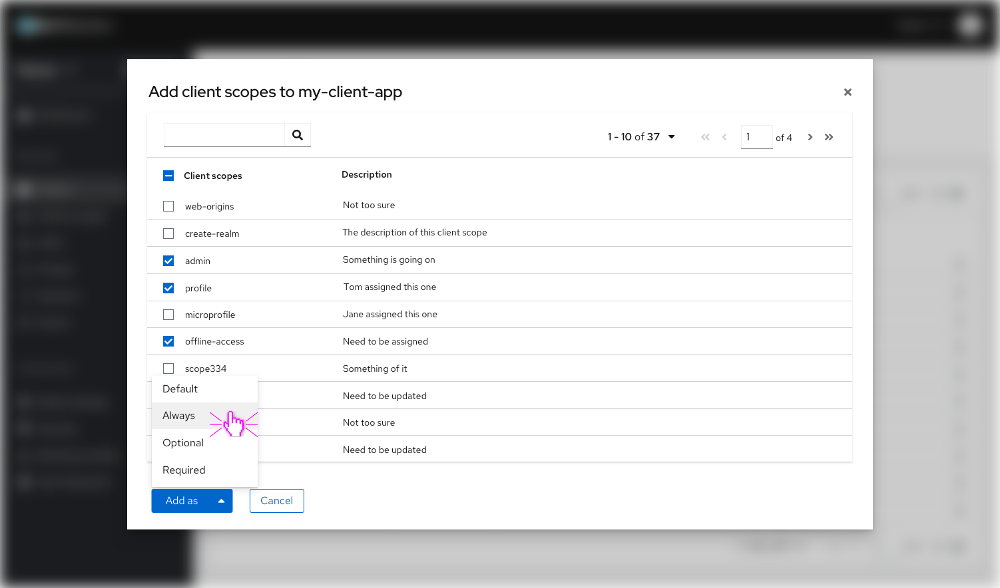
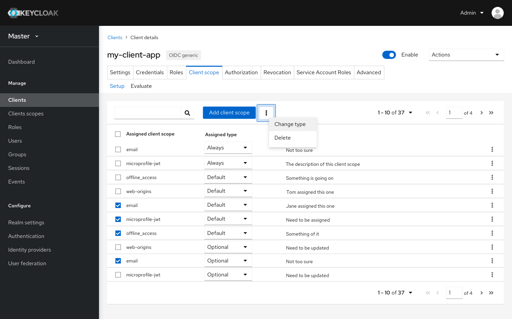
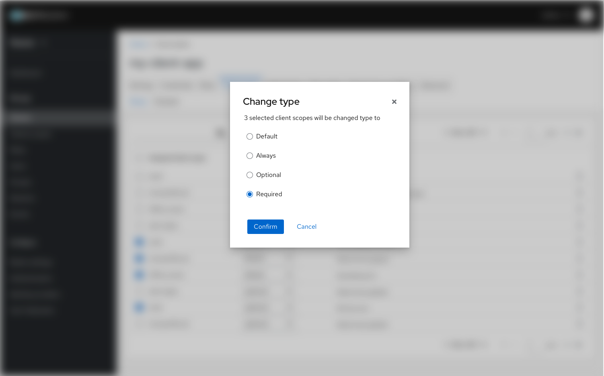
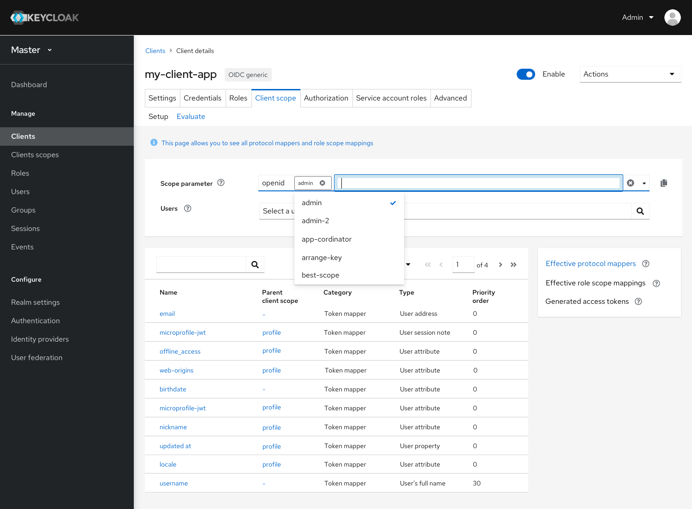
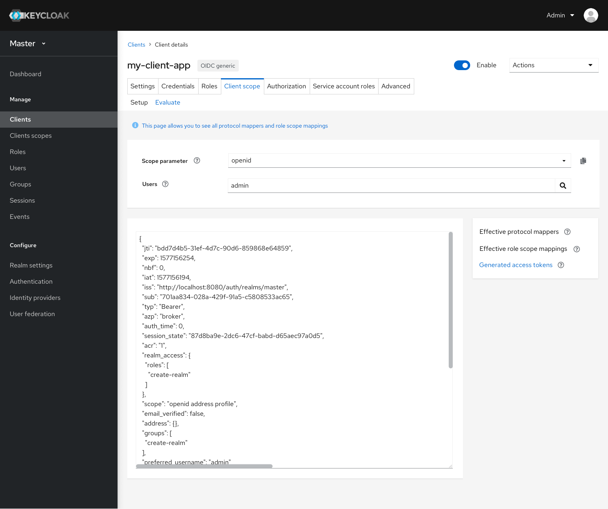

# Client Scopes
## Setup tab

For the Setup page in Client scopes of a Client, we got rid of the old patterns and used PF4 tables to display all the Assigned client scopes. Also, I added a column of description for each client scope, which allowed users to add some descriptions while creating new client scopes.

As for adding available client scopes, click the blue Add button and choose target client scopes in a pop-up Modal page, the current client scopes have 4 types(always, default, optional, required). Users can select multiple client scopes and add them to one of these 4 types.

### Layout improvements

* The landing page displaying all the assigned client scopes in a table format.
* Add a Description column for each client scope.

* Use Modals as a new way of assigning available scopes.

### Function changes

* Users are able to change the assigned type for each client scope in the table.

* Change type for multiple client scopes in a Modal （Click on kebab menu)

## Evaluate tab

In the new design, the layout of Evaluate remains 80% the same as the old one. The biggest change is we removed the Evaluate button, and made the page to display everything at default.

The lower part of the page will remain the same as the old console in terms of functionality. Only little changes in the tab’s format. We used a right-side nav to let users navigate among the options.

### Layout improvements

* One page format
* Right side menu for the lower part of the scope mapping
* The lower part will be showing on the first landing on Evaluate page

### Function improvements

* Using [multiple selector component](https://www.patternfly.org/v4/documentation/react/components/select#multiple-with-custom-objects) of PF4 to choose scopes, when in selecting editing mode, looks like below:

* After selection the field turned into a normal display of plain texts, user can click on the copy icon at right to copy the texts.

* ‘Generated Access token’ still appears but remains empty state when there’s no user’s selected.

* ‘Effective role scope mappings’ table only shows granted roles

* Generated access token page shows the editor view with fixed width.

