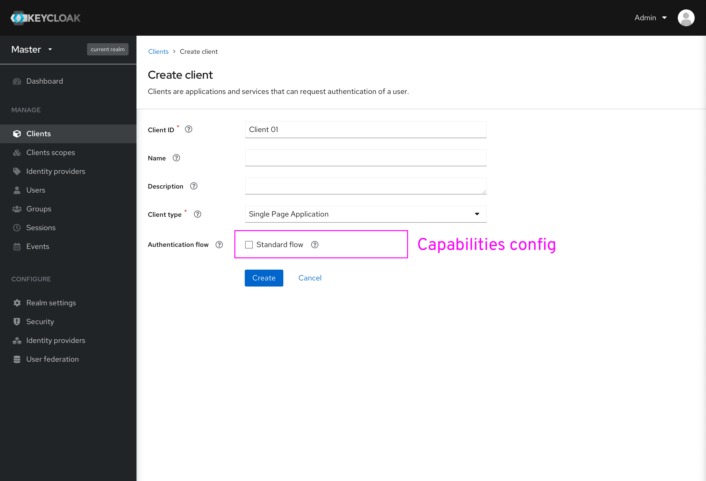
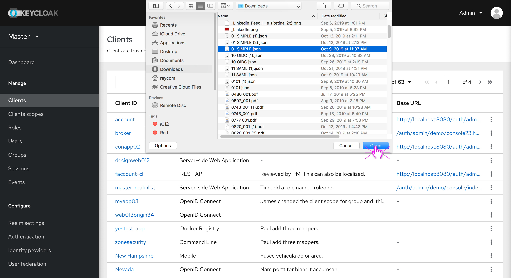
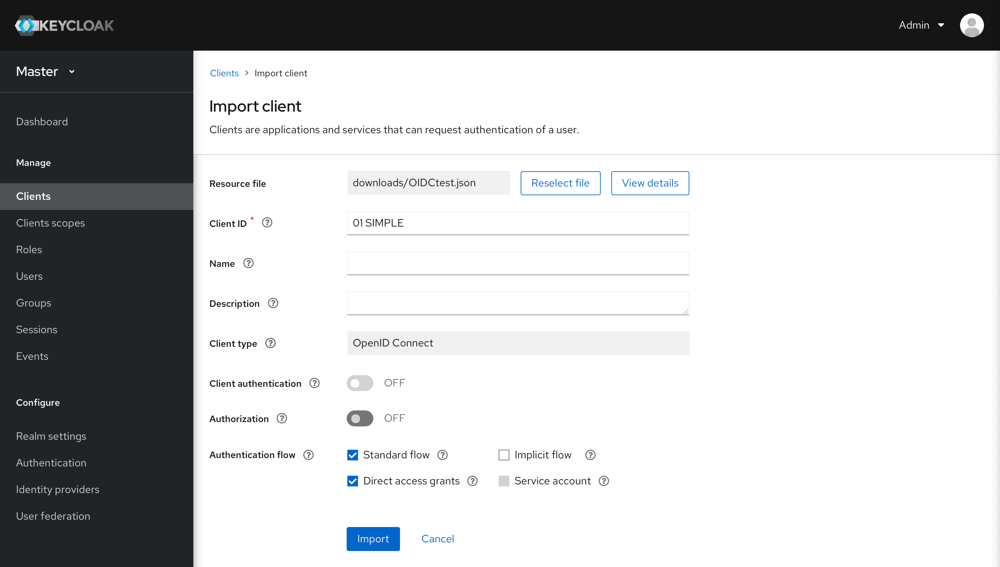

# Create/Import client

Create and Import are separated as two buttons in the Clients list. Users can choose to take each action respectively.

### Create client

* Name and Description are added as optional fields.
* Users can configure capabilities during the creation process. The capabilities config will affect the Settings page after it. For example, if the standard flow and implicit flow are both unselected, then users don’t need to configure the Valid Redirect URIs in the Settings page of this client.
* The Client authentication in the form replaces the Access type in the current console. Now, Access type has three options: Public, Confidential and Bearer-only. In the new console, we will get rid of the Bearer-only type and use disabled Client authentication instead of Public, and enabled Client authentication instead of Confidential.

* Capabilities config will change according to the Client type selected. As mentioned before, non-generic types have preset configs so only the editable capabilities will be displayed. For example, for the SPA (Single page application) type, the client authentication is preset to be disabled (equal to the Public type). The Implicit flow and the Direct access grants are not allowed to be used. In that case, users can only configure the standard flow during creation.

### Import client

* After clicking the Import button in the Clients list, users need to choose a JSON file first.

* Once the JSON file is imported, users cannot change the client type anymore.
* Users can also configure the capabilities in the Import process.

