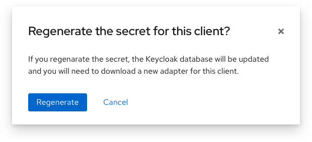
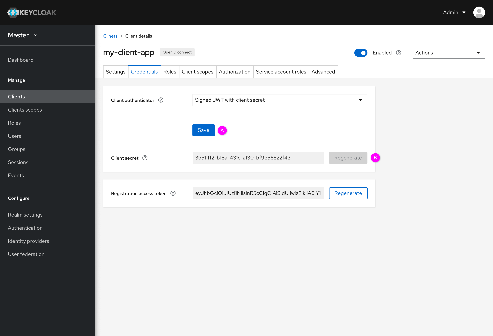
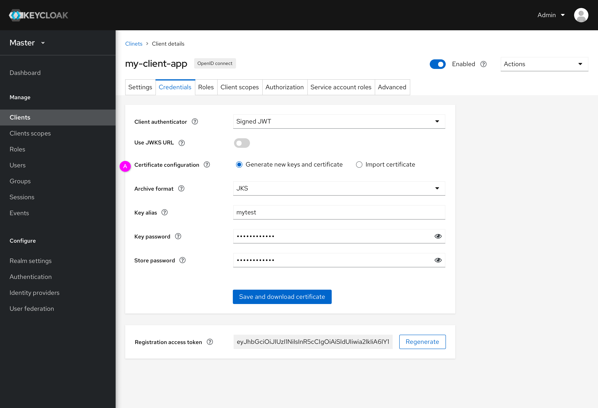
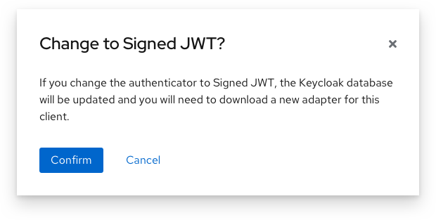
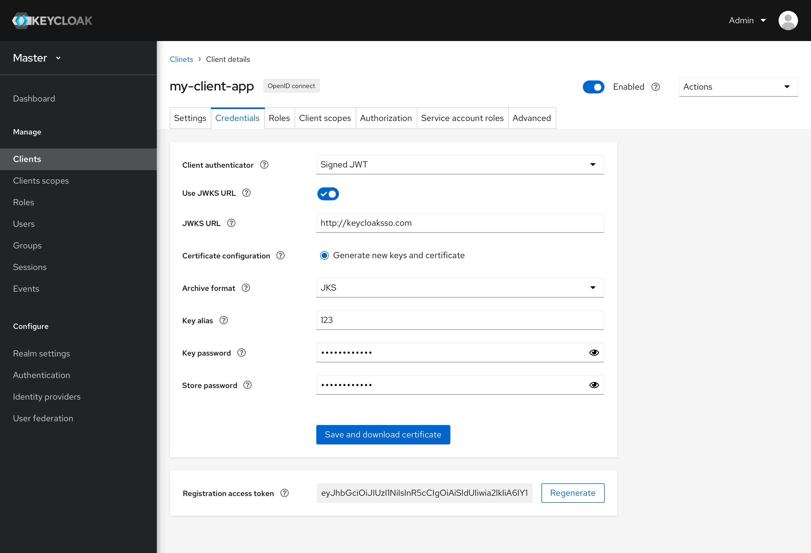

# Credentials

In the current console, there are two main problems as below:
1. If users change the authenticator or some parameters associated with the authenticator (including secret, certificate or subject DN), users may need to download a new adapter. But in the current console, there is no reminder for users that the adapter will be changed and they need to download the new adapter.
2. In the current console, users can change the authenticator but don’t fill in the required fields. In fact, if users don’t fill in the required fields, authenticators shouldn’t take effect. So in the current console, it doesn’t make sense.

In order to resolve those two problems, the function of confirmation has been added and save strategy has been optimized in the new design.
1. Confirmation. If the user wants to change the authenticator or some parameters related to the authenticator, there will be a reminder to inform the user to download a new client adapter.
2. Saving strategy. When users change authenticators, they need to fill in the required fields, otherwise they can’t change authenticator.

In this document, there are three parts based on different authenticators: Client ID and secret/ Signed JWT with client secret, X509 certificate and Signed JWT. Through these three parts, the function of confirmation and save strategy are introduced in detail.  

### Client ID and secret/ Signed JWT with client secret

* Client ID and secret

  * Regenerate secret (A):
  If users regenerate “client secret”, the adapter of the client will be changed, so users need to download a new adapter. There is a reminder will pop up and let users to confirm the changes. As shown in the figure below.
  
  * Regenerate registration access token (B):
  It is similar to regenerating “client secret”. There is also a reminder for users. But registration will not influence client adapter. It is not affected by the authenticator.

* Signed JWT with client secret

  * Change to “Signed JWT with client secret” and save it (A):
  Users change the client authenticator, they need to click the save button and then there will be a reminder for users. Authenticator will take effect after it is saved.
  
  * Regenerate secret (B):
  After clicking the save button, users can regenerate “client secret”.
  * Note: The interaction flow of “Signed JWT with client secret” is the same as “ClientID and secret”.

### X509 certificate

* Subject DN (A):
Users have to fill in Subject DN or they can’t save this authenticator. After filling in the Subject DN, the “Save” button can be clicked. As shown in the screenshot below.

* Note: If users click the save button, there is a reminder for users. After saving, Subject DN can be edited but must not be empty.

### Signed JWT

* Generate new keys and certificate

  * Generate new keys and certificate: 
  If users change the authenticator to Signed JWT and there is no certificate, users need to generate a certificate for this authenticator and save it. All fields need to be filled in.
  As mentioned earlier, there will also be a reminder after clicking the save button.
  

  
  * After generating a certificate and saving this authenticator, users can regenerate keys and a certificate or import a certificate (B). For example, if users click the “Regenerate keys and certificate”, there is a modal pops up. Like this screen shows.
  
  After users fill out this form and click the “Regenerate and download” button, the new certificate will be regenerated. After regenerating, users may need to download a new adapter for this client.

* Import certificate

  * Users can import a certificate and need to fill in all fields for this authenticator. After saving, users can regenerate keys and a certificate or import a certificate. As shown in the screenshot below.
  

* Use JWKS URL

  * Users have to fill in all fields and save them. If the certificate has been generated, users can regenerate new keys and a certificate. As shown in the screenshot below.
  
