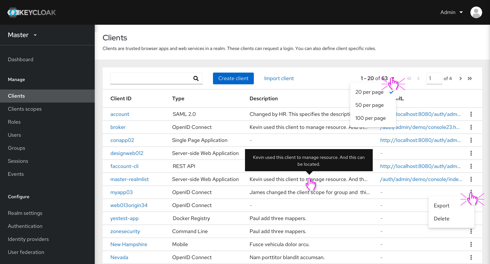

# Clients list

* The Clients list view will have four columns. The column which shows the Enable/Disable status (in current console) is removed. The columns of Types and Descriptions are added. The descriptions will be truncated when they are too long to be displayed. Hovering on the truncated description can view the whole text.
* Pagination is added to the toolbar. Users can change the display items of a page.
* Export and Delete are collapsed in kebab menus.

