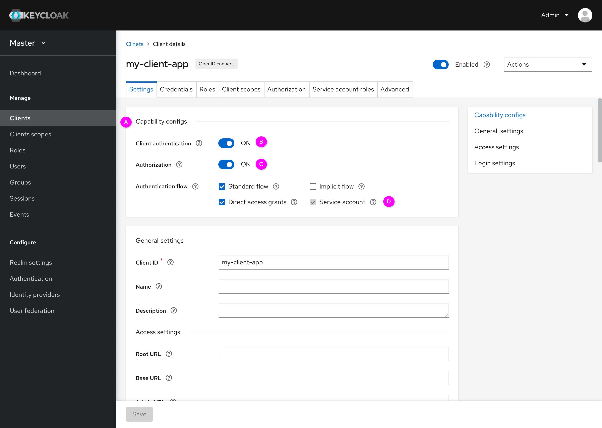
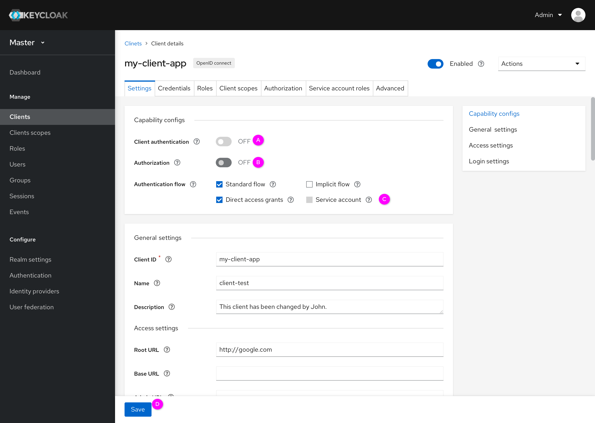

# Settings

In the current console, there is a long-form in the Settings tab. The fields in the form are numerous and confusing. To simplify the form and make it more user-friendly, we updated the design.

There are three main changes:
1. The header is applied to a new layout. A label of the client type and a toggle to enable/disable this client is moved to the header. Some actions are integrated into a dropdown.  
2. A scroll-spy is added to the form part. Scroll-spy can help users rapidly locate the part that they want to edit. It makes the long-form more readable.
3. The settings form is separated into two parts. A new capability section is added and some configurations are moved into it. These capability configurations can have an effect on the other fields and tabs.

### Header

* Client type (A):
In the new design, client type can’t be changed. This label can indicate the client type.
* Enabled/Disabled (B):
This toggle has been moved from the "Settings" form to the header. Switching the toggle can change the status of this client.
* Actions (C):
  * Download adapter configs:
This function comes from the current Installation tab. Users can achieve the same function with the Installation tab through this option.
  * Export:
Users can export this client in this detailed page.
  * Delete: 
Delete this client. If users click the delete option, there will be a reminder for users.

### Scroll-spy

* A scroll-spy is added to quickly locate different parts of settings. For example, if users click the "General settings", the form will locate to the general settings part.
* Note: There is a new tab named "Advanced". Fine-grain OpenID connect configuration, OpenID connect compatibility modes, advanced settings, and authentication flow overrides have been moved to the Advanced tab.

### Capability configs
* Authentication: ON

  * Separate the capabilities configs (A) with the settings.
  * Client authentication (B)
    * Access type has been changed to Client authentication, we got rid of the bearer-only type.
    * If the status of “Client authentication” is “ON”, it is equal to confidential access type in the current console. While it is “OFF”, it means public.
    * If users change the status of “Client authentication”, the capabilities below will change the status along with it.
  * Authorization and Service account
  The status of Authorization (C) will affect Service account (D) . For example, if users change the status of Authorization from OFF to ON, Service account will be automatically selected.
* Change client authentication state

  * When the client authentication (A) is turned off, the capabilities below will change the status along with it. For example, the Authorization (B) and Service account (C) will change to off.
  * After clicking the save button (D), there is a confirmation for users. Below is the confirmation popup.
  
* Save changes of capability configs

  * Alert for users (A)
  * Top navigation bar (B)
  Credentials, Authorization and Service account roles have been disabled and hidden.
  * Note: The top navigation has some changes compared to the current console.
    * Sessions and Offline access have been merged with the Sessions tab in the left navigation bar.
    * Revocation and Clustering have been moved to the Advanced tab in the top navigation bar.
