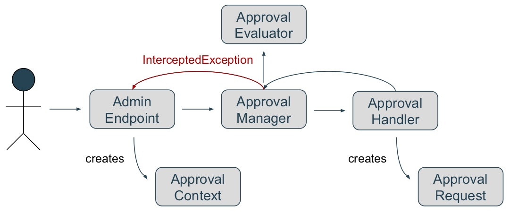

# Approvals System

* **Status**: Notes
* **JIRA**: [KEYCLOAK-8441](https://issues.jboss.org/browse/KEYCLOAK-8441)


## Motivation

Keycloak offers several ways of server management access control, including RBAC, UBAC, ... with support for fine-grained permissions. All of them works on a similar basis - access for a user is either granted or denied.

A server administrator might want to use a hybrid solution - approving certain actions before them taking in effect.

### Use Case #1

- Let’s have some administrators hierarchy
   - Some super admin has subordinates - sub-admins
- Sub-admins have limited permissions in Keycloak Admin Console
- Sub-admins are allowed to create new Clients
 - They can access relevant sections of Admin Console (they “pass” the AuthZ checks)
- When a new Client is created, it’s not yet effective
   - Instead, an *Approval Request* is created
- Once the *Approval Request* is approved by the super admin, the new Client comes into effect

### Use Case #2

- User self-registers to Keycloak
- Once they’re registered, an *Approval Request* is created
   - They can’t use their new account just yet
- After the *Approval Request* is approved by an admin, the user is allowed to login

### Use Case #3

- Users are allowed to change their email through the Account Console
- The Approvals System can dynamically decide if an approval is required
   - E.g. based on the new email domain etc.

### Approvals System

All of the use cases could be generalized as approval of server configuration changes (even the user creation/modification can be seen as a config change). I.e. the Approvals System will be responsible for: audit, interception and approving/rejection of a configuration change in the server.

## Design Proposal

### Step 1: Evaluation of Approval Requirement

Approvals System needs to decide whether requested action (i.e. the configuration change) requires an approval. If not, the System doesn't interfere and the config-changing process continue normally. If an approval is required, the System proceeds to Step 2.

This step is executed after the standard Authorization Services checks, i.e. a user still needs to have required permissions (i.e. pass AuthZ checks) to be able to make a config change.

The deciding evaluation process can be done either by Keycloak itself or could be delegated to an external entity (JBoss BPMS / Red Hat Process Automation Manager).

### Step 2: Interception of a Configuration-changing Action

When an approval is required for an action, we need to prevent the action from taking effect until it’s approved.

The most naive solution - disabling the entity (e.g. a newly created user) - wouldn't work very well here because it's not applicable to edit operation.

The solution would be to store a representation of given change as an Approval Request which would include all the necessary details (who's requesting the change, when, type of the requested change, the change itself - e.g. a new user representation).

The configuration changing process will be then interrupted and the user notified about this in the UI.

### Step 3: Approval / rejection of an Approval Request

Approving of an config-changing action is basically performing the requested change from the beginning.

On rejection, the Approvals System could optionally do some clean up.

## Implementation proposal

**PoC:** https://github.com/vmuzikar/keycloak/tree/approvals

**Demo:** https://youtu.be/qtGcuYYo61g (turn on English subtitles)

**Current PoC limitations:**
- Only user creation and self-registration is covered by the Approvals System
- Not all config options have endpoints (and UI) implemented
- No caching
- No tests

**Diagram - Interception of config-changing action and creation of an Approval Request:**


### Admin Endpoint

Represents any existing endpoint (typically a REST API endpoint) that is used for changing a configuration. Any endpoint that wants to use the Approval System needs to be slightly modified to call the Approval Manager and should also expect / catch an exception (in case an approval is required) and react on it (typically inform the user about approval requirement).

Such modification of an Admin Endpoint could then look like this:

```java
approvalManager.interceptAction(UsersHandler.createUserCtx(userRep, realmModel));
```

Notice `UsersHandler.createUserCtx`. This is a helper method creating a Data Transfer Object [**`ApprovalContext`**](https://github.com/vmuzikar/keycloak/blob/approvals/server-spi-private/src/main/java/org/keycloak/approvals/ApprovalContext.java) that's used by the Approval System for evaluation and creation of an Approval Request. This object transfers any dependencies specific for given config-changing action. Could contain any Representations and Models required in the approval process.

### [Approval Evaluator](https://github.com/vmuzikar/keycloak/blob/approvals/server-spi-private/src/main/java/org/keycloak/approvals/ApprovalEvaluator.java)

A component that decides whether an approval is required or not. Current default implementation is a Role-Action matrix, specifying what user roles require approval for what action. However this is an SPI allowing admin to develop their own evaluators.

### [Approval Request](https://github.com/vmuzikar/keycloak/blob/approvals/core/src/main/java/org/keycloak/representations/idm/ApprovalRequestRepresentation.java)

This is the final representation of an Approval Request that can be serialized and persisted in the DB. Contains only the data required to perform the previously interrupted config-changing action (in case it'll be approved).

### [Approval Handler](https://github.com/vmuzikar/keycloak/blob/approvals/server-spi-private/src/main/java/org/keycloak/approvals/ApprovalHandler.java)

This is the only component of the Approvals System that can be only partially generalized, i.e. some of it's implementation needs to be specific for each supported config-changing action - see below. It has the following responsibilities:
1. Create an instance of `ApprovalRequest` based on provided `ApprovalContext`. The Approval Handler needs to "know" what data will be later required for performing the given approved action. Can be (partially) generalized.
2. Perform the approved config-changing action. The Approval Handler needs to understand given Approval Request and needs to "know" how to perform the requested Action. The original and interrupted config-changing process (i.e. the the REST API call) cannot be (easily) resumed. Therefore the action needs to be performed by the Handler and this functionality can't be generalized and must be implemented for each supported action.

### [Approval Manager](https://github.com/vmuzikar/keycloak/blob/approvals/server-spi-private/src/main/java/org/keycloak/approvals/ApprovalManager.java)

The central component of the Approvals System. Interconnects all components of the System and serves as an entry point for rest of Keycloak.

## BPMS integration

### Keycloak side

There's a generic [**Approval Listener SPI**](https://github.com/vmuzikar/keycloak/blob/approvals/server-spi-private/src/main/java/org/keycloak/approvals/ApprovalListener.java). The specific [`BPMSListener`](https://github.com/vmuzikar/keycloak/blob/approvals/services/src/main/java/org/keycloak/approvals/listeners/BPMSListener.java) then creates a User Task inside external instance of BPMS.

There's an [example task definition](https://github.com/vmuzikar/bpms-appprovals-quickstart) for a quick start and later modification by a BPMS admin.

### BPMS Side

First, BPMS needs to obtain a Keycloak access token - either for a real life user/admin (so the approval would be logged and connected to a specific user), or for a service account in case the process should be automated.

In the example implementation a [simple helper Java EE app is used](https://github.com/vmuzikar/keycloak-quickstarts/tree/approvals/app-bpms-approvals) that obtains the Keycloak access token (the app is actually secured by Keycloak) and handles the BPMS User Task providing it with the access token.