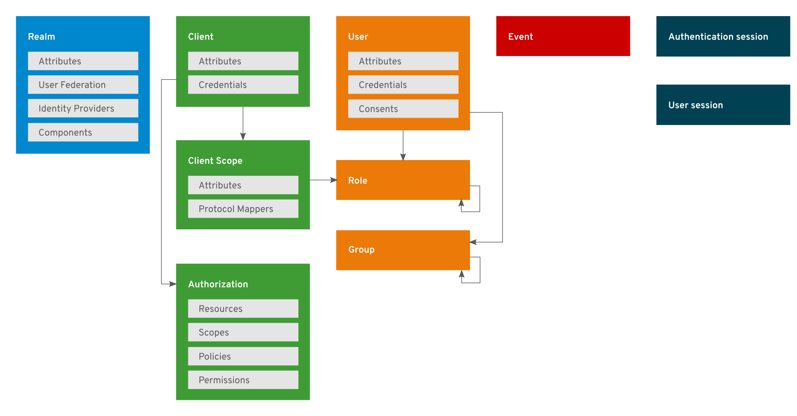
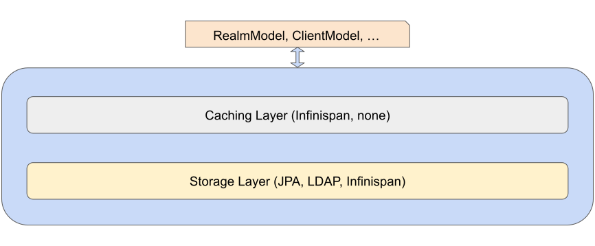
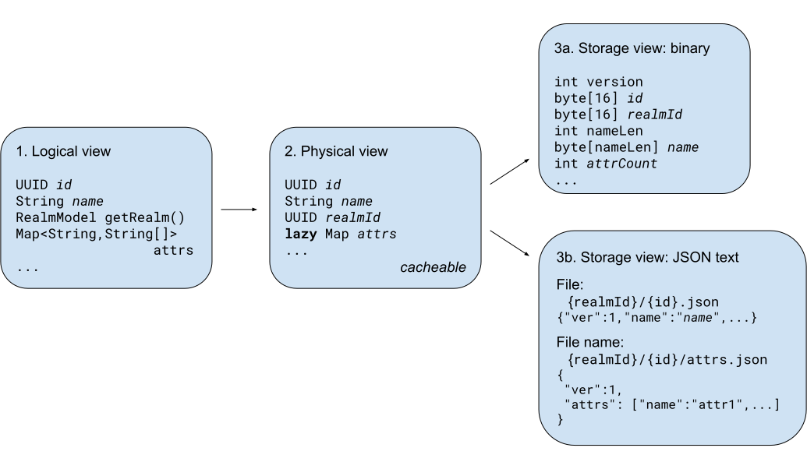

# Keycloak X - Storage - High-level architecture

* **Status**: Draft
* **JIRA**: https://issues.redhat.com/browse/KEYCLOAK-10213

## Current state

Store in the current Keycloak codebase has reached its limits. For small
deployments, it takes too long to initialize the database and start
Keycloak. For large scale cross data center deployments, the setup is too
complicated to be user friendly with *high maintenance cost*.

*Migration* is another part where store turns out to be one of the
factors that can block. The consistent need for updating a database,
often in a version-incompatible way, upon start of a new version means
requirement for stop-the-world updates and gives little chance for no
downtime upon upgrade.

*Design-wise*, part of the problem is that the interfaces for accessing
data objects are intertwined. For example the realm provider is used to
access not only realm data, but also e.g. clients and roles. The flaw of
this approach can be seen e.g. in the case of `ClientProvider` which has
a method `addRole` for adding a client role but no method to remove one -
`removeRole` is only found in `RealmProvider`. This flaw stems from the
expectation that the data store is (apart from the user and session
provider) bound to use the same physical store.

## Logical view

There was always a dichotomy between what is considered cached and what
stored, especially with the user sessions. “Usual” objects are *stored*
in a database, yet online sessions are *stored* in Infinispan cache while
the other objects are *cached* there.

To address this, the split of the storages for the different objects will
happen - each of the first-class objects like realms or clients (see
below) will be stored and cached in generally a different store. That
way, the user will be able to tune the system store and caching engines
to have e.g. realm definitions stored in files and cached in Infinispan,
clients stored in etcd store and cached in plain hashmaps and sessions
shared in Infinispan caches. (This is indeed overstretched but you get
the picture.) With this split it comes that the references to other
objects would be loose, and it will be Keycloak responsibility to keep
referential integrity.

### First-class objects

First-class objects are objects that have a common store settings, and
their separation is logical  from the perspective of objects handled in
Keycloak. The first-class objects are depicted below in the color boxes.
A **realm** contains all data related to the realm that almost never
changes (realm name and other attributes, identity providers, user
federation, flows setup of keys etc.). A **client** contains similarly
all the data related to the client, and **client scope** description of
the client scope attachable to a client. **Authorization** store contains
definitions of resources, scopes, policies and permissions. **User**,
**role**, and **group**, as well as **event** are self-explanatory.
Sessions have data stored separately for **authentication sessions** and
**user sessions**.

### Store configuration

For each object type, a separate store can be configured. The store
allows configuring persistence and caching independently. For the current
store, JPA would be used for persistence and Infinispan for caching in
case of realms, roles etc., and Infinispan would be used for persistence
and passthrough (i.e. nothing) for caching in case of sessions.

By separating the configuration of the two, it is possible to create
often-used templates, e.g. JPA+Infinispan, Files/YAML+Infinispan,
etcd/JSON+passthrough etc.

Caching requires some kind of event support from the underlying store to
be able to invalidate the cached objects.

## Physical layout

Since the references between the objects will be loose, the benefits of a
relational database diminish, and most of the work with querying and
maintaining indexes (if any) will be done in Java. The objects in
Keycloak JVM have three representations:

1. Logical representation (a.k.a. `*Model` and `*Adapter` in current
   codebase) - the representation contains reference to KeycloakSession and
   thus depend on the state of the objects (realms, sessions etc.)
   throughout the period of handling the request

2. Stateless representation (similar to aggregated `*Entity`) - the
   representation contains IDs rather than ability to provide logical
   representation of the object. The crucial feature of each field type is
   that its representation is serializable, and is independent of the
   datastore format.

3. Storage representation - datastore-dependent representation, e.g.
   byte-stream or text.

Sample representations of a realm-dependent object, e.g. a role, is depicted below:

1. Logical representation is used e.g. in the endpoints

2. Physical representation is used in the store layer. Caching and lazy
   loading of selected attributes can hook in in this part.

3. Storage representation is used when communicating with a data store.

## Migration

For migration, the following approaches are available:

* Eager - like there is now in Keycloak, database migrations are performed for all objects upon start

* Lazy - migrate only when loading an object
   * Much better performance
   * Every object needs to maintain the version

Note that change in indices has to be always eager: Suppose that the new
version expects a query by username but no such index was built in the
*users* store; then the query would fail to find any user.

Complexity of the migration depends on format:
* Text-like format would help, since it needs not store default values
   * Jackson / CBOR looks promising and is used already by WebAuthn
* Protobuf supports object versioning
