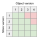

# Keycloak X - Storage / Persistence layer

* **Status**: Draft v2
* **JIRA**: https://issues.redhat.com/browse/KEYCLOAK-7301

## Goals of this document

This documents aims to address the following items:

* Define a strategy for no-downtime storage upgrades
* State the requirements imposed on the persistent part of the store
* Provide design of layer that allows for simple yet performant
  implementations of custom stores

## Non-Goals of this document

This documents aims to _not_ address the following items:

* Provide exact prescription of how the data are stored in the data store
* Discuss design of caching or its impact on performance
* Discuss pros and cons of individual storage technologies

## Introduction

In an ideal world, Keycloak cluster upgrade would be done seamlessly -
no service disruption, new version rolled out without user noticing.

This can only be done if all relevant components support this.
This document specifically discusses persistence aspect. Other aspects,
e.g. caching or API compatibility, are left for other specifications.

There are several strategies of updates with respect to persistence possible.
Those that do not work are listed below:

*  _Stop the world._ Stop old version; Update all the data; Start new version.

   This is the current state of Keycloak. It disrupts the service
   and thus is not an option.

* _[Blue-green deployment.](https://martinfowler.com/bliki/BlueGreenDeployment.html)_
  Two production-grade clusters with a router that redirects traffic
  to the updated one once update is done.

  This is problematic for Keycloak since it maintains state in the cluster.
  For example, code-to-token flow could be disrupted upon switching the traffic.

  The same concern applies to a variant of blue-green deployment
  where only a portion of traffic is directed to the updated
  cluster and the rest is directed to the old one, with the proportions
  being gradually changed towards the new cluster.

* _Keep the store schema unchanged._ Update the nodes gradually
  to the new version.

  With the current database (as of Keycloak 11), this would work
  for most of the maintenance releases. However it would
  not work if there were new features that introduce more
  than cosmetic changes the database.

The last option is attractive though. Could the store structural changes,
i.e. changes in the physical model, be kept minimal or none while
allowing for changes in the logical model (e.g. adding a new attribute
to a client)?

This proposal is about the following strategy:

1. The store can read objects from the oldest ones to the current version
2. The store can read objects from the version following the current one
3. The schema version of objects in the store is only updated when written and will be written with the current version
4. Number of schema changes should be kept at absolute minimum
5. Schema changes can be postponed and run at chosen time
   (even if that means running a degraded service)

The following text elaborates on the above strategy.

## Notions

For convenience, definitions of various types of object representation
and related notions from [storage-architecture.md](storage-architecture.md)
are repeated below.

* <a name="_def_logical_representation_"></a>
  _Logical representation_ of an object is denoted as `Model`. This
  representation is used in the code above storage layer. Examples of models
  existing in the current codebase are `ClientModel` or `RoleModel`.

  Mapping of logical representation to the physical representation is done
  via `Adapter`s.

* <a name="_def_stateless_representation_"></a><a name="_def_physical_representation_"></a>
  _Stateless representation_, also called _physical Java representation_
  of an object is denoted as `Entity`. This representation contains all
  attributes necessary for serializing the object into the store. Note
  that this Java representation is not necessarily 1:1 representation
  of the stored object which is named as <a name="_def_storage_representation_"></a>
  _storage representation_.

  An example of stateless representation is in [MapClientEntityImpl](https://github.com/keycloak/keycloak/blob/master/model/map/src/main/java/org/keycloak/models/map/client/MapClientEntityImpl.java).

  Example of a storage representation in the current code base is the
  JPA database representation, e.g. [GroupEntity](https://github.com/keycloak/keycloak/blob/master/model/jpa/src/main/java/org/keycloak/models/jpa/entities/GroupEntity.java).

## Requirements

### <a name="_perf"></a> Performance

The store needs be able to handle tens of thousands of realms and
hundreds of millions of users and clients, roles and groups.

The performance characteristics needs to be validated for each implementation
individually since the characteristics will vary between the technologies
(e.g. LDAP vs REST) as well as within a particular technology (e.g. Postgres
vs MySQL, partitioning, different approach to structuring the data).

### <a name="_vc"></a> Version Compatibility (VC)

<a name="_def_entity_schema_version"></a>
An _entity schema version_ is a version of storage representation of
some object, e.g. a realm or a role.
Any change in the model interfaces (e.g. adding getters/setters)
might propagate into change in the storage representation, which would
change entity schema version of that type of objects.
In contrast, adding a method to model
that operates on existing fields does _not_ change entity schema version.

For example, [this change in `RoleModel`](https://github.com/keycloak/keycloak/commit/9ef4c7fffd75ed63c49713405083c17e643ff80a#diff-38a40e77fbc7b5c42eb6cda54cf5cd6e)
added attributes to the roles and thus means update to the entity schema version.
On the other hand, [this change in `RoleModel`](https://github.com/keycloak/keycloak/commit/8f7f9e0b9c1ea0a50a4f6292ffa09c856e067c10#diff-38a40e77fbc7b5c42eb6cda54cf5cd6e)
did operates on data already available in the model, thus the entity schema version
of `RoleModel` remains unchanged.

<a name="_def_current_store_version_"></a>
For each of the entities (realm, user, client etc.),
the _current store version_ is the entity schema version that
the store uses for writing objects.

This is done even if the data has been read from a version following the current one,
thereby downgrading the version on that object.
This enables writable data on all nodes during zero downtime upgrades and on rollbacks
and ensures that the data is migrated again once it is read by the next version.

Conditions for the readability of an object stored by store of version _N_
are as follows:

1. _Backward compatibility._
   Object stored by store of version _N_ MUST be readable by any newer store,
   i.e. store of version _M_ where _M ≥ N_

2. _Forward compatibility._
   Object stored by store of version _N_ MUST be readable by a previous store,
   i.e. store of version _N-1_.
   This is to support seamless upgrade in a manner where nodes
   of version _N-1_ in the cluster are gradually replaced
   by newer version. It also provides means to revert to
   the previous version if anything goes wrong.

   As nodes reading the object might also update and write it to the store
   with their version _N-1_, no information must be lost that was present in version _N_.

3. _Extended forward compatibility_ (optional).
   Object stored by store of version _N_ MAY be readable by much older store,
   i.e. store of version _M_ where _M ≤ N-2_, but the store MUST
   throw an `IllegalArgumentException` if the object cannot
   be reliably reconstructed from the stored data.

   As nodes reading the object might also update and write it to the store
   with their version, no information must be lost that was present in version _N_.
   If the object cannot be reliably written the store MUST
   throw an `IllegalArgumentException`. 

The following matrix illustrates the above conditions. It shows whether
an object stored in version _X_ in a store of version _Y_ is readable
(green) or unreadable (red):



For the sake of simplicity, object versions are treated as a sequence of integers
thorough this text. See [below](#_otherVersioning) for other options.

Versions of individual stores in the same server version are unrelated.
For example, in Keycloak of version 1.2.3, versions can be 53 for user objects,
41 for clients, and 14 for realms. Versioning of Keycloak and the logical objects
is independent, so it is possible that the Keycloak version 1.2.4 may have
the same object versions as in 1.2.3, that one of them has changed,
or all have changed.

*Note on testability:* It must be possible to automatically test that
a store implementation satisfies all the requirements stated in this section.
For this purpose, there is
[a project in keycloak-playground](https://github.com/keycloak/keycloak-playground/tree/master/no-downtime-upgrade) repository
that captures all the requirements and provides a harness to implement
a proposal for a 0-downtime storage implementation.

### <a name="_cir"></a> Custom implementation requirements (CIR)

The requirements coming from the need to easily provide
custom implementations are vague by nature but useful to state them here.

1. Store interfaces must be simple enough to provide fast custom implementations.
2. Store interfaces must be generic enough to fit any storage technology.
3. Store interfaces must operate on logical level.

## Design

Actual storage can be based on various technologies. For example,
the storage can use a file system, relational database, LDAP,
in-memory streaming database, or a REST service.
For this reason, it is important to keep the storage interface
on the level of logical objects (i.e. models)
and detached from the physical implementation.

It is obvious that no-downtime requirement and performance are mutually
outbalancing each other. Hence it should be stated that:

* No-downtime constraints must be satisfied
* Performance needs to be good-enough. This means that:
  * Object lookup by an object identifier must succeed
    in logarithmic time (w.r.t. total number of objects) at worst
  * Lookup by searchable attribute should be bound
    by logarithmic time (w.r.t. total number of objects)
  * There must be no or only short windows when stop-the-world
    updates happen and timing of all of these must be
    controlled by Keycloak administrator

### Transaction Processing

In Keycloak, many places are under transaction control, e.g. cache
updates or database operations. The transaction is controlled by
a transaction manager owned by a `KeycloakSession` object.

In case of request processing, `KeycloakSession` lifespan is that
of processing the request, and the same lifespan
is of the transaction manager and every
[provider](https://www.keycloak.org/docs/latest/server_development/#_providers)
instantiated in this session.

A storage is implemented as a provider and has to implement
the transaction management according to the technology it
uses under the cover. For example, it may delegate to JTA or
delegate to a remote transaction supported by the storage.

### Object Providers

There are several object types as explained
in [storage-architecture.md](storage-architecture.md), e.g. realms, clients.

For each object type, there will be a corresponding SPI
(e.g. [`ClientSpi`](https://github.com/keycloak/keycloak/blob/master/server-spi-private/src/main/java/org/keycloak/models/ClientSpi.java)),
and a provider (e.g. [`ClientProvider`](https://github.com/keycloak/keycloak/blob/master/server-spi/src/main/java/org/keycloak/models/ClientProvider.java))
in this SPI implements operations on this type of objects.

Methods in the provider refer to other objects as either `Model` instances
or `String` identifiers. In this logical view, an object identifier is
always a `String`; if desirable, the key may be potentially translated
to a binary key by the storage implementation. The `String` representation
was chosen primarily because the IDs of objects are mainly used in URLs
of endpoints and JSON payloads, and both are texts. To improve readability
of URLs, IDs may be even human-readable.

All the operations invoked on an instance of an object provider are
performed within the transaction that belongs to the `KeycloakSession`
which created this object provider. If needed, handling
of a transaction in the storage backend can be done via
a custom `KeycloakTransaction` in the provider.

### Logical to Storage via Stateless Representation: There and Back Again

To cover [CIR requirements](#_cir), it should be possible
to implement an object provider in the terms of CRUD
(Create-Read-Update-Delete) operations on individual objects,
rather than implementing all the methods of a particular object provider.
In the current codebase,
[`map`](https://github.com/keycloak/keycloak/tree/master/model/map)
providers are such providers. To implement a particular technology,
only these CRUD operations need to be implemented. No-downtime
upgrade feature can also be implemented just on CRUD, i.e.
significantly smaller number of the methods as compared
to case when implementing the same in all the methods
of an object provider.

The ease of support of a new technology may be penalized
by suboptimal performance. To cover these cases, implementing
an object provider fully is still possible.

For a primary key type `String`, and model `ModelType` type, a `StorageProvider`
interface is introduced that provides basic CRUD operations
on individual objects, and an operation for reading objects that
satisfy the given criteria.

```java
interface StorageProvider<ModelType extends HasId<String>> {
    /**
     * Creates an object in the store. Introduces new ID.
     * @param object
     * @return ID of the object
     */
    String create(ModelType object);

    /**
     * Returns object with the given {@code id} from the storage or {@code null} if object does not exist.
     * @param id
     * @return See description
     */
    ModelType read(String id);

    /**
     * Returns criteria builder for the storage engine.
     * The criteria are specified in the given criteria builder based on model properties.
     * <br>
     * <b>Note:</b> While the criteria are formulated in terms of model properties,
     * the storage engine may in turn process them into the best form that suits the
     * underlying storage engine query language, e.g. to conditions on storage
     * attributes or REST query parameters.
     * If possible, do <i>not</i> delay filtering after the models are reconstructed from
     * storage entities, in most cases this would be highly inefficient.
     *
     * @return See description
     */
    ModelCriteriaBuilder getCriteriaBuilder();

    /**
     * Returns stream of objects satisfying given {@code criteria} from the storage.
     * The criteria are specified in the given criteria builder based on model properties.
     *
     * @param criteria
     * @return Stream of objects. Never returns {@code null}.
     */
    Stream<ModelType> read(ModelCriteriaBuilder criteria);

    /**
     * Updates an object with the given {@code id} to the storage if it already exists.
     * @param id
     * @throws NullPointerException if object or its {@code id} is {@code null}
     */
    void update(ModelType object);

    /**
     * Deletes object with the given {@code id} from the storage, if exists, no-op otherwise.
     * @param id
     */
    void delete(String id);
}
```

The `ModelCriteriaBuilder` is an interface that captures criteria restricting the
results of a search. This object relates to the [performance requirement](#_perf)
since it enables bulk operations on top of plain single-object CRUD.

The criteria are imposed on properties of the _model_ and
are translated to the query by the storage implementation.

For example, in JPA the `ModelCriteriaBuilder` would
translate to SQL `WHERE` clause, in LDAP to a LDAP filter,
while when filtering a Java `Stream`, it would translate to a `Predicate`.
If the given combination of predicated is not valid for a particular
storage, the `ModelCriteriaBuilder` should throw an `IllegalArgumentException`.

The object models will be accompanied with `String` constants that
denote the fields that can be searched by. This is to prevent typos
and also to make it possible for storage developers to adjust
the implementation to e.g. create indices for the fields in the store
that correspond to the named fields in the model.

`ModelCriteriaBuilder` allows creating a filter on data
by building predicates on fields and Boolean combinations of the predicates.

```java
public interface ModelCriteriaBuilder {

    /**
     * The operators are very basic ones for this use case. In the real scenario,
     * new operators can be added, possibly with different arity, e.g. {@code IN}.
     * The {@link ModelCriteriaBuilder#compare} method would need an adjustment
     * then, likely to taky vararg {@code value} instead of single value as it
     * is now.
     */
    public enum Operator {
        EQ, NE, LT, LE, GT, GE, LIKE, ILIKE
    }

    /**
     * Adds a constraint for the given model field to this criteria builder
     * and returns a criteria builder that is combined with the the new constraint.
     * The resulting constraint is a logical conjunction (i.e. AND) of the original
     * constraint present in this {@link ModelCriteriaBuilder} and the given operator.
     *
     * @param modelField Field on the logical <i>model</i> to be constrained
     * @param op Operator
     * @param value Operand to the operator.
     * @return
     */
    ModelCriteriaBuilder compare(String modelField, Operator op, Object value);

    /**
     * Creates and returns a new instance of {@code ModelCriteriaBuilder} that
     * combines the given builders with the Boolean AND operator.
     * <p>
     * Predicate coming out of {@code and} on an empty array of {@code builders}
     * (i.e. empty conjunction) is always {@code true}.
     *
     * <pre>
     *   cb = storage.getCriteriaBuilder();
     *   storage.read(cb.or(
     *     cb.and(cb.compare(FIELD1, EQ, 1), cb.compare(FIELD2, EQ, 2)),
     *     cb.and(cb.compare(FIELD1, EQ, 3), cb.compare(FIELD2, EQ, 4))
     *   );
     * </pre>
     *
     */
    ModelCriteriaBuilder and(ModelCriteriaBuilder... builders);

    /**
     * Creates and returns a new instance of {@code ModelCriteriaBuilder} that
     * combines the given builders with the Boolean OR operator.
     * <p>
     * Predicate coming out of {@code and} on an empty array of {@code builders}
     * (i.e. empty disjunction) is always {@code false}.
     *
     * <pre>
     *   cb = storage.getCriteriaBuilder();
     *   storage.read(cb.or(
     *     cb.compare(FIELD1, EQ, 1).compare(FIELD2, EQ, 2),
     *     cb.compare(FIELD1, EQ, 3).compare(FIELD2, EQ, 4)
     *   );
     * </pre>
     */
    ModelCriteriaBuilder or(ModelCriteriaBuilder... builders);

    /**
     * Creates and returns a new instance of {@code ModelCriteriaBuilder} that
     * negates the given builder.
     * <p>
     * Note that if the {@code builder} has no condition yet, there is nothing
     * to negate: empty negation is always {@code true}.
     *
     * @param builder
     * @return
     */
    ModelCriteriaBuilder not(ModelCriteriaBuilder builder);
}
```

## <a name="_otherVersioning"></a> Other Versioning Options

The versions in the [VC requirements](#_vc) are treated as sequences of integers.

This is insufficient in case of long-term support releases where patches
are issued between micro releases, but 0-downtime upgrade between minor
releases is still a requirement.

Note though that the versions in the [VC requirements](#_vc) can be
implemented by _any_ ordered sequence. For long-term support (LTS)
releases, this can be a pair _(minor, micro)_, where
the [VC](#_vc) condition 1 and 3 would be defined on the whole pair,
and the [VC](#_vc) condition 2 would be defined on the _minor_ component.

To address maintainability, it is possible to impose further conditions
for LTS version. For example, borrowing versioning from RHSSO,
it may be valid to impose a condition that objects written
in version 7.4.0 are readable by store from 7.3.z but objects
from further 7.4._z_ versions (_z_ ≥ 1) may be not. Specifically,
it means that updating from e.g. 7.3.4 to 7.4.2 is only possible
in two separate steps: 7.3.4 &rarr; 7.4.0 and 7.4.0 &rarr; 7.4.2.

## Upgrades

Upgrade of a single Keycloak server in cluster should have no impact
on the service availability. That is achieved by ensuring that
two adjacent versions of Keycloak can be run alongside each other
in the same cluster and share the same stores. How this is done depends
on the storage implementation. One of the (inefficient) ways to achieve
that is to ensure that every store version _N + 1_ writes two object
versions - one for version _N_ and other _N + 1_. There are other ways
possible to achieve the same, basically they count on redundancy.

### Physical Schema Upgrades

Some of the changes need updates of the physical storage schema. For example,
in case of adding a single searchable field, this field should be somehow
indexed, and in case of relational databases, that may require adding
a column and an index. Adding an index may in turn lock the table and
slow down the whole system.

Such changes would be disruptive even in case of satisfying all the [VC](#_vc)
conditions. Hence a mechanism for postponing such disruptive operations to
appropriate time chosen by administrators needs to be implemented.

It would be useful to implement this as a generic framework for running and
watching progress of background tasks. Schema upgrade would be a perfect
candidate for this type of tasks. Design of this is framework left to a follow-up
specification.

## Sample Scenarios

To show feasibility of the above design, several scenarios are provided.
For illustratory purposes, relational database is used in the following
examples. Note that the actual implementation might and will vary due
to underlying storage technology and design of the store.

For all of these scenarios, it is assumed that Keycloak runs in a cluster
of three nodes and Keycloak has storage in version _N_, and is upgraded
to a higher version with storage of version _N+1_, and later _N+2_.

### Adding non-searchable attributes in the model

1. Upgrade cluster in one-by-one node manner.
2. _Skipped if the attribute is stored in a blob._
   Upon first node startup, add immediately a new attribute.
3. Objects are updated lazily on write.

### Adding a searchable attribute

To allow search by an attribute, it might be necessary to build an index.
That may be time-consuming and cause service degradation.

1. Do the same as above. Report that attribute still cannot be
   searched by (i.e. degraded service) to the administrator
2. Add a task to create an index runnable by the administrator
   manually
3. After task from 2 completes, update objects one by one in background.
   Search is now possible but may return only partial results.
4. After task from 3, remove the warning of the degraded service from 1.

### Removing a searchable attribute

Remove a searchable attribute would be done in two phases:

1. Remove capability to search for this attribute in version _N+1_.
    1. Gradually update the cluster from version _N_ to version _N+1_.

2. Remove the physical representation (e.g. drop column / index)
   in version _N+2_.
    1. Update the cluster from version _N+1_ to version _N+2_.

### Replace one concept by another

If there is a need to replace one concept (e.g. client templates)
with another (client scopes), this needs to be done in a backward
compatible way. Most like this means redundance that needs to
exist for some time. Similarly to previous case, this would be
done in two phases:

1. Preparation: Gradually update the cluster from version _N_
   to version _N+1_. Version _N+1_ would write objects so that
   beside client template it would also write relevant client scope.

2. Replacement: Gradually update the cluster to version _N+2_ where
   client templates would not be written into the objects anymore.

It may happen that some of the changes would induce change in issued
tokens. This means that every such a token (e.g. refresh token) has
to bear version with itself and also follow similar backward
compatibility rules as presented in this document.
