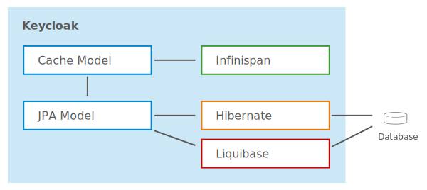
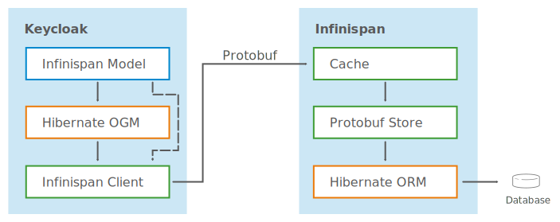
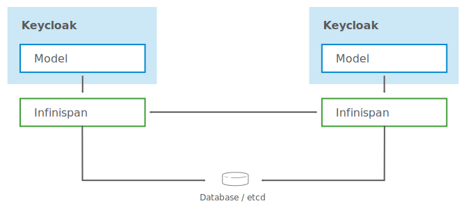
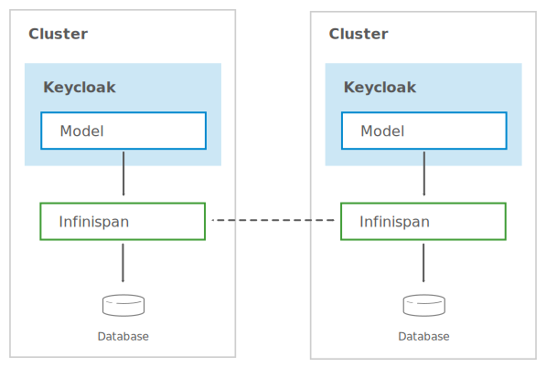

# Keycloak X - Storage

* **Status**: Obsoleted by [Store architecture](storage-architecture.md)
* **JIRA**: TBD

## What we have today

* Hibernate JPA for persistence
  - Complex and unpolished database schema
  - Requires frequent database schema updates
* Infinispan for caching
  - Custom and complex implementation
  - Hard to debug or extend
* Infinispan for sessions
  - Sessions are in-memory onlym with exception of offline sessions
* Liquibase for database schema updates
  - Works pretty well
  - Only real option to manage schemas for many databases
 

The below shows how big the database schema is.

 

Introduction of Cross DC support made the invalidation cache layer even more complex. There are also a number of 
dissadvantages with the current aproach, including:

* Preview
  - Use in production with great care
* Complex setup
  - External Infinispan server configuration
  - Active-active relational database setup
* Potential scalability issues
  - Both JDG and database replication messages

With regards to zero downtime upgrades there are also a number of issues:

* Need to consider both DB and caches
  - Hard to do with current database schema
  - Hard to do with current caches
* Requires a lot of custom complexity each time DB schema or cache changes are made

It would be a significant effort to fix the current storage and some things like simplified cross DC setup and zero 
downtime upgrades may not even be achievable.

With all this in mind we are re-thinking completely how we do storage.

## Breaking storage into chunks

* Realm Config
* Client Scopes
* Clients
* Groups
* Roles
* Authorization
* Sessions
* Events
* User Profiles
* User Credentials
* User Consents
* User Group Mappings
* User Role Mappings

## External Store Service

One idea could be to define gRPC interfaces for the various stores. This would make it easier to implement and maintain
different stores.

## Infinispan Store

Infinispan is a distributed in-memory key/value data store. However, it has support for persisting data and can also
deal with replicating data with multiple DCs.

The core idea is to use Hibernate OGM with Infinispan Hot Rod Client, which has built-in near cache support. 
Clustering and persistence would then be delegated to external Infinispan servers. We would also use protobuf to
support backwards compatibility.

Protobuf provides a flexible, efficient and automated mechanism for serializing structured data. It supports forward/backwards
compatible schemas, and is supported by Hibernate OGM.

For a single cluster deployment would look like:

In this example there is no need to configure clustering for Keycloak, but rather this is taken care of by Infinispan.
Infinispan also has support for different stores, so could in theory support a relational database as well as etcd.

In a cross DC setup the deployment is simpler than before:

In this setup Infinispan is responsible for all replication cross DC, which would provide a redundant copy of the database
without the need to configure replication of the database itself.

### Summary

* Keycloak almost only has to deal with Infinispan through Hibernate OGM
  - No more Liquibase or complex database schema
  - No more complex custom invalidation cache
  - No more complex “event” mechanism for cross DC support
* Rolling upgrades a lot more straightforward
* Cross DC no longer needs active-active DB
* Live backups of DB is easy
* Simplified model also opens up for alternative stores (community)

### Work need from Infinispan

* Protobuf cache store [ISPN-9781](https://issues.jboss.org/browse/ISPN-9781)
* Etcd Cache Store [ISPN-9779](https://issues.jboss.org/browse/ISPN-9779)
* XSite improvements [browse/ISPN-9154](https://issues.jboss.org/browse/ISPN-9154), [ISPN-1195](https://issues.jboss.org/browse/ISPN-1195)
* Rolling Upgrades support with protobuf cache store
* Add openssl to the Hot Rod client
* Compute if absent support for Hot Rod Client [ISPN-9780](https://issues.jboss.org/browse/ISPN-9780)
