# Managing multi-factor authentication and Step-up authentication in Keycloak

* **Status**: Draft #3
* **JIRA**: [KEYCLOAK-9693](https://issues.jboss.org/browse/KEYCLOAK-9693), [KEYCLOAK-9694](https://issues.jboss.org/browse/KEYCLOAK-9694) and [KEYCLOAK-847](https://issues.jboss.org/browse/KEYCLOAK-847)

## Motivation

The [W3C Web Authentication - Two-Factor](https://github.com/Keycloak/Keycloak-community/blob/master/design/web-authn-two-factor.md) document specifies as sub tasks
the administration of two authentication factors ([KEYCLOAK-9693](https://issues.jboss.org/browse/KEYCLOAK-9693)) and of multiple authenticators for users
([KEYCLOAK-9694](https://issues.jboss.org/browse/KEYCLOAK-9694)).

The purpose of this design document is to define how this is to be handled in the
administration console, and therefore by extension to how Keycloak handles authentication
on a logical level. The design may also specify functions, data structures and screen
mockups as the design progresses.

The design of the step up authentication ([KEYCLOAK-847](https://issues.jboss.org/browse/KEYCLOAK-847)) process is also defined in this proposal as it is linked to the multi-factor
authentication (MFA) and the mechanisms that are defined in the one will have an impact
on the other.

The design also has the following constraints:
* The design must be simple to use, but can be customised for more complex use cases. This is true for both the administrator when setting up the realm and the user when logging in with Keycloak.
* In addition to two factor authentication, the design must take into account the use with password-less authentication (i.e. a single factor authentication that is not a password).
* The system must be easily extensible for groups that wish to add their own authenticators within Keycloak.

For [KEYCLOAK-9693](https://issues.jboss.org/browse/KEYCLOAK-9693) this means changes
to the authentication logic, changes to the authentication part of the admin console,
changes to the authentication screens that the user sees during login, changes to the
REST API, and changes to the database.

For [KEYCLOAK-9694](https://issues.jboss.org/browse/KEYCLOAK-9694) this means
changes to the *users > credentials* part of the administration console and to
the REST API.

For [KEYCLOAK-847](https://issues.jboss.org/browse/KEYCLOAK-847) this means changes
to the authentication logic, changes to the authentication part of the admin console,
changes to the client part of the admin console, extending Keycloak's comprehension
of the OIDC and SAML protocols, and some small changes to the REST API.

What this design proposal does _not_ cover is the specific handling of the WebAuthn
and modifications to the account console, as other design proposals and JIRAs already
specify those modifications.

## Design proposal for [KEYCLOAK-9693](https://issues.jboss.org/browse/KEYCLOAK-9693)

In this section we discuss modifications necessary to allow an admin to manage two factor
authentication, and the design of the admin GUI for this task. We will also be using the following concepts:
* **Authentication flow**: Corresponds to the current flows used for authentication. However, their logic is changed to allow the use of multiple factors during authentication and multiple alternative authentication executions.
* **Sub-flow**: A flow that is set within a authentication flow. The containing flow will be referred to in this case as the **parent flow**
* **Flow elements**: Any execution or flow that can be set within an authentication flow or sub-flow.
* **Authentication execution**: An execution that is used for authentication purposes. This doesn't correspond to an actual different set of classes but is used to differentiate the executions that are used for authentication from those that are used, for example, to reset a password. Examples of authentication executions in Keycloak would be the classes OTPFormAuthenticator, UsernamePasswordForm or ValidateOTP.
* **Credential type**: A logical grouping between authentication executions and credentials. This design is to allow for multi-tokens by allowing the authentication execution to find the list of allowable credentials.
* **Credential**: The credentials that are used by the user to log in. Keycloak stores shared secret that is used to log in with, for example hash for passwords, symmetric key for OTP and public key for Fido2. In this document, **credential** will be used for both the representation in Keycloak and the user's possession/knowledge.

### Multi-factor and password-less

#### Authentication flow logic

The current authentication flows system relies on a sequential execution and the following requirement instructions: REQUIRED, ALTERNATIVE, OPTIONAL, DISABLED. This system allows the administrator to set up the current steps and options that the user has to perform actions like registering and logging in.

However, the current system is insufficient to support multi-factor and credential selection mechanisms. This section aims at redefining the logic of the flows, and of the requirements both for the flows and of the executions. However, while flows have only a few different types, there are multiple different types of executions. For the purpose of this section we will divide them into two categories:

* Executions that require user interaction, it is these executions that display the forms presented to the user.
* Executions that requires no user interaction

Flows are still read from top to bottom, and may contain executions and sub-flows. Flows have a "successful" criteria, that denote if the user performing the flow has achieved the purpose of the flow. For example, for a browser flow, successful means that the authentication is valid and that the user can log in, and for a registration flow "successful" means that the user created a user for himself within Keycloak.

The possible requirements and their logical rules are:
* **Required**: Within a flow, any **required** flow elements MUST be processed. However, this is only true for the current flow. Any **required** flow element within a sub-flow is only processed if that sub-flow is entered. For a flow to be successful, every **required** flow element must be successful.
* **Alternative**: Within a flow, **alternative** flow elements are only executed if the flow is not already successful. Because the **required** flow elements within a flow are sufficient to mark a flow as successful, any **alternative** flow element within a flow that contains **required** flow elements will never be executed. In this case, they are functionally **disabled**.
* **Conditional**: This requirement replaces **optional** and can only be placed on flows. A **conditional** flow can contain a "condition execution". These condition executions are logical statements. If the condition execution processes as _true_ then the **conditional** flow acts as **required**. If not, the **conditional** flow acts as **disabled**. If no conditional execution is set, the **conditional** flow acts as **disabled**. If a flow contains conditional executions and is not set to **conditional**, the conditional executions are not evaluated.
* **Disabled**: within a flow, any **disabled** flow elements MUST NOT be processed.

These rules are mostly the same as the current rules, with flow elements being processed sequentially from top to bottom. The major change is what happens with a flow or sub-flow with _active_ **alternative** flow elements (where _active_ means that it is in a flow or sub-flow that contains neither **required** flow elements or **conditional** flows whose conditions evaluate to _true_): flow elements that require no user interaction are automatically executed sequentially, until the first flow element which requires user interaction is encountered. A user who is at an **alternative** execution which has user interaction MUST be able to select any other **alternative** flow element, including **alternative** flows and **alternative** executions that do not require user interaction.

#### Conditional flows and conditional executions

While the behaviour of **conditional** flows is simple - evaluate the conditional execution, consider the flow **required** if _true_ and act as **disabled** if _false_ - the conditional executions themselves can have a more complicated logic. An example of a simple conditional execution would be a "role" conditional execution. This would be configured with a set of roles, and would only evaluate to _true_ if a user currently executing the flow has one of the configured roles.

A more complex conditional execution is required to replicate and extend the behaviour of current **optional** authentication executions, for example the OTP Form execution. For these authentication executions, when **optional**, the user is presented with the authentication form only when the user has a credential of the corresponding type (e.g. an OTP credential for the OTP Form execution). The corresponding conditional execution would have a similar behaviour:
* When set in a **conditional** sub-flow containing **alternative** authentication executions, the conditional execution must check if the user has a credential for at least one of the **alternative** authentication executions, and if this the case it evaluates to _true_,
* When set in a **conditional** sub-flow containing **required** authentication executions, the the conditional execution must check if the user has a credential for each of the **required** authentication executions, and only then will it evaluate to _true_.

#### Moving back within flows

With the ability to design more complex flows, the user may wish to return to a previous state without having to restart a flow from the beginning. This is especially important because a user may select a flow in an **alternative** execution, meaning that the user must be able to return to the **alternative** selection of executions. But this is also true if the user has a long sequence of **required** executions which require user interaction, and may wish to cancel his last action without having to start over. For this, the user would have a "back" button available within forms. This "back" button allows the user to return to a previous interactive execution, no matter how many non-interactive executions happened in between. For the flow, this means rolling back the state to the previous interactive execution, and displaying it to the user. If there is no previous interactive execution to return to, the "back" button is not displayed.

#### Flow logic examples

Here are some examples of how the new flow logic works for single factor, multi-factor, password-less, and conditional authentication.

An example of a single factor flow is the following:

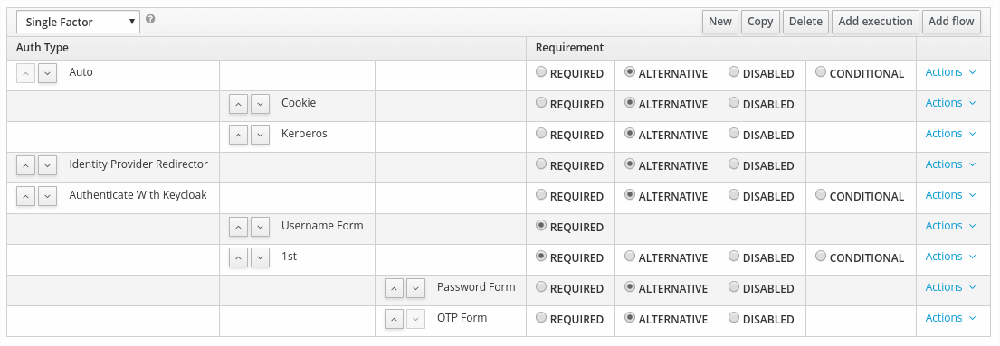

At the top level flow there are three **alternative** flow elements:
* `Auto` is a sub-flow that will be evaluated first. Both executions don't have any user interaction, so they will be automatically evaluated sequentially. If the user has a session cookie or kerberos it will be successful, and he will be logged in. Otherwise the sub-flow is not successful.
* `Identity provider Redirector` is an authentication execution that is encountered next. It will redirect the user for identity brokering if configured appropriately, but will otherwise be automatically skipped.
* `Authenticate with Keycloak` is a sub-flow with two **required** flow elements. Both will be executed sequentially:
  * `Username Form`: the user must type in his username. This execution is successful as long as the username is in the database.
  * `1st`: a subflow with two **alternative** flow elements. Any one of the two will allow the user to log in, as the flow will be successful:
    * `Password Form`: a password set by the user. From here the user can either select `OTP Form` or move back to the `Username Form` (for example if he realises that he mistyped his username).
    * `OTP Form`: an OTP from a device owned by the user. From here the user can either select `Password` or move back to the `Username Form`.

An Example of a 2 factor flow is similar to the single factor flow:

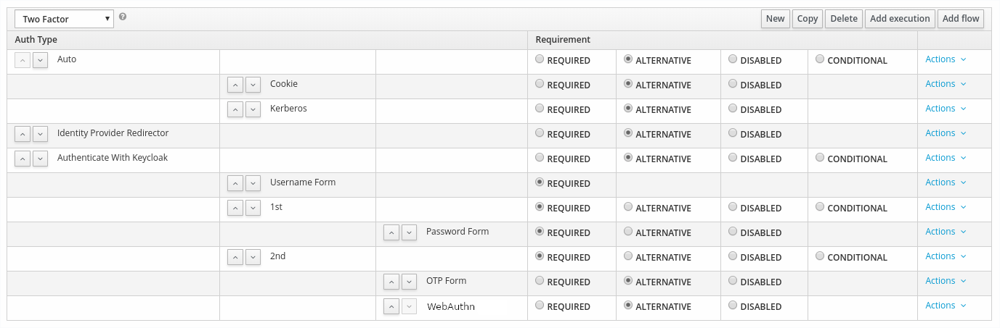

The top flow is the same as the previous example, so we will just look at what has changed within the `Authenticate with Keycloak` sub-flow, which now has three **required** flow elements:
* `Username Form`: the user must type in his username. This execution is successful as long as the username is in the database.
* `1st`: a sub-flow with a single flow element: `Password Form`. Since it's alone it could be **alternative** or **required** and the result would be the same.
* `2nd`: a subflow with two **alternative** flow elements. Any one of the two will allow the user to log in, as the flow will be successful:
  * `OTP Form`: an OTP from a device owned by the user. From here the user can either select `Webauthn` or move back to the `Username Form`.
  * `Webauthn`: a Webauthn device owned by the user. From here the user can either select `OTP Form` or move back to the `Username Form`.

An example of a flow which allows the user to choose between password-less and 2 factors would be the following:

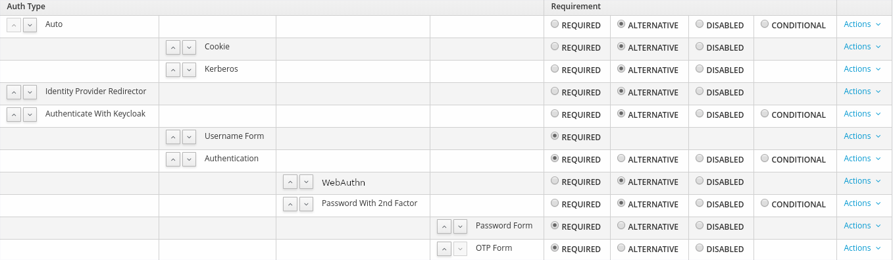

This is similar to the 2 factor authentication, and an example where a user may select an **alternative** subflow. Within the `Authenticate with Keycloak` sub-flow, there are the following changes:
* There are two **required** flow elements: the `Username Form` execution and the `Authentication` subflow.
* Within the `Authentication` sub-flow, there are two **alternative** flow elements:
  * `WebAuthn`, an execution which allows here the user to log in in a password-less manner
  * `Password with 2nd factor`, a sub-flow in which both `Password Form` and `OTP Form` are **required**, and which therefore will be executed sequentially. Once reaching the `OTP Form`, the user can move back to the `Password Form`, and from the `Password Form`, the user can move back to the last authentication execution in the previous sub-flow, which in this case would be `WebAuthn`.

An example of the use of conditional flows is the following:

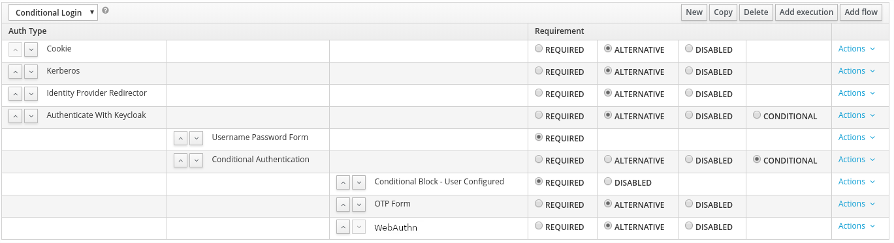

This is closer to the standard browser flow, with with the difference being that instead of an **optional** `OTP form`, there's now a **conditional** sub-flow, with three elements:
* `Conditional Block - User Configured`, a conditional execution which determines if the other authentication executions are configured for a user.
* `OTP Form`, which will return "configured for" for a user only if that user has an OTP credential configured
* `WebAuthn`, which will return "configured for" for a user only if that user has an WebAuthn credential configured.

The result is that:
* If the user has neither OTP nor WebAuthn credential configured, he will be able to log in with only username and password.
* If the user has only an OTP credential, he will be presented with first the username and password form, and then the OTP form for 2nd factor.
* If the user has only a Webauthn credential, he will be presented with first the username and password form, and then the WebAuthn form 2nd factor.
* If the user has both an OTP credential and a WebAuthn credential, he will be presented with first the username and password form, and then with the choice to login either with the OTP form or with the WebAuthn form.

The rules defined in the previous sections allow all these flows, but the administrator is responsible for defining flows that make sense.

### Multi-token

#### Linking credentials with authentication executions

Taking the 2 factor example from the previous section, as 2nd factor it is possible for the user to switch between `OTP` and `WebAuthn`, but it doesn't allow the user to have multiple authentication OTP credentials or multiple FIDO2 credentials.

For multi-token support in keycloak, when an authentication execution uses credentials to authenticate the user, it must be able to present a list of the credentials available to the user. Moreover, multiple authentication executions may use the same types of credentials, for example, the "ValidateOTP" and "OTPFormAuthenticator" both use the same OTP credentials to authenticate. These authentication executions must be linked to the credentials through the type of credential that they accept. Schematically, we would have:

```
-----------------------         ----------------------
| OTP Credential 1    |---------|                    |    ------------------------
-----------------------         |                    |----| OTPFormAuthenticator |
-----------------------         |        OTP         |    ------------------------
| OTP Credential 2    |---------|  Credential type   |    ---------------
-----------------------         |                    |----| ValidateOTP |
-----------------------         |                    |    ---------------
| OTP Credential 3    |---------|                    |
-----------------------         ----------------------
```

The credential type described here is similar to the current "type" field in the credential table in the database, but more restrictive. The idea is for an `Authenticator`, the type is obtained from the `CredentialProvider`: the interface has a `String getType()` method added to it that returns the type of the credential. The type itself is a simple String, but which is defined only at a single point in the code, in a child of the `CredentialModel` class. This is detailed later in the document

On the credential side, the value is input in the database when a credential of the corresponding type is recorded by the user. For example, when a user records a new OTP token, whether it is TOTP or HOTP, the type in the database `credential_type` field will always just be "OTP". The "hotp" or "totp" subtype will be recorded in another field. This is also detailed later in the document.

On the authentication execution side, classes that implement the methods that require validation of credentials will implement a new `CredentialValidator` interface, which is the following:
```
package org.keycloak.authentication;

import org.keycloak.credential.CredentialModel;
import org.keycloak.credential.CredentialProvider;
import org.keycloak.models.KeycloakSession;
import org.keycloak.models.RealmModel;
import org.keycloak.models.UserModel;

import java.util.List;

public interface CredentialValidator<T extends CredentialProvider> {
    T getCredentialProvider(KeycloakSession session);
    default List<CredentialModel> getCredentials(KeycloakSession session, RealmModel realm, UserModel user) {
        return session.userCredentialManager().getStoredCredentialsByType(realm, user, getCredentialProvider(session).getType());
    }
    default String getType(KeycloakSession session) {
        return getCredentialProvider(session).getType();
    }
}
```

And the implementation in the class is, for `OTPFormAuthenticator` for example:
```
@Override
public OTPCredentialProvider getCredentialProvider(KeycloakSession session) {
    return (OTPCredentialProvider)session.getProvider(CredentialProvider.class, "keycloak-otp");
}
```
Having the associated credential provider directly in the class allows the retrieval of the credentials through the `UserCredentialManager` and the type given by the `CredentialProvider`. It also simplifies the validation code a little, as it's no longer necessary to pass by the `UserCredentialManager` to call `isValid()`, but it can (and should) be called directly from the associated `CredentialProvider`.

#### Combining multi-token with multi-factor authentication

During a sub-flow in which a user can choose between authentication executions that extend `CredentialValidator`, the user will directly choose a credential that he has recorded instead of choosing the authentication execution. For example, if a user has three Fido2 devices recorded, and enters the following password-less authentication flow:


When the user enters the `Authentication` sub-flow he will have the option of choosing between his three Fido2 devices and the `Password with 2nd factor` sub-flow. Likewise, if the user doesn't have any Fido2 devices recorded, he would automatically enter the `Password with 2nd factor` sub-flow.

### Adding new credential types and authentication executions

Currently in keycloak there's only two types of credentials: OTP and Password. However, as other providers are added, there may be more credential types added, starting with WebAuthn. With the proposed changes, adding a new credential type and its associated authentication execution would mean at the least:
* adding the classes to handle the format of the new credential type in the database. Credentials are now described in json format, the details of which is further described later in the document, but this means:
  * adding a new child of `CredentialModel` class which contains the string description for the type, and the methods to read and create a credential object of the given type.
  * adding the classes to marshal and unmarshal the json representation of the credential
* adding a `CredentialProviderFactory`
* adding the associated `CredentialProvider`
* adding a `AuthenticatorFactory`
* adding the associated `Authenticator` which also implements `CredentialValidator`

When adding a new authentication execution that works for an existing credential type, only the last two steps would be necessary.

Some existing classes have also been refactored to correspond this model. For example the classes `UserCredentialModel`, which was simplified to conform to its role as a credential input from a user, and `CredentialModel` which was modified to correspond to the new credential format.

### Authentication section in the admin console

#### Default Flows

The schema described in the logic would be implemented in the _Authentication > flows_ section. Some work can be done on the UX to make
the process more intuitive, but this is not covered by this design.

Keycloak should have the same built in flows as is currently the case, except adapted to the new logic.
For the browser flow:
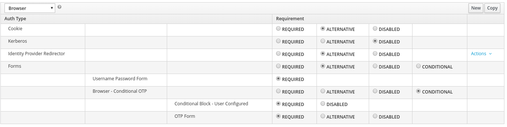

For the direct grant flow:
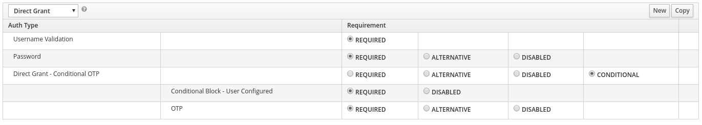

For the for the first broker login flow:
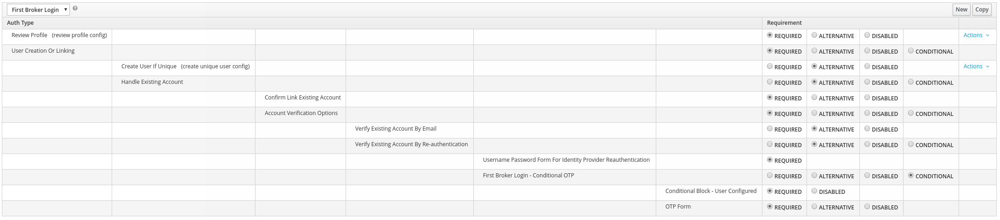

For the http challenge flow:
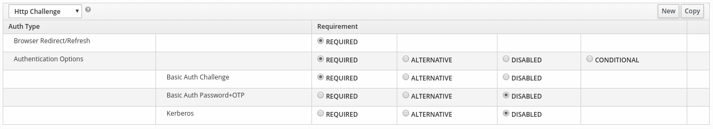

And for the reset credentials flow:
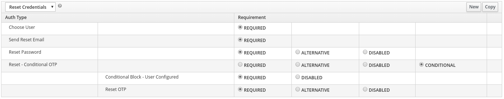

#### Bindings

No changes are necessary here.

#### Required Actions

No changes are necessary here, but current required actions may be a bit limited for the the new multi-factor scenario. See the appendix **Future improvements** for possible changes.

#### Policies

Modifications to the policies are not in the scope of this design proposal. However, with multiple authentication methods available, and as a user may possess multiple credentials for each method, the concept may have to be reworked. See the appendix **Future improvements** for possible changes.

### Authentication screens for the user in a browser flow

When the user is redirected towards Keycloak, unless he's using some system that bypasses the login actions (e.g. session cookie, kerberos,...) he will first enter at the very least his username, and then arrive at a form in two parts:
1. The first part allows the user to select which credential he wishes to use to login. We will call this the "credential selector". This could for example be a drop down list. This list only contains the credentials that the user can use at his current step in the authentication flow.
1. The second part is the form corresponding to the currently selected credential.

If a new credential selection is made, the 2nd part of form is changed. For example, if the user has by default the password selection screen, and an alternative is an OTP code, then the user may select his OTP device, and the screen is changed to an OTP form.

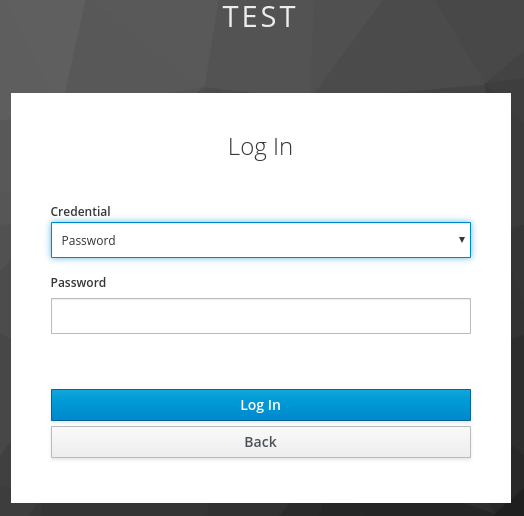

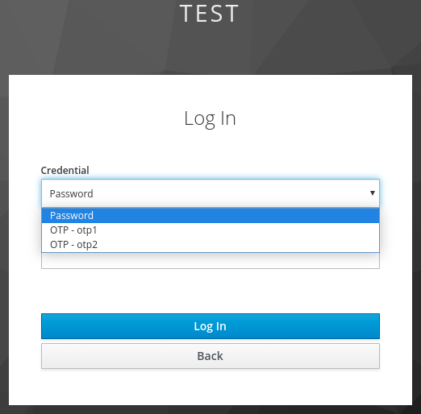

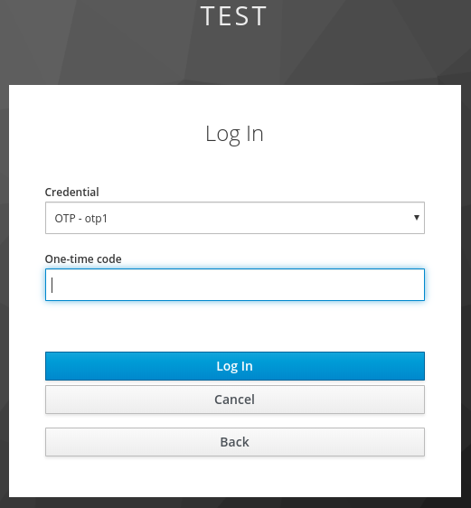

The default form presented to the user depends of course on what is available at the authentication step the user is currently at, but if there are several authentication executions available there are three rules to take into account:
1. The user has a possibility to order his credentials by preference. If one of those credentials are available at an authentication step, then the default page presented will correspond to that credential. For example, if the user has set an OTP credential as his preferred login method, and it is allowed, then the initial value of the selection part will be set to that OTP credential, and the OTP form will be displayed.
1. If the user doesn't have a preferred credential available for an authentication step, then the form displayed will be the highest in the corresponding authentication sub-flow, and if the user has multiple credentials for that authentication execution, then the selected credential in the "credential selector" is the first in the list of credentials returned for the user. For example, if a user has the credentials **OTP home**, **OTP office**, **OTP backup** in that order, and he arrives in a subflow with "OTP" and "Webauthn" (also in that order), then the user will arrive by default on an OTP form, and in the "credential selector" he will have **OTP home** selected.
1. In the case of step-up, a client via the SAML protocol can ask for a specific set of credential types. In this case, the first two rules are still valid, but are restricted to the subset asked for by the client. This mechanism will described in more detail in the section on step up mechanisms.

Note that under this new scheme, the system is potentially vulnerable to username enumeration, as entering a username will list the credentials associated with the user. However, this can only be prevented if the first authentication collects both a username and a preset credential (typically a password). With a password-less setup, it is not possible to prevent the username enumeration.

### REST API

There's no major change here.

### Database modifications

No database modifications are necessary for these changes.

## Design proposal for [KEYCLOAK-9694](https://issues.jboss.org/browse/KEYCLOAK-9694)

### Changes to the users > Credential menu

Instead of manage Password we have "manage credentials", with a list of credentials
for a user.  The administrator should
be able to edit / remove a credential, and in some cases maybe even create a credential.

#### Editing

Credentials are now designed to be mostly immutable, aside from those credentials which
need to update as a part of their mechanism, such as an HOTP's counter.
The administrator is able to visualise the data of the credential (except any
secret data). The administrator (and user) is able to set a label for the device to identify it.
They are also able to set a "preferred order" for the credentials. The credential used
by default during login will be the "most preferred" credential belonging to a valid
credential type, at each authentication step.

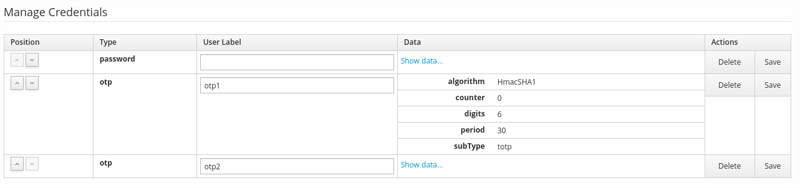

A note for passwords: Unlike other credentials there should not be more than one password that can be configured. Since credentials are designed to be mostly immutable, resting a password now means deleting a credential and creating a new one.

#### Deleting

Deleting credentials can lead to a user being unable to authenticate himself.
While a user shouldn't be able to put himself in this situation, an admin must be
able to remove any or all credentials for a user if they have been compromised.
Considering the problems that may result from incorrectly removing a credential,
the admin GUI should ask for a validation (e.g. "Are you sure?") before doing
the delete.

The functionality to disable a credential type for a user is removed, since the administrator can now delete any individual credential.

#### Creating

For some credential types, an admin may be able to create a credential.
The most obvious of these is the password, as is currently the case. If a user doesn't already have a password, the admin may
create a new password for a user (temporary or not).

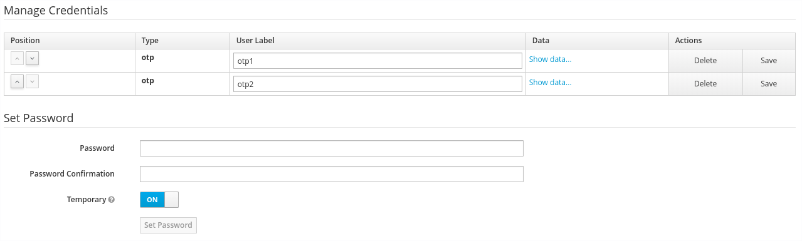

For other credential types, it is up to them to determine if a credential can be created, and to determine how they can be created.

### Modifications to the REST API

Currently there's no way to get credentials with the REST API. This should change with these
modifications to reflect the new options for the administrator. The API should function in the
same manner as the admin console: Credentials can be exposed (except for secret
values), the label edited, the preference changed, and the credentials deleted with the same restrictions as described in the previous section.

### Database modifications

The current system has multiple fields to store information about a credential. Some
are common, others are not. For example, a password's secret is the hash of the password,
an otp's secret is the value shared between Keycloak and the device. However, some information
is only relevant for a credential of a specific credential type, for example,
password credentials contain the salt and the hash iterations, while TOTP may have the
number of digits and the period. Other credential types will likely have their own set of
fixed metadata. This data doesn't need to be queried nor modified, therefore the new
credential table columns are:
```
-----------------------------
| ID                        |
-----------------------------
| user_ID                   |
-----------------------------
| credential_type           |
-----------------------------
| created_date              |
-----------------------------
| user_label                |
-----------------------------
| secret_data               |
-----------------------------
| credential_data           |
-----------------------------
```

Where:
* `ID` the primary key of the credential.
* `user_ID` is the foreign key linking the credential to a user.
* `credential_type` a string set during the creation that must reference an existing credential type.
* `created_date` being the creation date (in long format) of the credential.
* `user_label` being the editable name of the credential by the user (a varchar(N)).
* `secret_data` containing a static json with the information that cannot be transmitted outside of Keycloak
* `credential_data` containing a json with the static information of the credential that can be shared in the admin console or via the REST API.

It is up to the code linked with an authentication execution to be able to interpret the `secret_data` and `credential_data` correctly. Note that in some cases, `credential_data` or `secret data` cannot be fully static. This is for example the case for HOTP, as the counter needs to be updated.

## Design proposal for [KEYCLOAK-847](https://issues.jboss.org/browse/KEYCLOAK-847)

In this section we discuss mechanisms of step up authentication, the logic of the
implementation within Keycloak, how the administrator can configure the step up
within the admin console (what this implies for flows and clients), and the
implications for users.

### Step up mechanisms

Step-up is the ability to allow access to clients or resources based on an authentication
level of a user. It can be described by two example use cases:
1. A user has a session in Keycloak for a *client A* after having logged in with username and password. However, when connecting to a *client B* which demands greater security, the user is asked for a second authentication factor before proceeding. Had the user connected initially to *client B*, he would have had to provide username/password **and** the second factor.
1. A user has a session in Keycloak with a *client C*, that was logged in with username and password. However, when doing an operation with more risk *client C* asks Keycloak to provide a second factor authentication for the user. Note that the client may also ask for a full 2 factor authentication: username/password + 2nd factor. A good example for this case would be a bank that allows a user to browse his transaction history with only username/password, but which requires a 2nd factor to access the payment functionality.

In many ways, step-up can be viewed as an authorization which is enabled by stronger
authentication to be granted. Use case 1 can be handled only through internal configurations
within Keycloak but the use case 2 requires support from both Keycloak and the client.
Conceptually, the mechanisms to support both use cases must be present within Keycloak.

Use case 2 is supported by both the SAML and OIDC protocols. Within these protocols
there are three concepts that are represented that enable step-up:
* Level of Authentication (LoA)
* Specifying Credential types
* Forcing authentication

#### Level of Authentication

This defines an agreed upon level of authentication (also called level of assurance)
between an IDP and client. There is no single formal document that specifies the
requirements for an authentication.
For example [NIST's SP 800-63-3](https://pages.nist.gov/800-63-3/) has three different
categories of three levels each, while
[ISO/IEC 29115](https://www.iso.org/standard/45138.html) defines 4 assurance levels.
The basic idea is the manner in which an authentication is done or which authenticators
are used causes lower or greater assurances about the identity of the user. This level
can then be used to determine if a user can or not perform a requested action.

OIDC supports LoA with the optional Authentication Context Class `acr` claim,
or with the `acr_values` parameter as defined in the
[core specification](https://openid.net/specs/openid-connect-core-1_0.html#acrSemantics).

SAML supports LoA with the [Identity Assurance Profiles](http://docs.oasis-open.org/security/saml/Post2.0/sstc-saml-assurance-profile.html) part of the protocol, and with the
`<RequestedAuthnContext>` element.

#### Specifying credential types

A client may also specify exactly which type of credential it wishes to use.

For SAML this is done with the [Authentication Context for the OASIS Security Assertion Markup Language](http://docs.oasis-open.org/security/saml/v2.0/saml-authn-context-2.0-os.pdf)
part of the protocol, and with the `<RequestedAuthnContext>` element.

For OIDC there is no way to do this. The `amr` parameter can describe which authenticators
are used with the Authentication Method Reference `amr` Claim, which is defined within the
[core specification](https://openid.net/specs/openid-connect-core-1_0.html) with some
extra information in [rfc8176](https://tools.ietf.org/html/rfc8176). However, this is only used to _list_ the credential type used for the login, but cannot be used request a specific credential type.

#### Forcing authentication

To fully support the step-up, a client should be able to force re-authentication even
when Keycloak considers that a user is authenticated to an acceptable level.

For OIDC this is done with the `prompt=login` optional parameter.

For SAML this is done with the `ForceAuthn="true"` attribute of the `AuthnRequest`.


### Logic within Keycloak

Implementing the step-up authentication in Keycloak means implementing both the LoA
and the request of authenticator categories. These capabilities are build upon the new
authentication mechanisms described previously in the document.

#### Level of Authentication

##### Flow configuration

The LoA is specified as markers within the authentication flow, specifically, this is set as an **LoA execution** within an a subflow. For Keycloak this is internally set as a positive numerical value. Any correspondence to an external definition of an LoA is handled through configuration. Passing an **LoA execution** within an authentication flow sets that level for a user. User sessions record both the current highest authentication level used, as well as the credential types used (possibly which credentials have been used instead of the credential types).

For entering a flow for a LoA, the **conditional** requirement is used, with a **conditional execution**. For example, a 2 factor setup would become:

```
Auth type                         | Requirement
-----------------------------------------------------------------------------------------------
Auto                               [x] Alternative  [ ] Required  [ ] Conditional  [ ] Disabled
  | - Cookie                       [x] Alternative  [ ] Required                   [ ] Disabled  
  | - Kerberos                     [x] Alternative  [ ] Required                   [ ] Disabled
Identity Provider Redirector       [x] Alternative  [ ] Required                   [ ] Disabled  
Authenticate with Keycloak         [x] Alternative  [ ] Required  [ ] Conditional  [ ] Disabled  
  | - Username                     [ ] Alternative  [x] Required                   [ ] Disabled
  | - 1st                          [ ] Alternative  [ ] Required  [x] Conditional  [ ] Disabled  
       | - Condition 1                                                             [ ] Disabled  
       | - Password                [x] Alternative  [ ] Required                   [ ] Disabled
       | - setLoAOnSuccess (set LoA=1)                                             [ ] Disabled  
  | - 2nd                          [ ] Alternative  [ ] Required  [x] Conditional  [ ] Disabled
       | - Condition 2                                                             [ ] Disabled  
       | - OTP                     [x] Alternative  [ ] Required                   [ ] Disabled
       | - WebAuthn                [x] Alternative  [ ] Required                   [ ] Disabled
       | - setLoAOnSuccess (set LoA=2)                                             [ ] Disabled
```
Where the value within parentheses indicates the configuration of the component. The configuration of the conditions are not indicated within the previous schema for clarity, but they would be:
* Condition 1: ((LoA < 1 AND (RequestedLoA >=1 OR RequestedLoA < 0)) OR (force AND (RequestedLoA = 1 OR (LoA < 1 AND RequestedLoA > 1))))
* Condition 2: ((LoA < 2 AND (RequestedLoA >=2 OR RequestedLoA < 0)) OR (force AND (RequestedLoA = 2 OR (LoA < 2 AND RequestedLoA > 2))))

More generally, the LoA configuration for a level N would be:
* ((LoA < N AND (RequestedLoA >=N OR RequestedLoA < 0)) OR (force AND (RequestedLoA = N OR (LoA < N AND RequestedLoA > N))))

Considering the complexity of this expression, it would be simpler to have a `LoACondition` execution which is just configured with a value (1, 2, ...).

We use negative numbers as requested LoA to indicate that a client is requesting the maximal level available in Keycloak.

The problem with this flow is that when requesting a step-up, it is logical that the flow executes from the top. This means that in some cases, certain elements of the flow that are normally encountered during the login must be skipped. For example, if a user is logged in with LoA 1, and the RequestedLoA = 2, then the following flow elements would normally be encountered, and would cause a problem:
* `Cookie`: Currently the cookie would automatically allow logging in. With the new modifications, it must check if the RequestedLoA <= LoA to validate. However, it must in any case set the context to the user's session.
* `Identity Provider Redirector`: This element is skipped when there are no identity providers configured. If there is one configured however, there must be a mechanism to determine if the step-up request is done by the current IDP or by the trusted IDP which was originally logged in to.
* `Username`: The user should not have to re-input his username. The execution must recognise from the context that the user has already input his name.

##### Client configuration

By default, the administrator should have to set a LoA on a client. For security reasons, this means that if the LoA is not specifically configured, the client has `RequestedLoA = -1` which means that it will have to do the full authentication flow. However a `RequestedLoA` can be set within the configuration of the client, simulating an actual `acr_value` from the client.

When a user is logged on with a sufficient factor for a client, it can be directly accessed. When a
client is not logged with a sufficient LoA, the user will either perform the appropriate login flow, or keycloak will respond that it cannot satisfy the LoA request with the appropriate protocol mechanisms. A client may at any time use the LoA protocol mechanisms to ask for an
authentication level. If it requires the full re-authentication for the level,
no matter the current state of the user's session, it must use the force parameter.
When a client is using a protocol to ask for LoA (forced or not), Keycloak must respect the
protocol with respect to how it acts and how it responds.

A conflict situation may arise conceptually when an admin specifies several
flows, sets different LoA levels to each, and assigns the flows to different clients.
However, the rule is always the same: if a user has a certain level, it needs only have that
level to connect to a client. It's up to the admin to make sure that the LoA is
coherent.

A note for LoA configuration: for a given LoA for a specification such as [ISO/IEC 29115](https://www.iso.org/standard/45138.html), many of the factors for different
LoA levels are not dependent on MFA, but on organisational or other technical factors
(e.g. password strength, nature of an OTP device, ...), so it is up to the administrator
to evaluate how a LoA that can be requested by a client maps to a LoA within keycloak.

##### Setting the LoA in the response

When delivering a response with SAML or with OIDC the mechanisms to return the message, by protocol definition, keycloak MUST deliver an `acr` claim (for OIDC) or an `AuthnContext` (for SAML). Since the LoA value to text mapping may be different per client, this must be configured at the client level. This mapping is also used to do the text to value translation when a request is received from the client.

The numeric value to use as base for the mapping is retrieved from the user's session.

#### Specifying credential types

This only makes sense for SAML clients, which can use protocol mechanisms to request
specific authenticator categories, and in this case, Keycloak must act and respond as
defined by the protocol. If the user is already authenticated with the requested
credential type, Keycloak can simply return the requested token, but if not or
if the request uses the force parameter it must perform the extra authentication(s).

This can also be handled on a configuration level for clients, but it is simply
a matter of creating a specific authentication flow, with necessary **conditional** subflows, and the authentication executions corresponding to the required credential types and then setting the authentication flow to a client.

For both SAML and OIDC, however, this will require being able to define respectively
[authentication context classes](https://docs.oasis-open.org/security/saml/v2.0/saml-authn-context-2.0-os.pdf) and [authentication method reference values](https://tools.ietf.org/html/rfc8176) to a credential type. This is necessary to be able to transmit a value within an `<AuthContext>` (for SAML) or an `amr` claim (for OIDC). It is also necessary for Keycloak to be able to present during an authentication with a `<RequestedAuthnContext>` the user with the correct choice of authenticators.

##### Setting values within the response

For SAML, the same mechanisms as for the LoA are used, but for OIDC's `amr` value this is different, as this is an optional claim. Here a mapper is used for to make the mapping from the credential type to the value transmitted in the response.

#### Forcing authentication

As both protocols suggest, keycloak must ask for re-authentication when the `prompt=login` parameter is called from an OIDC client and `ForceAuthn="true"` called from a SAML client.

##### OIDC

For OIDC the protocol is not clear on what should be done when `prompt=login` is used with `acr_values` (and more generally with LoA). But keycloak can act exactly as asked with the request from the client. This can be illustrated with the following example:

Keycloak is configured with two authentication factor subflows, **1st factor** which provides LoA lvl1 and **2nd factor** which provides LoA lvl2. Imagining a user already logged in with a LoA lvl2, then

* the client asks `prompt=login` -> keycloak re-asks the user to log in with **1st factor** subflow, as it would do on a normal login with no acr_values specified.
* the client asks `prompt=login&acr_values=lvl1` --> same as case 1, but this time because it's explicitly specified.
* the client asks `prompt=login&acr_values=lvl2` --> keycloak only executes the subflow for **2nd factor**. Note that if the user hadn't already been logged in, keycloak would also have executed the subflow for **1st factor**.

##### SAML

SAML, both for requesting a specific credential types and for requesting LoA uses the `<RequestedAuthnContext>` element to request for an authentication context. Within this element it can specify a `comparison` attribute with the following possibilities:
* `exact`: the default, the resulting authentication context in the authentication statement MUST be the exact match of at least one of the authentication contexts specified.
* `minimum`: the resulting authentication context in the authentication statement MUST be at least as strong (as deemed by the responder) as one of the authentication contexts specified.
* `maximum`: the resulting authentication context in the authentication statement MUST be as strong as possible (as deemed by the responder) without exceeding the strength of at least one of the authentication contexts specified.
* `better`:  the resulting authentication context in the authentication statement MUST be stronger (as deemed by the responder) than any one of the authentication contexts specified.

For keycloak "strength" is determined by the LoA level association in the flow. When `ForceAuthn="true"` is used, Keycloak should act in the following way when receiving the comparison levels alongside one or many LoAs:
* `exact`: make the user register with the subflows corresponding to the asked LoAs.
* `minimum`: make the user register with the subflow corresponding to the first asked for LoA in the list.
* `maximum`: make the user register with all subflows up until and including the subflow corresponding to the highest LoA that was asked for.
* `better`: make the user register with the subflow corresponding to the next LoA higher than the highest one asked for.

If the user is not yet logged in, he will have to do all authentication steps up to the highest LoA asked for by keycloak as a result of the `<RequestedAuthnContext>`. The LoA returned by Keycloak in the `<AuthnContext>` is the highest the user logged in with as a result of the request.

SAML can also request Authentication Context Classes that map to actual credential types like "password" and "Public Key X.509". In this case keycloak can still use LoAs to define "strength" (with the link `Authentication Context Classes -- credential type -- authentication execution -- subflow -- LoA`, although this requires keycloak to go through the entire authentication flow to obtain the necessary information), but should try to honour the request by only allowing the user to choose from the credentials corresponding to the asked for context classes (which correspond to a credential type for us). For `exact`, keycloak must only allow credentials of those types, but for the other `comparison` types keycloak may allow the user to log in with a credential of an equivalent "strength".

### Modifications to the REST API

There are only minimal modifications to the REST API, and they mirror the changes
to the GUI:
* Configuration of the **conditional executions** and **LoA** executions for the flow
* Configuration of the LoA and LoA mapping within the client.

### Extending protocol implementation within Keycloak

The following protocols or optional parts of protocols must be implemented for OIDC:
* Handling of the `acr` claim, `acr_values` parameter and `prompt` parameter as
described in the [OpenID Connect Core](https://openid.net/specs/openid-connect-core-1_0.html)
* Implementation of the [RFC 8176: Authentication Method Reference Values](https://tools.ietf.org/html/rfc8176)

And for SAML:
* [Authentication Context for the OASIS Security Assertion Markup Language (SAML) V2.0](https://docs.oasis-open.org/security/saml/v2.0/saml-authn-context-2.0-os.pdf), although only context classes that actually match an authenticator need be implemented
* [SAML V2.0 Identity Assurance Profiles](http://docs.oasis-open.org/security/saml/Post2.0/sstc-saml-assurance-profile.html)
* Handling of the `<RequestedAuthnContext>` element and of the `ForceAuthn` parameter
as described in the [SAML core](https://docs.oasis-open.org/security/saml/v2.0/saml-core-2.0-os.pdf).

## Appendix

### Authentication examples

Below are a list of example authentication of users. A realm can support multiple alternatives, where a user can choose one as the default, but also have other alternatives configured. It is important that the changes to authentication flow take into account current and future approaches for authentication in order to not have to be re-designed again in the future.

Authentication mechanisms:

* Password
* PIN
* Software OTP
* Hardware OTP
* SMS
* Email
* WebAuthn
* Printed backup codes
* Kerberos
* Identity Provider (OIDC, SAML and Social)
* Cookie
* Device identification
* Push notification to mobile app
* External

The above can be used as a single factor, or combined to achieve N factors. A single authentication mechanism in Keycloak can also provide multiple factors on its own. Example of the latter could be a WebAuthn device that requires user fingerprint or pin to unlock, or an external authenticator.

The authentication mechanisms can be combined in different combinations. Examples include:

* Password and Software OTP
* WebAuthn (multiple factors built-in to device)
* WebAuthn and PIN

### Future enhancements

This appendix has suggestions of improvements in keycloak that are related to this design proposition, but which will not necessarily be accomplished within the scope of the multi-factor and step-up.

#### Required Actions

Current required actions are a bit too limited to support multi-tokens. While it is currently
possible to require a user to, for example, register an OTP device, it must be possible for the
administrator to require "register a valid 1st factor" and "register a valid 2nd factor".

To do this, it must be possible to register a required action multiple times, and to configure
required actions. It must also be possible to remove required actions from the list. The code
of the required action should define if it can be registered multiple times, and how it can
be configured. However, all required actions should be able to be removed, and removing a
required action should also remove it from all users for which it is currently required.

The purpose of this is to be able to have a "register credential" required action in which
credential types can be set. For example, if an admin were to configure a 2nd factor
with OTP and WebAuthn, he could then set a "register credential" with the OTP and Fido2
credential types. A user, when confronted with that required action, would only have
to register one of the two.

#### OTP policy

OTP policy is currently set within the "Authentication > OTP Policy" page, which makes it realm-wide. It is also limiting in its options, that is, for example, it doesn't allow to have OTP tokens with both 6 digits and 8 digits within the realm. With the advent of multi-factor and multi-token, this design could be modified in the following manners

##### Allowing the user to choose some options

While an option such as the look ahead window is server side and should be applied equally to the entire realm, the other OTP options (type, OTP hash algorithm, number of digits, OTP token period) are also characteristics of the device. As such, the administrator could allow the user to choose, for example, if he wants 6 or 8 characters for his OTP token, or if he prefers HOTP to TOTP.

##### Adding to the Policy the number of allowed OTP devices for a user

With the possibility of multi-tokens, some administrators may allow a user to have any number of OTP tokens, while some may wish to keep it to a limited number. This improvement would allow the administrator to have a policy option called "Number of software OTP tokens per user", and he could choose between "unlimited", and setting a positive number.

##### Attaching the Policy to the credential type

To have true flexibility with regards to credentials and types, administrators can instantiate their own "credential types" as well as "credential type policies", rather than support just policies for a few "concrete" specific credential types like "password" and "totp":
Under left tab "Authentication" in admin console have subtab "Credentials" .

* Admin can create instances of Credentials based on available Credential Provider Types. Initial available Credential providers will be: password, otp, WebAuthn

* By default, there will be 1 instance of "password", 1 instance of OTP and 1 instance of WebAuthn created.

* In case that a credential provider supports credential provider policies (which both password and OTP obviously support), there will be another UI page shown when admin can configure credential policies for a given credential instance.

* The admin can for example have setup with 1 instance of "password" credential and 2 instances of "otp" credential called "otp-credential-1" and "otp-credential-2" where each of the OTPs will be configured with different OTP policies

* In the authentication flow configuration, the administrator can  "link" the specified authenticator execution with the given credential instance, as long as they both support the same credential provider. In other words, in the "browser" flow, the administrator can add "OTP Form" authenticator and point to "otp-credential-1". In the DirectGrant flow, the administrator will create "ValidateOTP" authenticator and point it to "otp-credential-1" as well. This will allows the administrator to share the same TOTP policies for both the "browser" and "direct grant" flow as policies are configured for the instance of "otp-credential-1"

Migration from previous version should be fine as after migration, there will be 1 instance of "password" credential with password policies, which are in current version configured at realm level. Same for OTP.

#### Restricting executions to the flows where they can be used.

Currently, there are many executions which only make sense in limited flow types. For example `OTP Form` is usable in the `Browser` flow type, but not in the `Direct Grant` flow type. However, currently you can still add `OTP-Form` to most flows.

To simplify selection in the GUI, it would also be useful to do some refactoring to ensure that the execution code for the `Browser` / `Registration` / `Direct Grant` / `Reset Credentials` / `Client Authentication` bindings can only be selected as executions for their binding categories. This already seems to be the case for `Client Authentication`, and would simplify the selection of executions.

It would also allow a simplification of the naming of executions. For example, we could just have `OTP` instead of `OTP Form` (for `Browser` binding) and `OTP` (for `Direct Grant`).

#### Increasing the static data linked to a credential provider

A `CredentialProvider` could potentially have more static data associated with it to serve as information about the credential type. For example, an icon for the credential type, to be presented within the user interface, or an internationalised informational text about the credential type, also for the user interface. This information would be held within resource files, and accessed through code associated to the `CredentialProvider`.   

#### Encrypted confidential credential data in the databases

It is a best security practice to make sure that confidential data, for example symmetric or private keys, are encrypted in the database, in order to avoid any potential sql injection attack that could reveal the information. With the modification of credentials to support a `secret_data` field and a `credential_data field`, it would be worthwhile to allow users to encrypt the contents of the `secret_data` field when written to the database, and decrypted when read by keycloak.
