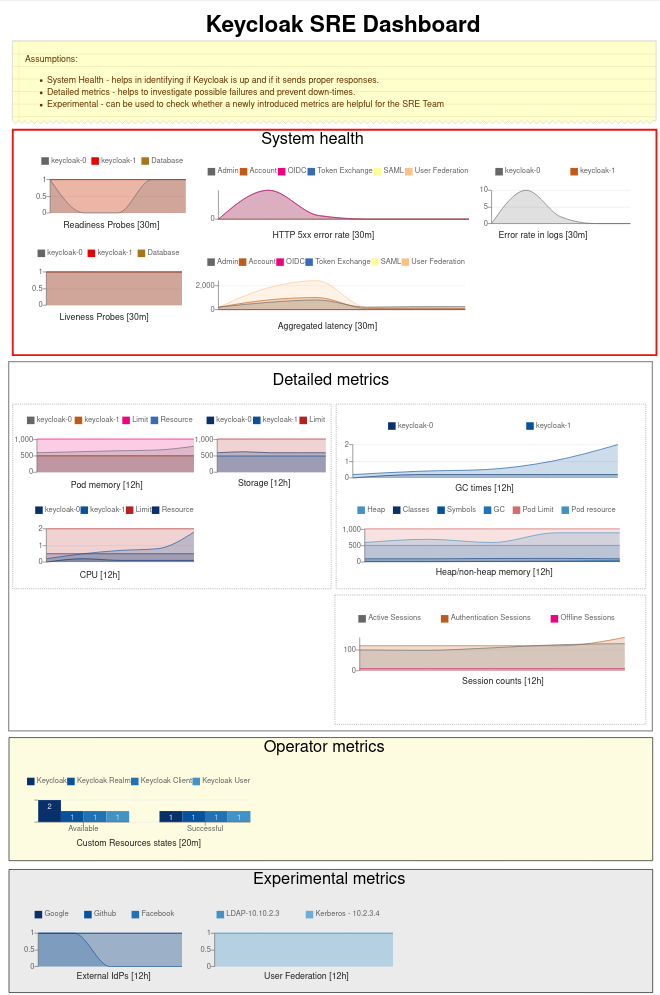
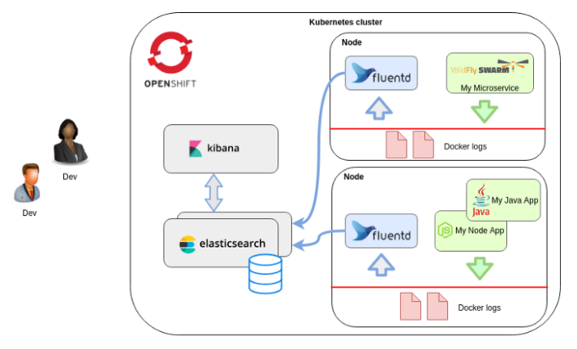

# Observability

* **Status**: Draft #2
* **JIRA**: [KEYCLOAK-8288](https://issues.jboss.org/browse/KEYCLOAK-8288)
* **Healthcheck API JIRA**: [KEYCLOAK-12398](https://issues.redhat.com/browse/KEYCLOAK-12398)

## Glossary

- SRE - Site Reliability Engineering
- SLI - Service Layer Indicator - basically a metric
- SLO - An assumption about SLI. The SLI should be between the lower bound and the upper bound. [Here’s a good example](https://landing.google.com/sre/workbook/chapters/slo-document/).
- SLA - Service Level Agreement - what are the SLOs written into an agreement between services (or Red Hat and end users for that matter).
- Alert - A warning triggered when metrics went beyond a level defined in SLO.
[Here’s the OpenShift Dedicated SLA (go to page 9)](https://www.redhat.com/licenses/Appendix_4_Online_Global_20200406.pdf).
- Prometheus - A time-series database. We store metrics there.
- Grafana - A service that presents diagrams based on metrics from Prometheus.
- EFK Stack - Elsticsearch, Fluentd and Kibana. A typical log-collecting stack.
- CLO - Cluster Logging Operator
- CR - Custom Resource. An API provided by Keycloak Operator for the context of this document.

## Motivation

Managing Keycloak cluster requires involving a dedicated SRE (Site Reliability Engineering) Team. Such a team needs to
be able to:

* Diagnose if Keycloak cluster is up and running
* Have sufficient information to diagnose issues
* Have enough data and metrics to foresee problems that will happen in the near future
* Determine of the SLI levels and tell if the service operates without interruptions

Typically, an SRE Team uses dashboards and alerts. Both of them are created based on metrics exported by a Service
(in this case, the Service is both Keycloak and Keycloak Operator).

## Scope

What's in the scope of this design:
- Designing a new Healthcheck API. This has been covered in a separate design document. See [KEYCLOAK-12398](https://issues.redhat.com/browse/KEYCLOAK-12398)
- Designing and implementing a dashboard for the SRE Team.
- Defining SLIs and SLOs proposals for a managed Keycloak cluster.
- Defining metrics required by the proposed dashboard as well as designing a mechanism for exporting them to prometheus.
- Design logging improvements for better error tracking.

What's out of the scope:
- Traceability - tracking a user across the whole authorization flow. The progress within this space is tracked in
[KEYCLOAK-7432](https://issues.redhat.com/browse/KEYCLOAK-7432).

## Coarse-grained Keycloak Services

For the purpose of this design, Keycloak has been divided into the following Services:
* Admin - both the Console and the REST endpoints.
* Account - both the Console and the REST endpoints.
* OIDC - All endpoints for OpenID Connect.
* Token Exchange - Token Exchange endpoint.
* SAML - All endpoints for SAML spec.
* User Federation - LDAP servers used for User Federation

[^1]: The Token Exchange feature belongs to oAuth spec, so it can't go under OIDC.

## SRE Dashboard

NOTE: The diagram implementation and specific charts might change during the implementation phase. The above proposal
shows only the general idea.

The proposal consists of 3 sections:
- System health - Enables the SRE Team to quickly tell if Keycloak cluster is up and running. This section consists of:
  - Readiness and Liveness Probes chart
  - HTTP 5xx error rate for all major Keycloak Services, including: Admin Console, Account Console, OIDC, SAML
  - Aggregated latency across the most important endpoints
  - (Optional) Error rate in logs [^2]
- Detailed Metrics - This section helps foresee upcoming failures. It includes:
  - Pod memory, CPU and container storage charts
  - GC Times
  - Heap and non-heap memory metrics
  - The number of Infinispan sessions
- Operator metrics - Metrics exposed by the Operator indicating its health
  - The number of observed and reconciled (successfully) Custom Resources
- Experimental metrics - Acts as a bridge between the SRE and Keycloak Teams. We introduce new metrics here and if they
are useful, we promote them to other sections. This section includes:
  - External IdP state (Social Login Providers)
  - The Total number of CRs discovered by the Operator vs the number of CRs successfully reconciled

[^2]: The Error rate in logs is not a required metric for the dashboard. After discussing it with both AOS and MAS
Teams we came to the conclusion that it might be fuzzy and inaccurate. A much better choice is to observe responses
from a service and use logs for further, more detailed diagnosis.

## SLI/SLO

SLOs might be specified in several categories, including:
- Availability
- Latency
- Freshness - cache usage
- Correctness - interesting in distributed environments
- Completeness - interesting for batch applications

Based on the dashboard, the proposed SLI/SLO are the following:

|   Use Case             | Type         | SLI                                                                           | SRE Team Action if failing                               |
|------------------------|--------------|-------------------------------------------------------------------------------|----------------------------------------------------------|
| Health                 | Availability | Check individual Pod Liveness and Readiness status                            | Check the DB status  / Report a JIRA / Restart Pods      |
| Health                 | Error rate   | Monitor error rates of individual Keycloak services                           | Investigate further                                      |
| Health (optional)      | Error rate   | Monitor error rate in logs                                                    | If increases, check what might be causing it             |
| Performance            | Latency      | Monitor the aggregated average response time for individual Keycloak Services | If drastically increases, check what might be causing it |

For all the SLOs mentioned the above, the Keycloak Operator needs to set proper Prometheus Alerts.

The implementation should provide a detailed "SRE Team Actions" paragraph in the Keycloak documentation.

## Investigating failures

Based on the Keycloak SRE Dashboard and additional alerts set based on SLI/SLOs, a typical failure investigation
procedure might look like the following:

|             Failure             |            Alert indication           |                                         SRE Dashboard                                         |
|---------------------------------|---------------------------------------|-----------------------------------------------------------------------------------------------|
| Database is down                | Health (Availability) alert is firing | Readiness and Liveness probes indicate a failure. HTTP Error rates go up                      |
| Out of memory                   | Health (Availability) alert is firing | Liveness Probes indicate a failure. Detailed metrics indicate total memory close to Pod Limit |
| Too much GC pressure            | Performance (Latency) alert is firing | Pod memory as well as GC times graphs are going up                                            |
| Too much sessions               | Performance (Latency) alert is firing | Session counts as well as Pod memory graphs are going up                                      |
| Keycloak CRs are not reconciled | No alert specified at this stage      | Custom Resources states graph shows unsuccessful CR installation                              |

## Logging improvements

Building alerts or dashboard based on logs requires using specific and consistent labels for the same errors. The easiest
way to achieve this is to prefix common errors. A good example is the Keycloak Services module, that emits all errors
with a pre-defined prefix:

    14:19:24,582 ERROR [org.keycloak.services] (ServerService Thread Pool -- 46) KC-SERVICES0002: Failed to migrate datamodel:
    java.lang.NullPointerException
    ...

This convention should be continued for all other Keycloak modules.

The other improvements involve:
* Checking if none of the exception is "swallowed" without emitting an error log.
* (optional) Adjusting the error levels for all logs emitted in the main authentication flow.

## Implementation

[This document](https://docs.google.com/spreadsheets/d/1YGn4wwUupgQsFTmlm-5VXgLYkigTdy_TEnDhqFxNXXo/edit?usp=sharing) contains exported metrics from Keycloak's `/metrics` endpoint.

The missing metrics are:
- HTTP 5xx error rates for OIDC, SAML, Account Console and Admin Console endpoints
- Aggregated latency for OIDC, SAML, Account Console and Admin Console endpoints
- External IdP responses (especially 5xx)
- User Federation responses (especially 5xx)

The additional metrics will be implemented using [Micrometer](https://micrometer.io/).

#### Microprofile Metrics vs Micrometer

Both Quarkus and Wildfly will adopt [Micrometer](https://micrometer.io/) for exposing metrics. The plan looks like the following:
* EAP 7.4 will drop Microprofile Metrics and expose it via EAP XP package.
* An additional compatibility layer will be introduced in EAP to provide backwards compatibility for Micrometer.
* Wildfly 22 (EAP 7.4 Beta) will not expose Microprofile Metrics API for external consumption.
* Wildfly 23 (EAP 7.4 GA) will switch to SmallRye Metrics + Micrometer

The main advantage of the Micrometer over Microprofile Metrics is that it reports metrics that can be compared between different
runtimes. Micrometer is strongly recommended by the Wildfly Team.

#### Enabling Metrics in Keycloak and Keycloak.x

Depending on the progress of integrating Micrometer in Wildfly and Quarkus, we might need to employ different implementation strategies.
This way or another, the implementation should use either Micrometer directly or [Smallrye Metrics](https://github.com/smallrye/smallrye-metrics).
The former approach is much more preferable.

At the time of writing this design, Quarkus already provides [Micrometer extension](https://quarkus.io/guides/micrometer).

Depending on timing, it is very likely that Wildfly deployment will require embedding Micrometer jars into Keycloak's modules
and configuring them manually. Deploying Micrometer as Keycloak's dependency also has some impact on productization. The current
version of Micrometer brings in the following dependencies:
* `org.hdrhistogram:HdrHistogram`
* `org.latencyutils:LatencyUtils`
* `io.prometheus:simpleclient_common`, which also brings `io.prometheus:simpleclient_pushgateway`

Depending on the timing, the Wildfly's distribution may need to expose all metrics in its own application context:

    http://127.0.0.1:8080/auth/metrics

In this case, it will be necessary to develop a custom bridge between JCA Metrics and the endpoint exposed in Keycloak. The
[Healthcheck API Design](https://issues.redhat.com/browse/KEYCLOAK-12398) requires some of them to inspect if the database
is up and running. The implementation of such a bridge might be similar to the
[Hibernates's Metrics implementation](https://github.com/micrometer-metrics/micrometer/blob/0dc111d1f6d3aa288dda24ac0912cbb483f1da1e/micrometer-core/src/main/java/io/micrometer/core/instrument/binder/jpa/HibernateMetrics.java#L191).

Both implementations (Wildfly and Quarkus based) will use a similar process for implementing metrics. The Micrometer
has a notion of a [Gloabl Registry](https://github.com/micrometer-metrics/micrometer/blob/master/micrometer-core/src/main/java/io/micrometer/core/instrument/Metrics.java#L35)
that can be used for environments where CDI injection is not possible (as a reminder, Keycloak doesn't use CDI). The implementation
can obtain all metrics instruments (such as gauges, histograms etc.) from it.

## Metrics for the REST interface

Most of the metrics are related to the various REST endpoints. Therefore, it makes sense to put the root metrics
component into `services` module under its own package - `org.keycloak.services.metrics`.

During initialization, the root metrics components should obtain an Application `MetricRegistry` from `MetricRegistries`.
The next step is to register all required `Metric`s using the `#register` method.

The best metric for measuring REST latency is Histogram. It gives the most information about the traffic going through
the specific REST method.

A bit more interesting is measuring the number of response codes in certain time (e.g. the number of 200 OK within a minute).
This requires registering at least 4 different counters in Microprofile Metrics: the number of 200s, 300s, 400s and 500s.

The easiest way to measure both latency and response codes is to register a new `MetricsFilter` that implements
`ContainerRequestFilter` and `ContainerResponseFilter`. The implementation also requires implementing a `MetricsWebFilter`
that implements a `Filter`. As Smallrye [Javadocs mentions](https://github.com/smallrye/smallrye-metrics/blob/b517d9904f91fd0077e0a215e5bb87ef9f1ac9ee/implementation/src/main/java/io/smallrye/metrics/jaxrs/JaxRsMetricsFilter.java#L36-L43):

> The reason for having two filters (one based on Servlet API, one on JAX-RS API)
> is to overcome the limitation of JAX-RS specification in that it does not require
> implementations to call a ContainerResponseFilter to finish exchanges that led
> to an unmapped exception. That's why we can't use a ContainerResponseFilter to
> 'finish' the tracking of a REST call and update the corresponding metrics.

it is necessary to properly track all non-successful responses.

The last part is tracking external IdP responses. Implementing this part requires changing the existing code around
`SocialIdentityProvider`s and `OIDCIdentityProvider`. All `SocialIdentityProvider` implementations usually throw
`IdentityBrokerException`s. The exception needs to be enhanced to contain an information about that provider has thrown
it. Then, the implementation should involve updating all places in `AbstractOAuth2IdentityProvider` and add
proper checks in all `catch` clauses. Once an `IdentityBrokerException` is caught, and it contains a provider ID,
it should result in updating certain metrics in the metrics components after logging an error.

## Logging architecture

Collecting logs in an OpenShift cluster is a cross-cutting concern that needs a unified solution. OpenShift provides a
Cluster Logging Operator, that represents a typical EFK stack implementation:

The Cluster Logging Operator uses Kibana (Open Distro) to view logs. The log-collecting stack requires annotating a
namespace with `openshift.io/cluster-monitoring: "true"` label.

#### Alerts on log errors

Unfortunately, the Cluster Logging Operator (and Kibana in this case) does not allow to set any alerts
(Watch UI is part of the "x-pack" distribution) nor to plot the output in Grafana.
This is very likely to change in the near future. Both AOS Logging and Managed Applications
teams are likely to introduce [Loki](https://grafana.com/oss/loki/) - a Grafana add-on for viewing
logs. So, before implementing this piece of functionality - please consult it with MAS and AOS Logging Teams.

Depending on timing and other teams progress, it is possible to implement error rate tracking using metrics. This
however, introduces a few design flaws:
- A new `LoggerAdapter` would need to be created. Whenever an error is logged in Keycloak's codebase, the `LoggerAdapter`
will increase the error log counter.
- All `Logger#getLogger` calls would need to be replaced to acquire the `LoggerAdapter` instead of pure
JBoss Logging `Logger`.
- The error-rate metric will miss all error emitted by Wildfly (as they will be thrown in different subsystems).

Keycloak.x distribution offers logging the number of log events by enabling `quarkus.log.metrics.enabled`. The functionality
has been implemented in Quarkus using [this Pull Request](https://github.com/quarkusio/quarkus/pull/11224).

Having the above in mind, if the implementation choice is to expose the number error in logs using metrics endpoint,
it is heavily recommended to focus on Quarkus distribution (and it's out-of-the-box capabilities) rather than Wildfly.

## Resources

* [Keycloak's exported metrics (as for Sep 2020)](https://docs.google.com/spreadsheets/d/1YGn4wwUupgQsFTmlm-5VXgLYkigTdy_TEnDhqFxNXXo/edit?usp=sharing)
* [OpenShift logging stack](https://itnext.io/multiline-logs-in-openshift-efk-stack-7a7bda4ed055)
* [Microprofile Metrics Specification](https://github.com/eclipse/microprofile-metrics/blob/master/spec/src/main/asciidoc/metrics_spec.adoc)
* [Microprofile Metrics Documentation](https://download.eclipse.org/microprofile/microprofile-metrics-3.0-RC1/microprofile-metrics-spec-3.0-RC1.html#scopes)
* [Quarkus and Microprofile Metrics guide](https://quarkus.io/guides/microprofile-metrics)
* [An article on measuring REST responses with histograms](https://chartio.com/learn/charts/histogram-complete-guide/)
